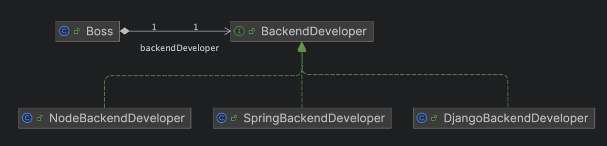

객체지향을 공부하면 빠질 수 없는 내용이 있다.<br>
바로 _SOLID_ 라고 불리는 객체지향 설계 원칙이다.<br>
이번 글은 SOLID 원칙이 무엇이고 왜 탄생하게 되었으며 각 원칙은 무엇을 의미하는지 알아보겠다.

## SOLID 원칙

SOLID는 객체지향 프로그래밍을 할 때 객체지향의 특징을 잘 살릴 수 있는 설계 원칙이다.<br>
총 5가지의 원칙이 있으며, 원칙이라는 이름이 붙은만큼 다섯 가지의 원칙을 모든 상황에서 지켜야 하는 것은 아니다. 대부분의 상황에 적절히 사용 가능한 *가이드라인*과도 같다.<br>
다만, SOLID를 생각하며 코드를 설계하고 작성하면 객체지향의 큰 장점인 유연함과 생산성이 향상되는 것을 느낄 수 있을 것이다.

이제 다섯 가지 원칙에 대해 알아보자.

### SRP: 단일 책임 원칙

**클래스나 모듈이 변경되는 이유는 단 한가지 때문이어야 한다**는 원칙이다.<br>
아래 코드는 백엔드 개발자를 나타내는 객체를 나타내본 코드다.<br>
메서드를 보면 서버를 구축하고 DB를 설정하며 MainPage를 개발하는 역할을 가진다.

```java
public class SpringBackendDeveloper {

    public void deployServer() {
    }

    public void setupDatabase() {
    }

    public void developMainPage() {
    }
}
```

보통 백엔드 개발자의 역할은 API 서버와 관련된 일을 수행한다.<br>
MainPage를 개발하는 것은 **백엔드 개발자의 관심사가 아니다**.<br>
아래와 같은 백엔드 개발자가 있다면 MainPage를 수정해야 하는 상황이 생긴 순간, 백엔드 서버와 관련된 일뿐만 아니라 프론트엔드의 책임까지 가지게 되고<br>
SRP를 위반한다고 할 수 있다.

이때, **책임은 상황에 따라 유동적**일 수 있다.<br>
요구 사항에 따라, 책임을 나누는 기준에 따라 달라질 수 있다.<br>
바로 위 코드를 다시 살펴봤을 때, 백엔드 개발자가 MainPage까지 개발하는 것이 책임이라면 SRP를 위반하는 것이 아니게 된다.<br>
따라서 중요한 것은, **특정 객체의 역할이 무엇인지 잘 정의하는 것**이다.

### OCP: 개방 폐쇄 원칙

**변경에는 열려있고 수정에는 닫혀 있어야 한다**는 원칙이다.<br>
열려있고 닫혀 있다는 표현이 한국어로 표현하면 다소 어색할 수 있는데, 열려있다는 건 허용한다는 의미고 닫혀있다는 건 허용하지 않는다고 이해하면 될 것 같다.

아래 코드를 살펴보자.<br>
```java
public class Boss {

    SpringBackendDeveloper springBackendDeveloper = new SpringBackendDeveloper();
    
    public void developService() {
        springBackendDeveloper.setUpDatabase();
        springBackendDeveloper.deplyServer();
    }
}
```
`Boss` 객체는 `SpringBackendDeveloper` 고용해 서비스 개발에 의존하고 있다.<br>
그런데 갑자기 Spring이 아니라 Node로 서비스를 마이그레이션 해야 할 상황이 생겼다고 가정해보자.<br>
`Boss`가 의존하는 `SpringBackendDeveloper`을 `NodeBackendDevloper`로 교체하기 위해 모든 코드를 고쳐나가야 할 것이다.<br> 

이제 아래 코드를 살펴보자.
```java
public interface BackendDeveloper {

    void deployServer();

    void setupDatabase();
}

public class NodeBackendDeveloper implements BackendDeveloper {

    @Override
    public void deployServer() {
    }

    @Override
    public void setupDatabase() {
    }
}

public class Boss {

    BackendDeveloper backendDeveloper;

    public Boss(BackendDeveloper backendDeveloper) {
        this.backendDeveloper = backendDeveloper;
    }

    public void developService() {
        backendDeveloper.setupDatabase();
        backendDeveloper.deployServer();
    }
}
```

`BackendDeveloper`라는 인터페이스를 만들고 `NodeBackendDeveloper`가 이를 구현하고 있다.<br>
동시에 `Boss`는 생성자로 `BackendDeveloper`를 받고, 기존과 동일하게 작업을 요청한다.<br>
위 코드는 `Boss` 입장에서 봤을 때, **변경에는 열려있고 수정에는 닫혀있는 것**이다.

OCP는 **높은 응집도, 낮은 결합도**라고도 표현할 수 있다.<br>
특정 객체의 관심사(`Boss` 입장에서 서비스를 개발하는 것)를 하나의 객체가 모두 담당하고, 관심사가 아닌 것(개발자의 기술스택)과는 느슨하게 연결되어야 한다는 의미다.

### ISP: 인터페이스 분리 원칙

**인터페이스도 관심사에 따라 적절히 분리해야 한다**는 원칙이다.<br>

위의 예시를 계속해서 사용해보자.<br>
만약 백엔드 개발자 2명과 프론트엔드 개발자 1명을 고용하고 싶다고 가정해보고 적절한 코드를 작성해보았다.

```java
public interface FrontendDeveloper {

    void developMainPage();
}

public class Boss {

    BackendDeveloper backendDeveloper;
    FrontendDeveloper frontendDeveloper;

    public Boss(BackendDeveloper backendDeveloper, FrontendDeveloper frontendDeveloper) {
        this.backendDeveloper = backendDeveloper;
        this.frontendDeveloper = frontendDeveloper;
    }

    public void developService() {
        frontendDeveloper.developMainPage();
        backendDeveloper.setupDatabase();
        backendDeveloper.deployServer();
    }
}
```

화면 개발을 책임지는 `FrontendDeveloper` 인터페이스를 분리해 만들었다.<br>
그리고 `Boss`는 `BackendDeveloper`와 `FrontendDeveloper`를 의존하여 각각에게 적절한 역할을 요청한다.<br>
만약 풀스택 개발자 1명을 더 데려오고 싶어도 아래와 같이 작성하면 된다.

```java
public class FullStackDeveloper implements BackendDeveloper, FrontendDeveloper {

    @Override
    public void deployServer() {
    }

    @Override
    public void setupDatabase() {
    }

    @Override
    public void developMainPage() {
    }
}

public class Boss {

    BackendDeveloper backendDeveloper;
    FrontendDeveloper frontendDeveloper;
    FullStackDeveloper fullStackDeveloper; // 풀스택 개발자 추가

    public Boss(BackendDeveloper backendDeveloper, FrontendDeveloper frontendDeveloper, FullStackDeveloper fullStackDeveloper) {
        this.backendDeveloper = backendDeveloper;
        this.frontendDeveloper = frontendDeveloper;
        this.fullStackDeveloper = fullStackDeveloper;
    }

    public void developService() {
        frontendDeveloper.developMainPage();
        fullStackDeveloper.developMainPage();
        backendDeveloper.setupDatabase(); // 풀스택 개발자 추가
        backendDeveloper.deployServer();
        fullStackDeveloper.deployServer(); // 풀스택 개발자 추가
    }
}
```

인터페이스를 관심사에 따라 적절히 분리하여 `FullStackDeveloper` 라는 객체가 손쉽게 탄생할 수 있게 되었다.

### LSP: 리스코프 치환 원칙

**하위 타입은 상위 타입을 대체할 수 있어야 한다**는 원칙이다.<br>
좀 더 풀어서 설명하면, **상위 타입을 사용하는 클라이언트는 하위 타입이 어떻게 변해도 동일한 동작을 할 것으로 기대하고 보장되어야 한다**는 것이다. 

만약 아래와 같은 코드가 있다고 가정해보자.
```java
public class DBA implements BackendDeveloper {
    
    @Override
    public void deployServer() {
    }

    @Override
    public void setupDatabase() {
    }
}
```

직책(이름)은 DBA인데 정작 `BackendDeveloper`를 상속받아 구현하고 있다.<br>
만약, `new Boss(new DBA(), ..., ...);` 가 호출된다면 어떻게 될까?<br>
Boss는 당연히 BackendDeveloper가 수행할 동작들에 대해 기대할 것이다.<br>
하지만 정작 실행 결과 DBA가 동작을 수행하게 될 것이다.

에시가 약간 현실과 괴리감이 있다고 생각할 수 있다.<br>
하지만 여기서 중요하게 볼 것은 **하위 클래스가 상위 클래스의 동작을 잘 수행하는가?** 이다.<br>
또 다른 예시로 Stack과 Vector의 관계가 있다. [^1]

### DIP: 의존관계 역전 원칙

**고수준 모듈은 저수준 모듈의 구현에 의존해서는 안되며, 저수준 모듈이 고수준 모듈에 의존해야 한다**는 원칙이다.<br>
말이 조금 어려운데 아래 그림을 통해 이해해보자.


"_고수준 모듈은 저수준 모듈의 구현에 의존해서는 안되며_" == Boss가 Node, Spring, DjangoBackendDeveloper에 의존해서는 안되며<br>
<br>
"_저수준 모듈이 고수준 모듈에 의존해야 한다_" == Node, Spring, DjangoBackendDeveloper가 BackendDeveloper에 의존해야 한다.

로 이해할 수 있다.

## 마치며

지금까지 SOLID 원칙에 대해 알아보았다.<br>
결국 다섯 가지 원칙 모두 **객체의 관심사에 따라 적절히 분리**하고, 이 과정에서 **추상화를 통해 유연한 설계를 하라**는 의미와 일맥상통 하는 것 같다. 

---

[^1]: [Stack보다는 ArrayDeque를 쓰자. Stack과 Vector의 문제점](https://jaehee329.tistory.com/27)
