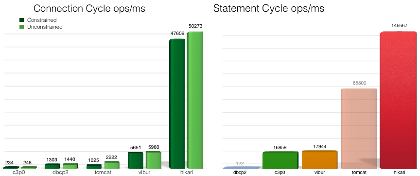

## DBCP (DataBase Connection Pool) 탄생 배경

서버 애플리케이션에서 DB 서버로 요청을 보내면 TCP 통신을 한다.

TCP 통신은 **Connection**이 유지되는 상태에서 통신한다.

이 Connection은 생성하고 사용하고 삭제되기까지 꽤 많은 작업이 포함된다. 즉, 통신 비용이 **비싸다**.

이러한 상황에서 서버는 많은 요청을 처리하는데, 이 요청들이 DB 서버로의 요청으로 이루어진다면 비싸고 오래걸리는 작업이 많아질 것이다.

결국, 서버 성능에 악영향을 줄 수 있다.

이를 해결하기 위해 DBCP는 탄생했다.

## DBCP 기본 개념

서버가 실행되면 DB와 Connection을 **미리 만들어 놓고 Pool에 저장해놓는다.**

미리 만들어 놓은 DB Connection을 서버에 미리 가지고 있다가, DB로 요청을 보내야 하는 상황이 발생한다면 기존에 가지고 있는 Connection을 이용해 쿼리를 요청한다.

요청을 모두 수행하면 요청에 사용된 Connection을 다시 Pool에 **반환**을 한다. 

결국, Connection을 생성하고 삭제하는 과정이 모두 생략되기 때문에 더 빠른 속도로 요청을 처리할 수 있게 된다.

## 종류

이 DBCP를 구현한 제품으로는 [HikariCP](https://github.com/brettwooldridge/HikariCP), [Apache Commons DBCP](https://commons.apache.org/proper/commons-dbcp/), [c3p0](https://github.com/swaldman/c3p0) 등이 있다.

## HikariCP

Spring Boot 2.0부터 내장되어 사용되는 DBCP 이다.

오픈소스로서, 타 제품에 비해 성능이 매우매우 뛰어나다.

실제로 README를 읽어보면 타 제품에 비해 성능이 너무 뛰어나다고 엄청나게 자랑한다.

아래 사진은 HikariCP 에서 자체적으로 진행한 벤치마크 결과이다. 

> One *Connection Cycle*은 한 쌍의 `DataSource.getConnection()`, `Connection.close()` 
> One *Statement Cycle*은 한 쌍의 `Connection.prepareStatement()`, `Statement.execute()`, `Statement.close()` 이다.

## 중요한 설정 포인트

이 유용한 DBCP를 정말 유용하게 사용하려면, DB와 서버에서 각각 DB Connection 관련 설정을 잘 알아야 한다.

> DB는 MySQL, 서버는 Spring, DBCP는 hikariCP를 기준으로 설명한다.

### 데이터베이스 서버 설정 (MySQL 기준)

- `max_connections`
  - DB 서버가 클라이언트와 맺을 수 있는 최대 Connection 수이다.
  - 컴퓨팅 자원을 적절히 사용하면서 동시에 가장 높은 처리량만큼을 설정하는 것이 중요하다.

- `wait_timeout`
  - 생성된 Connection이 아무 처리도 하지 않을 때, 새로운 요청이 오기까지 얼마만큼의 시간을 기다릴 지 설정한다.
    만약 `wait_timeout` 시간이 지나게 될 경우, Connection은 Close 된다.
  - 클라이언트에서 문제가 생겨 Connection을 정상적으로 종료하지 못하는 상황(비정상적 Connection 종료, Connection 반환 X, 네트워크 단절)에, 생성된 Connection을 알아서 종료해주기 위한 적절한 시간을 결정하는 것이 중요하다.
  - `wait_timeout`으로 인해 Connection이 종료되기 전에 새로운 요청이 들어올 경우, 0초부터 다시 시간을 측정한다.

### DBCP 설정 (HikariCP 기준)

#### 개수 관련 설정

- `minimumIdle`
  - Pool에서 유지하는 최소한의 Idle Connection의 수이다.
  - 만약 Idle 상태의 Connection 수가 `mimimumIdle` 값보다 작고, 전체 Connection 수가 `maximumPoolSize`보다 작은 상황이라면, 신속하게 새로운 Connection을 생성하고 Pool에 추가한다.
  - Default는 `maximumPoolSize`와 동일한 값이다. 값을 동일하게 설정해야 요청이 들어올 때 새로운 Connection을 만들지 않고 DBCP를 사용하는 장점을 누릴 수 있기 때문이다.   

- `maximumPoolSize`
  - Pool이 가질 수 있는 최대 Connection의 수이다.
  - Idle 상태와 Active 상태의 Connection을 모두 포함한다.

#### 시간 관련 설정

- `maxLifetime`
  - Connection Pool에서 Connection의 최대 수명 시간이다.
  - Active 상태의 Connection은 절대 종료되지 않으며 **Connection이 Pool에 반환된 이후의 시간을 기준으로 Connection을 종료**한다. 
    이 특징 때문에, Active 상태의 Connection이 모종의 이유로 Pool에 반환되지 않음과 동시에 DB의 `wait_timeout` 설정 시간 이후에 요청을 보내게 되면, DB는 이미 해당 Connection을 Close 했기 때문에 예외가 발생할 수 있다. 이는 Connection Leak의 문제가 될 수 있다. 
  - Connection Pool에서 갑작스런 Connection 대량 소멸을 방지하기 위해 Connection 별로 일종의 조치를 취해놓았다.
  - HikariCP가 권장하길, DB의 `wait_timeout`보다 몇 초 더 짧게 설정하는 것이 좋다고 한다. 
    이유로는, 만약 `wait_timeout`과 `maxLifetime` 값을 동일하게 설정했다고 가정했을 때, `maxLifetime`에 얼마 남지 않은 시점에 요청을 처리해야 한다면, 해당 Connection이 DB로 요청을 보내는 시간이 포함되게 되는데, 요청이 DB에 도달하기 전에 `wait_timeout` 시간이 지나게 되어 DB 서버 쪽에서 Connection을 끊게 된다면 예외가 발생할 수 있기 때문이다.

- `connectionTimeout`
  - 클라이언트가 Connection Pool에서 Connection을 획득하기까지 얼만큼의 시간을 기다릴 지 최대 시간을 정하는 설정이다.
  - 설정 시간만큼 획득하지 못하면 `SQLException`이 발생한다.
  - 위 설정도 마찬가지로 `wait_timeout` 보다 더 짧은 시간으로 설정해야 한다. 
    만약 `connectionTimeout`과 `wait_timeout` 시간이 같다면, 사용자가 Pool에서 `connectionTimeout` 직전에 Connection을 획득했다 하더라도, 실제 DB 서버에 도달하기까지 추가적인 시간이 반드시 존재하고, 만약 도달한 시점에 이미 `wait_timeout` 시간을 넘은 상태라면 예외를 발생하기 때문이다.

## 적절한 파라미터 값을 설정하는 방법

우선 서버 애플리케이션을 모니터링을 하며 리소스 사용률, 서버 스레드 수, DBCP 정보들을 확인할 수 있어야 한다. 
그리고 [nGrinder](https://naver.github.io/ngrinder/)와 같은 부하 테스트 툴을 사용하여 실제로 서버에 부하를 줌으로써 병목 지점을 확인한다. 
만약 병목 지점이 생긴다면, 해당 시점 이후의 지표들을 토대로 병목 지점을 유추한다. 
유추되는 지점이 존재한다면 해당 값을 적절히 조절해가며 적절한 설정 값을 찾는 과정을 거친다.

> ### Reference
> - https://www.youtube.com/watch?v=zowzVqx3MQ4