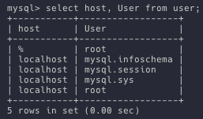
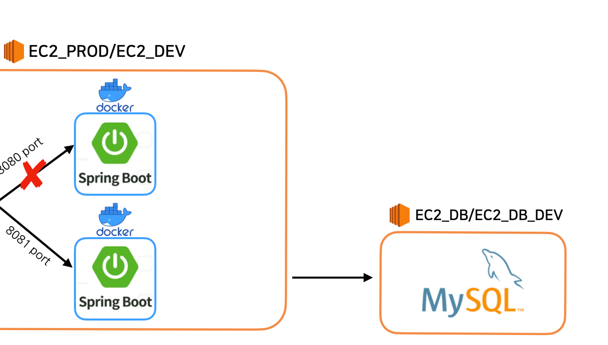
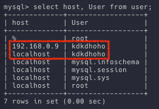
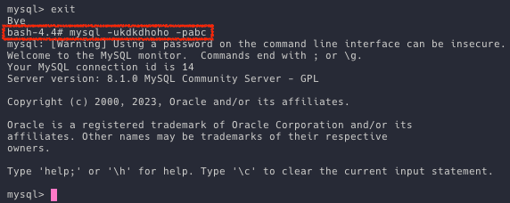
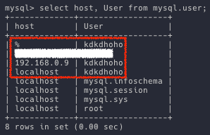
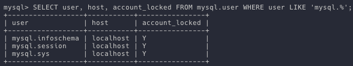
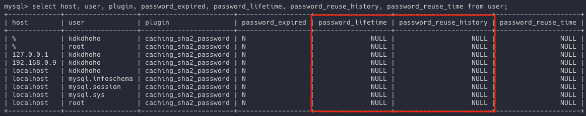
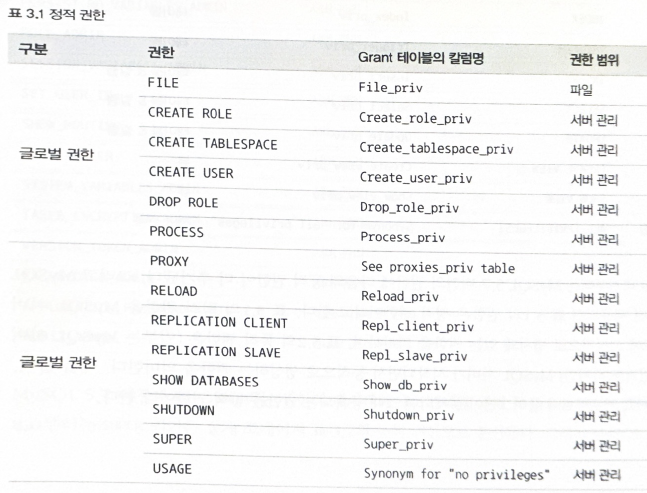
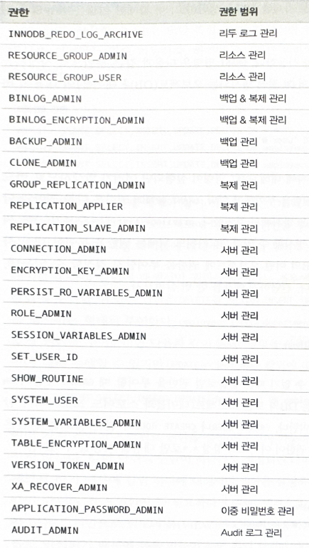

## 들어가며

MySQL에서의 계정 식별 방식, 권한, 역할에 대한 기본적인 내용을 알아보자

## 왜 알아야 할까?

데이터베이스 서버의 **보안**을 위해 !

> ~~괜히 보안떄문에 퇴근이 늦어지면 안되니까~~

## 1. 사용자 식별 방법
**사용자 아이디** 뿐만 아니라 **접속 지점(호스트명이나 도메인 또는 IP주소)**도 함께 확인한다.<br>
예시) `root@localhost`



따라서 계정의 HOST와 다른 지점에서 접속하면 실패한다.

> 💡 계정을 언급할 때는 **항상 아이디와 호스트를 함께** 명시하자 !

### 1-1. 만약 모든 지점에서 접속을 허용하고 싶다면
---
계정의 HOST를 `%` 로 설정하자. (와일드카드 느낌)

### 1-2. 계정의 HOST를 이용해 보안을 신경 쓴 사례
---
**[상황]**<br>
주어진 자원: 1대의 MySQL 서버, 1대의 개발용 서버 1대, 1대의 운영용 서버 1대

개발용, 운영용 서버에서 1대의 MySQL 서버로 요청을 보낸다.
MySQL 서버에는 개발용, 운영용 데이터베이스를 따로 구축하여 관리하고 있었다.

아래는 이해를 돕기 위한 사진이다.



**[문제]**<br>
혹여나 실수로 인해 개발용 서버에서 운영용 DB에 쿼리를 날리거나, 그 반대의 상황을 막고자 했다.

**[해결]**<br>
계정을 각 환경에 맞는 서버로 나누어 생성 및 관리를 함으로써 의도치 않은 상황을 예방했다.<br>
(`'celuveat_prod'@{ec2_prod_ip}`, `'celuveat_dev'@{ec2_dev_ip}`)

### 1-3. 계정 식별에서 주의할 점: 아이디는 같고 호스트가 다른 경우
---
만약 `user` 이라는 계정이 두 개가 있다.<br>
한 계정의 HOST는 `192.168.1.01`이고 나머지는 `%`라고 가정해보자.<br>
(`'user'@'192.168.1.01'`, `'user'@'%'`)

이때 클라이언트의 IP가 `192.168.1.01`인 곳에서 `user` 계정으로 접속을 시도하면 어떻게 될까?<br>
그리고 `192.168.1.01`이 아닌 곳에서 `user` 계정으로 접속을 시도하면 어떻게 될까?

정답은, `user@192.168.1.01` 계정으로 로그인을 시도한다.<br>
MySQL은 기본적으로 **더 좁은 범위의 HOST 계정으로 인증을 시도**하기 때문이다.

> 애초에 이런 식으로 설정하는 경우는 가급적 자제하는 게 좋아보인다.<br>
> 만약 불가피한 경우에는 `--host` 속성으로 계정을 명시해 접속 시도할 수 있을 것이다.

이때 주의할 점은, 인증에 실패했다고 더 넓은 범위의 계정으로 접속을 시도하지 않는다.

### 1-4. 실험1: 만약 `localhost`와 현재 IP 주소로 설정한다면?
---
`create user 'kdkdhoho'@localhost identified by abc;` 명령어와<br>
`create user 'kdkdhoho'@'192.168.0.9' identified by 123;` 명령어로 상황을 세팅해보자.



그리고 kdkdhoho 계정으로 로그인을 시도했을 때, 성공하는 계정을 보자.



HOST를 `localhost`로 설정한 계정으로 로그인이 성공한다.

### 1-5. 실험2: 실험1에 `%`이 추가된다면?
---


만약 위와 같이 `kdkdhoho@%` 계정이 추가된다면 어떤 계정으로 접속하게 될까?<br>
(참고로 위 계정의 암호는 `xyz`)

아마 예상하기 쉽겠지만 `localhost`로만 접속이 가능하다.

> 💡결론: HOST의 범위는 `localhost` < 지정 IP < `%` 인 것 같다.<br>
> 참고) 추가 실험 결과, `127.0.0.1`도 `localhost`에 순위가 밀린다.

## 2. 사용자 계정 관리

### 2-1. 시스템 계정과 일반 계정

MySQL 8.0부터는 `SYSTEM_USER` **권한**을 가지고 있냐에 따라 `시스템 계정`과 `일반 계정`으로 구분된다.

> `SYSTEM_USER` 권한은 `ALL PRIVILEGES` 안에 포함된다.

### 2-2. 두 계정의 차이

#### 시스템 계정
- MySQL 
- 시스템 계정과 일반 계정을 관리(생성, 삭제, 변경) 할 수 있다.
- DB 서버 관리와 관련된 작업은 시스템 계정으로만 수행할 수 있다.
  - 계정 관리
  - Connection(세션) 강제 종료
- DBA를 위한 계정

#### 일반 계정
- 시스템 계정을 관리할 수 없다.
- 개발자나 응용 프로그램을 위한 계정

### 2-3. 내장된 계정들

MySQL 서버에는 다음과 같은 내장된 계정들이 존재한다. (`root@localhost` 제외)

- `mysql.sys@localhost`: 8.0부터 기본으로 내장된 **sys 스키마의 객체들의 DEFINER**로 사용하는 계정
  > sys 스키마: Performance Schema를 편하게 볼 수 있도록 별도로 만든 뷰의 모음
- `mysql.session@localhost`: **MySQL 플러그인이 서버로 접근**할 때 사용하는 계정
- `mysql.infoschema@localhost`: **information_schema에 정의된 뷰의 DEFINER**로 사용하는 계정
  > information_schema: DB의 메타 정보(테이블 칼럼, 인덱스 등의 스키마 정보)의 모음

위 세 계정은 처음부터 잠겨있는 상태이다. `account_locked` 칼럼을 통해 확인할 수 있다.



## 3. 계정 생성

`CREATE USER` 명령으로 계정을 생성할 수 있다.<br>
`GRANT` 명령으로 권한 부여를 할 수 있다.

> 5.7v 까지는 `GRANT` 명령으로 생성과 동시에 권한 부여를 할 수 있었다.

### 3-1. 다양한 옵션 설정

계정을 생성할 때, 아래와 같은 다양한 옵션들을 설정할 수 있다.

- 인증 방식과 비밀번호
- 비밀번호 관련 옵션(유효 기간, 이력 개수, 재사용 불가 기간)
- 기본 역할(Role)
- SSL 옵션
- 계정 잠금 여부

위 옵션을 모두 적용한 임의의 쿼리문을 통해 하나씩 살펴보자.

```sql
CREATE USER 'user'@'{HOST}'
    IDENTIFIED WITH 'mysql_native_password' BY 'password'
    REQUIRE NONE
    PASSWORD EXPIRE INTERVAL 30 DAY
    ACCOUNT UNLOCK
    PASSWORD HISTORY DEFAULT
    PASSWORD REUSE INTERVAL DEFAULT
    PASSWORD REQUIRE CURRENT DEFAULT;
```

### 3-2. IDENTIFIED WITH

계정 인증 방식과 비밀번호를 설정한다.<br>
예) `IDENTIFIED WITH {계정 인증 방식} BY {비밀번호}`

계정 인증 방식은 플러그인 형태로 제공되며, 아래 4가지 방식이 가장 대표적이다.

- `Native Pluggable Authentication`: v5.7까지 기본으로 사용되던 방식이다. 단순하게 비밀번호에 대한 해시(SHA-1 알고리즘) 값을 저장하고, 클러이언트가 보낸 값과 해시값이 일치하는지 비교한다.
- `Caching SHA-2 Pluggable Authentication`: v8.0의 기본 인증 방식. 암호화 해시값 생성을 위해 SHA-2(256비트) 알고리즘을 사용한다. `Native` 방식은 입력과 해시값이 매번 동일하지만, `SHA-2` 방식은 내부적으로 Salt 키를 활용해 수천 번의 해시 계산을 수행해 계산을 만들고 결국 동일한 입력일지라도 매번 결과가 달라진다. 이는 속도가 매우 느린 점을 고려하여, MySQL 서버는 해시 결과값을 메모리에 캐시해서 사용한다. 따라서 이름에 `Caching`이 포함되었다. 이 방식을 사용하려면 SSL/TLS 또는 RSA 키페어를 반드시 사용해야하고, 이를 위해 접속할 때 SSL 옵션을 활성화해야 한다.
- PAM Pluggable Authentication
- LDAP Pluggable Authentication

이때, `IDENTIFIED BY {비밀 번호}`만 입력한다면 MySQL 서버의 기본 인증 방식으로 사용된다.

> MySQL 5.7에서 8.0으로 넘어오면서 기본 인증 방식의 변경으로 인해, SSL/TLS 또는 RSA 키페어가 필요해질 수 있다.
> 따라서 보안 수준은 낮아지더라도, 하위 호환성을 고려하면 `Native` 인증 방식으로 계정을 생성해야 할 수 있다.<br>
> <br>
> MySQL 8.0에서 `Native Authentication`을 기본 인증 방식으로 설정하려면 다음과 같이 설정을 변경하거나 my.cnf 설정 파일에 추가하면 된다.<br>
> `SET GLOBAL default_authentication_plugin="mysql_native_password`

### 3-2. REQUIRE

서버에 접속할 때 암호화된 SSL/TLS 채널을 사용할지 여부를 설정한다.

DEFAULT 값은 비암호화 채널로 설정된다.

하지만 `REQUIRE` 옵션을 `SSL`로 설정하지 않아도, `Caching SHA-2 Authentication` 인증 방식을 사용하여 계정을 생성하면 해당 계정으로 접속할 때 암호화된 채널만으로 서버에 접속하게 된다.

### 3-3. PASSWORD EXPIRE

비밀번호의 유효 기간을 설정한다.

DEFAULT 값은 `default_password_lifetime` 시스템 변수에 저장된 기간으로 유효 기간이 설정된다.

> 스프링 접근용 계정에 유효 기간을 설정하면 큰일이 날 수 있다!

설정 가능한 옵션은 다음과 같다.

- `PASSWORD EXPIRE`: 계정 생성과 동시에 비밀번호의 만료 처리
- `PASSWORD EXPIRE NEVER`: 비밀번호의 만료 기간 없음
- `PASSWORD EXPIRE DEFAULT`
- `PASSWORD EXPIRE INTERVAL n DAY`: 유효기간을 오늘부터 n일로 설정

### 3-4. PASSWORD HISTORY

비밀번호 이력을 얼마나 저장할 지에 대한 옵션이다.

설정 가능한 옵션은 다음과 같다.

- `PASSWORD HISTORY DEFAULT`: `password_history` 시스템 변수에 저장된 개수만큼 비밀번호 이력을 저장하며, 저장된 이력에 남아있는 비밀번호는 재사용할 수 없다.
- `PASSWORD HISTORY n`: 최근 사용한 n개의 비밀번호를 저장한다.

> 시스템 변수에 저장된 값으로 DEFAULT 값이 설정된다고 한다.
> 만약 설정하지도 않았으면 어떻게 될까?
> 
> 위와 같이 `NULL` 값으로 존재한다.

### 3-5. PASSWORD REUSE INTERVAL

한 번 사용했던 비밀번호의 재사용 금지 기간을 설정한다.

기본적으로 `password_reuse_interval` 시스템 변수에 저장된 기간으로 설정된다.

설정 가능한 옵션은 다음과 같다.

- `PASSWORD REUSE INTERVAL DEFAULT`
- `PASSWORD REUSE INTERVAL n DAY`: n일 이후에 비밀번호를 재사용할 수 있다.

### 3-6. PASSWORD REQUIRE

비밀번호가 만료되어 새로운 비밀번호로 변경할 때 현재 비밀번호를 필요로 할지 말지를 결정한다.

기본적으로 `password_require_current` 시스템 변수의 값으로 설정된다.

설정 가능한 옵션은 다음과 같다.

- `PASSWORD REQUIRE CURRENT`: 비밀번호를 변경할 때 현재 비밀번호를 먼저 입력하도록 한다.
- `PASSWORD REQUIRE OPTIONAL`: 비밀번호를 변경할 때 현재 비밀번호를 입력하지 않아도 되도록 설정한다.
- `PASSWORD REQUIRE DEFAULT`

### 3-7. ACCOUNT LOCK / UNLOCK

계정을 사용하지 못하게 한다.

- `ACCOUNT LOCK`: 계정을 사용하지 못하게 잠금
- `ACCOUNT UNLOCK`: 잠긴 계정을 다시 사용 가능 상태로 잠금 해제

## 4. 비밀번호 관리

### 4-1. 고수준 비밀번호

비밀번호의 규칙을 강제할 수 있는 방법이 있다.

`validate_password` 컴포넌트를 활용하면 된다.

이는 크게 중요하지 않은 부분인 것 같아 pass

### 4-2. 비밀번호 이중화

**[문제]**<br>
스프링이 DB 서버의 하나의 계정을 사용중이다.<br>
근데 만약 계정의 비밀번호를 바꾼다면 서비스에 장애가 발생할 것이다.<br>
이로 인해 결국 하나의 암호를 몇 년 동안 사용하게 될 수도 있다.

**[해결책]**<br>
이를 해결하기 위해 비밀번호로 2개의 값을 **동시에** 사용할 수 있도록 하는 기능이 존재한다.

**[설명]**<br>
2개의 비밀번호는 Primary, Secondary로 구분된다.

가장 최근 설정한 비밀번호는 Primary, 기존 비밀번호는 Secondary가 된다.

이중 비밀번호를 사용하려면 다음과 같이 기존 비밀번호 변경 문법에 `RETAIN CURRENT PASSWORD` 옵션만 추가하면 된다.

```sql
-- 비밀번호를 "abcd"로 설정
mysql> ALTER USER 'root'@'localhost' IDENTIFIED BY 'abcd';

-- 비밀번호를 "1234"로 변경하면서 기존 비밀번호 "abcd"를 세컨더리 비밀번호로 설정
mysql> ALTER USER 'root'@'localhost' IDENTIFIED BY '1234' RETAIN CURRENT PASSWORD;
```

그리고 root 계정으로 접속을 시도할 때 비밀번호를 "abcd" 또는 "1234"로 해도 접근이 가능하다.

이렇게 설정한 후, 스프링의 접속 설정을 새로운 비밀번호로 변경하고 배포 및 재시작한다.

이제 기존 비밀번호은 Secondary 비밀번호는 보안을 위해 삭제해주자.

## 5. 권한

v5.7까지 **글로벌 권한**과 **객체 권한**으로 구분됐다.

- **글로벌 권한**: DB 혹은 테이블 이외의 객체에 적용되는 권한
  - `GRANT` 명령에서 특정 객체를 명시하지 말아야 한다.
- **객체 권한**: DB나 테이블을 제어하는 데 필요한 권한
  - `GRANT` 명령으로 권한을 부여할 때 반드시 특정 객체를 명시해야 한다.
- **ALL or (ALL PRIVILEGES)**: 글로벌과 객체 권한 두 가지 용도로 사용할 수 있다.
  - 특정 객체에 ALL 권한이 부여되면 해당 객체에 적용될 수 있는 모든 권한을 부여한다.
  - 글로벌로 ALL이 사용되면 글로벌 수준의 모든 권한이 부여된다.




v8.0부터는 아래의 동적 권한이 추가됐다.

> 정적 권한: MySQL 서버의 소스코드에 고정적으로 명시돼 있는 권한
> 동적 권한: MySQL 서버의 컴포넌트나 플러그인이 설치되면 그때 등록되는 권한



### 5-1. 사용자에게 권한 부여하기

기본적으로 `GRANT` 명령을 사용한다.

이때, 부여하려는 권한의 특성에 따라 `GRANT` 명령의 `ON` 절에 명시되는 객체의 내용이 바뀌어야 한다.

```sql
-- 권한 부여하는 문법의 기본적인 틀
-- 부여하려는 권한을 추가한다. "," 를 구분자로 하여 여러 개를 동시에 명령할 수 있다.
mysql> GRANT {권한} ON db.table TO 'user'@'host';

-- 참고: GRANT OPTION 권한은 마지막에 WITH GRANT OPTION을 추가한다.
mysql> GRANT OPTION ON db.table TO 'user'@'host' WITH GRANT OPTION;

-- 글로벌 권한은 ON 절에 항상 *.* 을 사용한다.
-- *.*은 모든 DB의 객체를 포함해 MySQL 서버 전체를 의미한다.
mysql> GRANT SUPER ON *.* TO 'user'@'localhost';

-- DB 권한은 특정 DB에 대해서만 권한을 부여하거나 서버에 존재하는 모든 DB에 대해 권한을 부여할 수 있다.
-- 여기서 DB라 함은 DB 내부에 존재하는 테이블뿐만 아니라 스토어드 프로그램들도 모두 포함이다.
-- 하지만 DB 권한만 부여하는 경우 employees.department와 같이 테이블까지 명시할 수 없다.
mysql> GRANT EVENT ON *.* TO 'user'@'localhost';
mysql> GRANT EVENT ON employees.* TO 'user'@'localhost';

-- 테이블 권한은 서버의 모든 DB에 대해, 특정 DB의 모든 오브젝트에 대해, 특정 DB의 특정 테이블에 대해서 권한을 부여할 수 있다.
mysql> GRANT SELECT,INSERT,UPDATE ON *.* TO 'user'@'localhost';
mysql> GRANT SELECT,INSERT,UPDATE ON employees.* TO 'user'@'localhost';
mysql> GRANT SELECT,INSERT,UPDATE ON employees.department TO 'user'@'localhost';
```

### 5-2. 실제 권한을 사용한 사례

우아한테크코스 프로젝트 요구사항 중, 운영 DB 서버를 `DROP`하지 못하도록 하는 요구사항이 있었다.

이를 `celuveat_prod` 계정의 권한에서 `DROP`을 제거하는 식으로 요구사항을 만족했다.

## 6. 역할(Role)

v8.0부터 권한을 묶어 역할(Role)을 사용할 수 있게 됐다.

```sql
-- 역할 생성
mysql> CREATE ROLE role_emp_read, role_emp_write;

-- 역할에 권한 부여
mysql> GRANT SELECT ON employees.* TO role_emp_read;
mysql> GRANT INSERT, UPDATE, DELETE ON employees.* TO role_emp_write;

-- 계정 생성
mysql> CREATE USER reader@localhost IDENTIFIED BY 'abcd';
mysql> CREATE USER writer@localhost IDENTIFIED BY '1234';

-- 계정에 역할 부여
mysql> GRANT role_emp_reader TO reader@localhost;
mysql> GRANT role_emp_writer TO writer@localhost;

-- 역할 활성화
-- 주의! 계정이 로그아웃됐다가 로그인하면 역할이 비활성화된다. 아래 명령어를 통해 활성화를 시켜주자.
-- 자동으로 활성화를 시켜주려면 activate_all_roles_on_login 시스템 변수를 ON 으로 설정해주자.
mysql> SET ROLE role_emp_reader;
mysql> SET ROLE role_emp_writer;
```