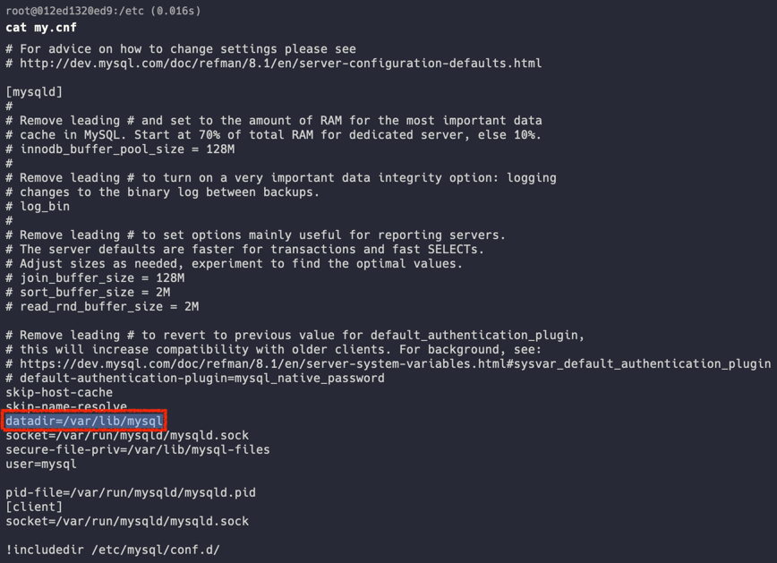
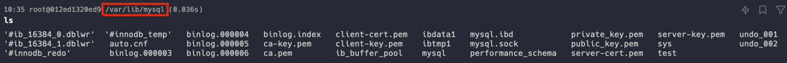
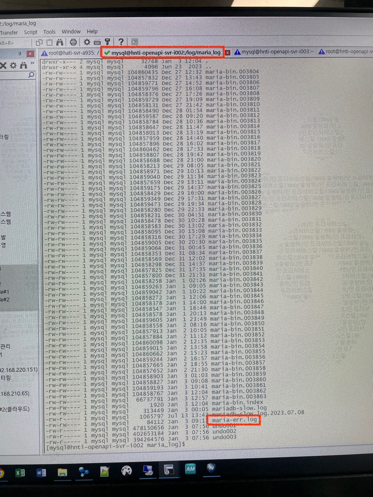
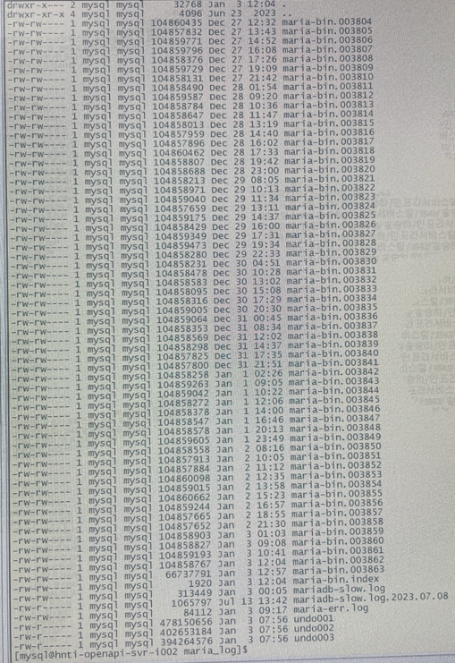
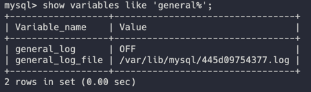
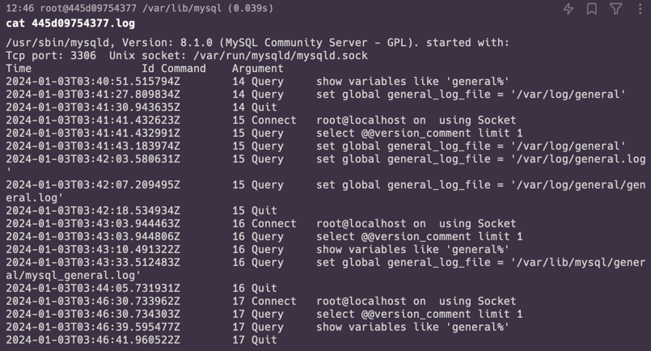
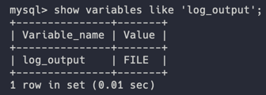
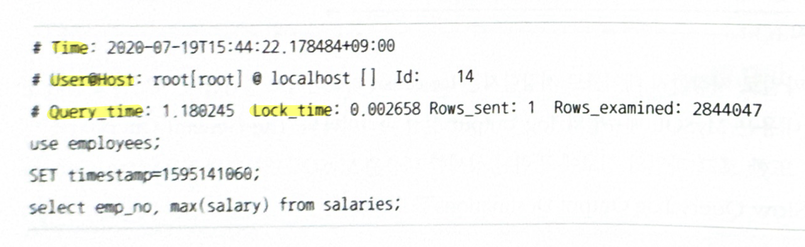

## MySQL 로그 파일

MySQL 서버에 문제가 생겼을 때, **로그 파일을 이용하면 문제의 원인을 쉽게 찾고 해결할 수 있다.** 
따라서 가급적 아래에 나올 로그 파일들을 통해 문제를 파악하려는 태도를 가지는 것이 중요하다.

로그 파일의 종류는 아래와 같다.

- 에러 로그
  - 서버가 시작되는 과정과 관련된 정보성 로그 및 에러 메시지
  - 서버가 비정상적으로 종료될 때 기록되는 InnoDB의 트랜잭션 복구 메시지
  - 쿼리 처리 도중 발생하는 문제에 대한 에러 메시지
  - 비정상적으로 종료된 Connection에 대한 Log
  - InnoDB의 모니터링 또는 상태 조회 명령의 결과 메시지
  - MySQL의 종료 메시지
- 제네럴 쿼리 로그
- 슬로우 쿼리 로그

## 1. 에러 로그 파일

서버가 실행되는 도중 발생하는 에러가 출력되어 기록되는 로그 파일이다.

`my.cnf`에서 `log_error` 파라미터에 정의된 경로로 설정된다. 
별도로 지정하지 않았으면 `datadir` 파라미터에 설정된 디렉터리에 `.err` 라는 확장자가 붙은 파일로 생성된다.

그런데 이 로그들이 어떻게 기록이 될까?

위 사진처럼 설정한 위치에 `.log` 파일들이 기록된다.

아래는 `error.log` 파일의 내용이다.

아래 설명될 로그들은 에러 로그에서 주로 보는 로그이다.

### 일별로 로그 저장하기

`log-error` 설정변수에 `"{로그가 저장될 디렉터리}/mysql-error-%Y-%m-%d.log"`로 값을 설정하자.

### 1.1 MySQL이 시작하는 과정과 관련된 정보성 및 에러 로그

설정 파일을 변경하거나 DB가 비정상적으로 종료된 이후 다시 시작하는 경우에, 반드시 MySQL 에러 로그 파일을 통해 변경이 제대로 적용됐는지 확인해야 한다.

만약 정상적으로 가동됐다면 `mysqld:ready for connection` 메시지를 확인할 수 있다.

### 1.2 서버가 비정상적으로 종료된 경우 나타나는 InnoDB의 트랜잭션 복구 메시지

InnoDB의 경우, MySQL이 비정상적으로 종료되면 완료되지 못한 트랜잭션을 정리하고 디스크에 기록되지 못한 데이터가 있다면 기록하는 작업을 진행한다.

이 과정에 대한 간단한 메시지가 출력되는데, 간혹 문제가 있어 복구되지 못할 때에는 에러 로그를 남기고 MySQL은 다시 종료된다.

### 1.3 쿼리 처리 도중 발생하는 문제에 대한 로그

쿼리 도중 발생하는 문제점은 사전 예방이 어려우며, 주기적으로 에러 로그 파일을 검토하는 과정에서 알게 된다.

**쿼리의 실행 도중 발생한 에러나 복제에서 문제가 될 만한 쿼리에 대한 경고 메시지가 에러 로그에 기록된다.**

### 1.4 비정상적으로 종료된 커넥션 메시지

클라이언트 애플리케이션에서 정상적으로 접속 종료를 하지 못하고 커넥션이 종료된 경우의 내용이 기록된다.

### 1.5 InnoDB의 모니터링 또는 상태 조회 명령어(`SHOW ENGINE INNODB STATUS`같은)의 결과 메시지

InnoDB의 테이블 모니터링이나 락 모니터링, 또는 엔진 상태를 조회하는 명령은 상대적으로 큰 메시지를 로그 파일에 기록한다.

엔진 모니터링을 활성화한 상태로 유지하는 경우 파일 시스템의 공간을 다 차지할 수도 있다.

따라서 모니터링을 사용한 이후에는 다시 비활성화해서 에러 로그 파일이 커지지 않게 만들어야 한다.

### 1.6 MySQL의 종료 메시지

누군가가 MySQL 서버를 종료시킨 경우 `Received SHUTDOWN from user ...`의 메시지를 확인할 수 있다.

그렇지 않고, 아무런 종료 관련 메시지가 없거나 스택 트레이스 같은 내용이 출력되는 경우에는 MySQL 서버가 세그멘테이션 폴트로 비정상 종료된 것으로 판단할 수 있다.

> 세그멘테이션 폴트 
> : 프로그램이 허용되지 않은 메모리 영역에 접근을 시도하거나, 허용되지 않은 방법으로 메모리 영역에 접근을 시도할 경우 발생한다. 

## 2. 제네럴 쿼리 로그 파일(제네럴 로그 파일, General Log)

- 실행 계획 분석을 하는 경우와 같이 사용되는 쿼리로 어떤 것들이 있는지 전체 목록을 뽑아서 검토하는 경우가 있다.
  > 스프링 애플리케이션 기준, 테스트 코드가 있다면 JPA가 뽑아주는 로그로도 추출하는 방법도 있다. 

  이 경우, 제네럴 쿼리 로그를 활성화해서 쿼리를 로그 파일로 기록하게 한 다음 해당 파일을 검토하면 된다.

- 시간 단위로 실행됐던 쿼리 내용이 모두 기록된다.

- 슬로우 쿼리 로그와는 달리 MySQL이 쿼리 요청을 받으면 실행되기 전에 바로 기록한다.

- `general_log_file` 이름의 파라미터에 설정돼 있다. 
  별도로 설정되지 않은 경우에는, 아래와 같이 확인할 수 있다.
   
  기본적으로 general_log 설정은 꺼져있다.
  

- 파일이 아닌 테이블로도 저장할 수 있다. 
  - `log_output` 파라미터로 설정할 수 있는데, default 값은 `FILE`이고 테이블에 저장하려면 `TABLE`로 설정하면 된다. 
     
  - 해당 설정은 슬로우 쿼리 로그와 같이 적용된다.
  - 옵션을 `TABLE`로 설정하더라도 mysql database의 *slow_log* 테이블과 *general_log* 테이블은 CSV 스토리지 엔진을 사용하기 때문에 결국 CSV 파일로 저장하는 것과 동일하게 작동한다.

더 자세한 내용은 [MySQL 공식문서](https://dev.mysql.com/doc/refman/8.0/en/query-log.html)를 참조하자

## 3. 슬로우 쿼리 로그

`long_query_time` 시스템 변수에 설정한 시간 이상의 시간이 소요된 쿼리가 모두 기록된다.

MySQL이 쿼리를 실행한 후, 실제 소요된 시간을 기준으로 기록하기 때문에 반드시 쿼리가 정상적으로 실행이 완료돼야 기록될 수 있다.

아래 사진은 슬로우 쿼리 로그의 일부이다.

여기서 중요하게 볼 것들을 설명해보겠다.

- Time
  - 쿼리가 종료된 시점
  
- Query_time
  - 쿼리가 실행되는 데 걸린 전체 시간

- Lock_time
  - 두 가지 레벨(MySQL 엔진 레벨, 스토리지 엔진 레벨)의 Lock 중 MySQL 엔진 레벨에서 관장하는 테이블 Lock에 대한 대기 시간만 표현
  - 값이 0이 아니라고 해서 무조건 Lock 대기가 있었다고 판단하기는 어렵다. 
    실제 쿼리가 실행되는 데 필요한 잠금 체키와 같은 코드 실행 부분의 시간까지 모두 포함되기 때문이다. 
    따라서 매우 작은 값이면 무시해도 된다.
  - InnoDB 스토리지 엔진은 스토리지 엔진 레벨의 Lock을 지원한다. 
    가끔 InnoDB 테이블에 대한 SELECT 쿼리의 경우에도 값이 상대적으로 큰 값이 발생할 수 있는데, 이는 InnoDB의 레코드 수준의 Lock이 아닌 MySQL 엔진 레벨에서 설장한 테이블 Lock 때문일 가능성이 높다. 따라서 InnoDB 테이블에만 접근하는 쿼리 문장의 슬로우 쿼리 로그에서는 Lock_time은 튜닝이나 쿼리 분석에 별로 도움이 되지 않는다.

- Rows_examined
  - 쿼리가 처리되기 위해 몇 건의 레코드에 접근했는지를 의미

- Rows_sent
  - 실제 몇 건의 처리 결과를 클라이언트에게 보냈는지를 의미
  - 일반적으로 Rows_examined 값은 높지만 Rows_sent 값이 적다면, 해당 쿼리는 더 적은 레코드만 접근하도록 튜닝할 가치가 있다. 