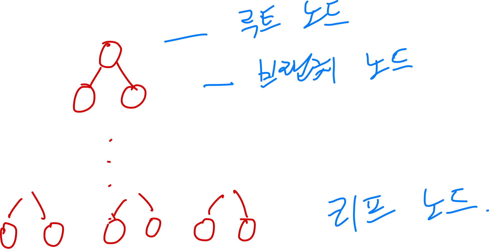
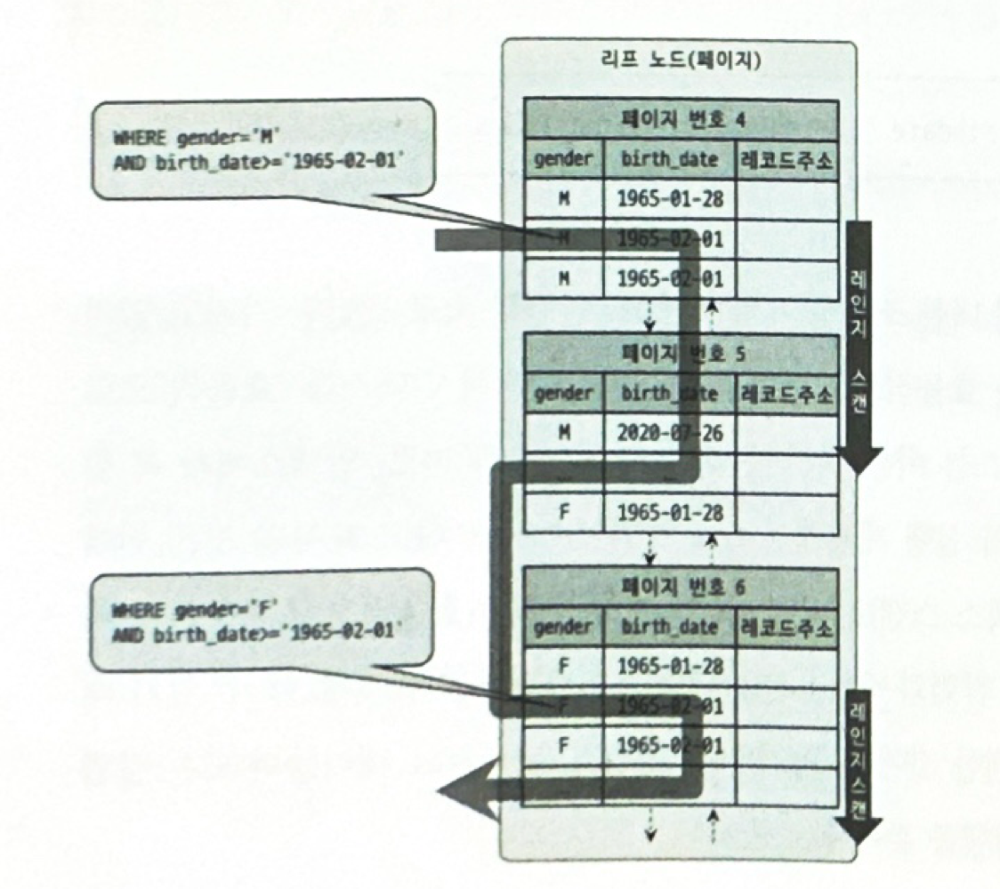
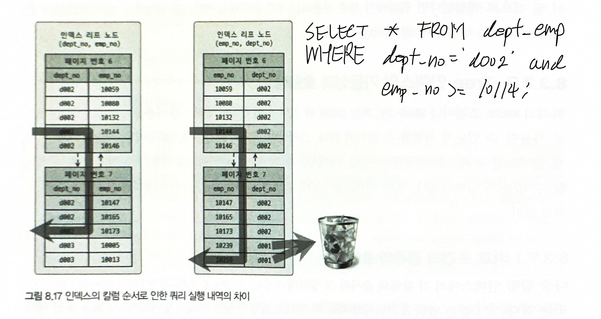

## B-Tree 인덱스

B-Tree 인덱스는 <u>데이터베이스의 인덱싱 알고리즘에서 가장 일반적으로 사용되는 알고리즘</u>이다.

가장 큰 특징은 <u>칼럼의 원래 값을 변형하지 않고</u> 인덱스 자료구조 내에서는 <u>항상 정렬된 상태로 값들을 저장</u>한다.

흔히 B-Tree를 Binary-Tree (이진 트리)로 생각한다. 하지만 Balanced-Tree의 약자로, Binary-Tree는 아니다.<br>
Balanced-Tree는 균형잡힌 트리로, 노드가 한 쪽 방향으로 치우치지 않고 왼쪽 위부터 차곡차곡 쌓인다고 생각하면 된다.

결국, <u>B-Tree 인덱스는 Balanced-Tree 자료구조를 이용한 인덱싱 알고리즘</u>이다.

> [Balacned Tree - Baeldung](https://www.baeldung.com/cs/balanced-trees)

### 1. B-Tree의 구조 및 특성

#### 구조 

B-Tree를 이해하기 위해 B-Tree의 구조에 대해 알아보자.



Tree의 구조를 기본적으로 가진다.

맨 위에는 1개의 `루트 노드`가 있다.<br>
맨 아래에는 여러 개의 `리프 노드`가 있다.<br>
루트 노드와 리프 노드 가운데는 `브랜치 노드`라고 한다.

데이터베이스에서 실제 데이터와 인덱스는 따로 관리되는데, <u>리프 노드는 항상 실제 데이터를 찾아가기 위한 주소값을 가진다.</u>

여기서 `Balanced` 라는 이름에 걸맞게 노드가 한 쪽으로만 치우치지 않는다.<br>
예를 들어 다음과 같은 형태이다.


#### 특성

가장 중요한 특성은 <u>노드들을 정렬된 상태로 저장한다는 것이다.</u><br>
이러한 특성 때문에 조회를 빠른 속도로 처리할 수 있게 된다.<br>
하지만 반대로 말해 인덱스에 값을 추가하거나 삭제하는 경우 정렬을 맞춰야하므로 오버헤드가 발생하게 된다.

그리고 또 하나의 중요한 특성은 <u>인덱스의 리프 노드는 실제 데이터의 PK 값을 가진다.</u><br>
인덱스를 통해 빠르게 원하는 값을 찾아도, 원하는 값이 없는 경우 실제 데이터를 조회해야 한다.<br>
이를 위해 실제 데이터의 주소값을 가져야하는데 기본키를 주소값으로 대신하여 사용하게 된다.

마지막으로 B-Tree의 중요한 특징은, <u>모든 세켄더리 인덱스 검색에서 데이터 레코드를 읽기 위해서는 반드시 PK 인덱스를 거쳐야 한다.</u><br>
이에 대한 자세한 내용은 8.8절에서 자세히 알아보자.

### 2. B-Tree 인덱스 CRUD: 인덱스 쓰기 작업과 조회 작업

위에서 언급했듯이 B-Tree는 값 쓰기 성능을 희생해서 조회 성능을 높인다.<br>
쓰기 성능이 어떤 이유에서 희생되는지 알아보자.

참고로 InnoDB에서는 B-Tree 쓰기 작업을 모두 `체인지 버퍼`를 활용해 지연처리 될 수 있다.<br>
이를 통해 다른 스토리지 엔진보다는 좋은 성능을 낳을 수 있다.

#### 인덱스 추가

새로운 키 값이 B-Tree에 저장될 때 즉시 저장될 수도 있고 아닐 수도 있다.
하지만 PK나 Unique Index의 경우 중복 체크가 필요하기 때문에 즉시 삽입하게 된다.<br>

저장될 때 값이 저장될 적절한 위치를 검색해야 한다. 위치가 결정되면 레코드의 PK 값과 레코드의 주소 정보를 B-Tree의 리프 노드에 저장한다.

만약 들어갈 위치가 없다면, `페이지`를 분리해서 들어갈 공간을 만들어야 한다.<br>
이러한 과정들이 포함되다보니 쓰기 작업은 오버헤드가 발생하게 되는 것이다.

#### 인덱스 삭제

삭제의 경우 추가보다 단순하다.<br>
B-Tree의 리프 노드를 찾아 그냥 삭제 마킹만 하면 끝이다.<br>
이렇게 마킹된 인덱스의 공간은 계속 방치되거나 재활용될 수 있다.<br>
하지만 마킹 작업 또한 디스크 쓰기가 필요하므로 오버헤드가 발생한다.

#### 인덱스 변경

단순히 값을 변경하지 않는다.<br>
인덱스 삭제가 먼저 이루어지고 인덱스 키 추가 작업이 이루어진다.<br>
때문에 가장 많은 오버헤드를 발생시키는 작업이 된다.

#### 인덱스 조회

B-Tree 인덱스를 조회하는 조건에 대해 알아보자.

우선 인덱스 조회는 `SELECT` 뿐만 아니라 `UPDATE`나 `DELETE`를 처리하기 위해 레코드를 검색하는 경우에도 사용된다.<br>
중요한 점은 <u>검색은 100% 일치하거나 값의 앞부분만 일치하는 경우에만 사용될 수 있다.</u><br>
다시 말해, <u>집계 함수나 연산을 수행한 결과로 검색하는 쿼리는 인덱스를 통해 조회가 이뤄지지 않는다.</u>

지금까지 B-Tree 인덱스의 CRUD에 대해 살펴봤다.<br>
기본적으로 조회 성능을 끌어올리기 위해 인덱스의 중요성을 많이 언급하지만, InnoDB 엔진의 경우 *레코드 락*이나 *넥스트 키 락*이 조회를 수행한 인덱스를 잠근 후 테이블의 레코드도 잠그는 방식으로 구현되어 있기 때문에 `UPDATE`나 `DELETE` 쿼리를 처리할 때도 적절한 인덱스가 없다면 상당한 성능 이슈를 야기할 수 있다.

### 3. B-Tree 인덱스 사용에 영향을 미치는 요소

그렇다면 이 B-Tree 인덱스를 어떤 기준을 가지고 설정하면 좋을까?<br>
여기에는 두 가지 기준이 있다.

#### 3-1. 인덱스 키 값의 크기

MySQL은 디스크에 데이터를 저장하는 가장 작은 기본 단위를 <u>페이지</u>라고 한다.<br>
이 페이지는 InnoDB 버퍼 풀에도 적용되며 <u>모든 작업의 최소 단위</u>가 된다.
인덱스도 결국 이 페이지 단위로 관리된다.<br>
참고로 default 값은 16KB이다.

그렇다면 인덱스 키 값의 크기가 이와 무슨 관련이 있을까?<br>
조금만 생각해보면 쉽게 알아차릴 수 있다.

인덱스 키 값이 크기가 늘어나면, 하나의 페이지에서 저장할 수 있는 인덱스는 줄어든다.<br>
하나의 페이지에서 저장할 수 있는 인덱스가 줄어들면, 그만큼 페이지를 더 많이 만들어야 한다.<br>
페이지가 늘어날 수록 한 페이지에서 조회할 수 있는 레코드의 수가 적으므로 더 많은 페이지를 뒤져야 한다.

결국, <u>인덱스 키 값의 크기가 작을 수록 인덱스를 이용한 조회 성능이 향상된다.</u>

#### 3-2. Cardinality

또 다른 기준으로 *Cardinality*가 있다.<br>
<u>Cardinality는 하나의 칼럼을 기준으로 유니크한 값의 수</u>를 의미한다.

결론부터 말하자면 Cardinality가 높은, 즉 중복도가 낮은 칼럼을 인덱스로 설정하는 것이 좋다.

중복도가 높은 칼럼을 인덱스로 설정했다면 그만큼의 값을 다 찾아야 한다.<br>
만약 1000개의 값이 중복되었고 그 중 한 개의 레코드를 조회하는 쿼리라면, 인덱스를 이용할 때 999개의 레코드에 Lock이 걸리고 결과적으론 1개의 레코드만 반환될 것이다.

그렇지만 Cardinality가 낮다고 해도 <u>정렬이나 그룹핑과 같은 작업을 위해 인덱스를 만드는 경우가 훨씬 나은 경우도 많다.</u>

### 4. B-Tree 인덱스를 통한 데이터 읽기

B-Tree 인덱스를 이용해 데이터를 조회하는 대표적인 세 가지 방식에 대해 알아보자.

#### 4-1. 인덱스 레인지 스캔

인덱스 접근 방식 중 대표적인 방식이다.<br>
뒤에 나올 두 가지 접근 방식 (인덱스 풀 스캔, 루스 인덱스 스캔) 보다 빠른 방식이다.<br>
실행 계획을 봤는데 인덱스 레인지 스캔이 나온다면 잘 사용하고 있다고 이해하면 된다.

인덱스 레인지 스캔은 <u>검색해야 할 인덱스의 범위가 결정됐을 때 사용하는 방식이다.</u><br>
기본적으로 값이 크기 순으로 정렬되어 있는 B-Tree에서, 찾고자 하는 값의 범위를 지정해 순차대로 조회하는 단순한 방식이다.

하지만 간과하기 쉬운 부분이 있다.<br>
인덱스에서는 단순하고 빠르게 조회를 하더라도 각 인덱스 레코드를 통해 실제 디스크에 저장된 레코드에 접근하는 것은 랜덤 디스크 I/O 작업이라는 것이다.<br>
그래서 옵티마이저가 적절히 판단해서 선택하게 된다.

```sql
mysql> SHOW STATUS LIKE 'Handler_%';
```
위 쿼리를 통해 인덱스 레인지 스캔이 얼만큼 수행됐는지 확인할 수 있다.<br>
자세한 내용은 [링크](https://www.manty.co.kr/bbs/detail/develop?id=100) 참고

#### 4-2. 인덱스 풀 스캔

인덱스 레인지 스캔과 마찬가지로 인덱스를 사용하지만 <u>인덱스의 처음부터 끝까지 모두 읽는 방식이다.</u><br>
대표적으로 <u><쿼리의 조건절에 사용된 칼럼이 인덱스의 첫 번째 칼럼이 아닌 경우 사용</u>된다.<br>
예를 들어 인덱스는 `(A, B, C)` 칼럼 순으로 만들어져있지만 `WHERE` 절에서 `B` 칼럼이나 `C` 칼럼으로 검색하는 경우다.

"이럴바엔 테이블 풀 스캔이 낫지 않나요?" 할 수 있지만 일반적으로 인덱스의 크기는 테이블 크기보다 작으므로 상대적으로 효율적이다.<br>
다만 <u>쿼리가 인덱스에 명시된 칼럼만으로 조건을 처리할 수 있는 경우 사용된다.</u> (커버링 인덱스)

그다지 효율적인 방식은 아니며, <u>일반적으로 인덱스를 잘 활용하지 못하는 경우다.</u>

#### 4-3. 루스 인덱스 스캔

루스 인덱스 스캔은 인덱스 레인지 스캔과 비슷하게 작동한다. 하지만 중간에 필요없는 인덱스는 무시하고 다음으로 넘어가는 형태를 취한다.<br>
일반적으로 <u>`GROUP BY` 또는 집계 함수 중, `MAX()` 또는 `MIN()` 함수에 대해 최적화하는 경우 사용된다.</u><br>
해당 방식을 사용하려면 여러 조건을 만족해야 하는데, 이는 10장 실행 계획에서 자세히 알아보자.

#### 4-5. 인덱스 스킵 스캔

해당 방식은 인덱스 풀 스캔 방식을 개선하기 위해 등장했다.<br>
만약 인덱스가 `(A, B)` 순으로 생성되었지만 조건절에 `(B)`를 통해 조회하는 경우, 우선 A에서 <u>유니크한 값들을 모두 조회해서 주어진 조건에 조회한 칼럼을 추가해서 쿼리를 다시 실행하는 형태로 동작한다.</u><br>



하지만 조회 비용과 관련해 다음과 같은 전제 조건이 필요하다.
- WHERE 절에 조건이 없는 인덱스의 선행 칼럼의 유니크한 값의 개수가 적어야 한다.
- 쿼리가 인덱스에 존재하는 칼럼만으로 처리 가능하다. (커버링 인덱스)

### 5. B-Tree 인덱스의 정렬 및 스캔 방향

인덱스의 키 값을 정렬하고 스캔하는 방향에 대한 내용이다.<br>
정렬은 내림차순, 오름차순 모두 가능하며 스캔 또한 정순과 역순 모두 가능하다.<br>

각 쿼리에 따라 내림차순이냐 오름차순이냐가 성능에 영향을 미칠 수 있다.<br>

중요한 점은 <u>인덱스 역순 스캔이 인덱스 정순 스캔에 비해 느리다는 것이다.</u>

### 6. B-Tree 인덱스의 가용성과 효율성

쿼리의 `WHERE` 절이나 `GROUP BY` 또는 `ORDER BY` 절이 어떤 경우에 인덱스를 사용하며 어떤 방식으로 조회하는지 식별할 수 있어야 한다.<br>
이번에는 이에 대해 알아보자.

#### 6-1. 비교 조건의 종류와 효율성

다중 칼럼 인덱스에서 각 <u>칼럼의 순서와 그 칼럼에 적용된 조건이 동등 비교인지 아니면 대소 비교 같은 범위 조건인지에 따라 인덱스 활용 형태가 달라진다.</u>



여기서 눈여겨 볼 것은 dept_no는 `=` 검색이고 emp_no는 `>=` 비교이다.<br>
이때 인덱스 칼럼의 순서가 `(dept_no, emp_no)` 이냐 `(emp_no, dept_no)`에 따라 인덱스를 조회하는 방식이 달라진다.

범위 조건 비교 (`>=`) 보다 동등 조건 비교 (`=`)가 값을 조회하기엔 더 최적화된 조건이므로, dept_no 칼럼이 선행된 인덱스의 경우 더 효율적으로 조회할 수 있는 것이다.

#### 6-2. 인덱스의 가용성

만약 인덱스 칼럼의 순서가 `(dept_no, emp_no)`인 인덱스에 `WHERE` 절에 `emp_no`만 있는 쿼리를 날린다면, 인덱스 칼럼의 선행 조건인 `dept_no`를 이용하지 못하므로 인덱스를 효율적으로 사용할 수 없다.

#### 6-3. 가용성과 효율성 판단

B-Tree 인덱스는 특성상 다음 조건에서는 사용할 수 없다. (필터링 작업을 통해 사용하는 경우는 있다.)

- Not Equal로 비교된 경우
- `LIKE '%??'` 처럼 <u>앞부분이 잘린 형태로 검색하는 경우</u>
- 스토어드 함수나 다른 연산자로 인덱스 칼럼이 변형된 경우
- NOT-DETERMINISTIC 속성의 스토어드 함수가 비교 조건에 사용된 경우
- 데이터 타입이 서로 다른 비교를 하는 경우 (인덱스 칼럼의 타입을 변환해야 하므로 X)
- 문자열 데이터 타입의 콜레이션이 다른 경우