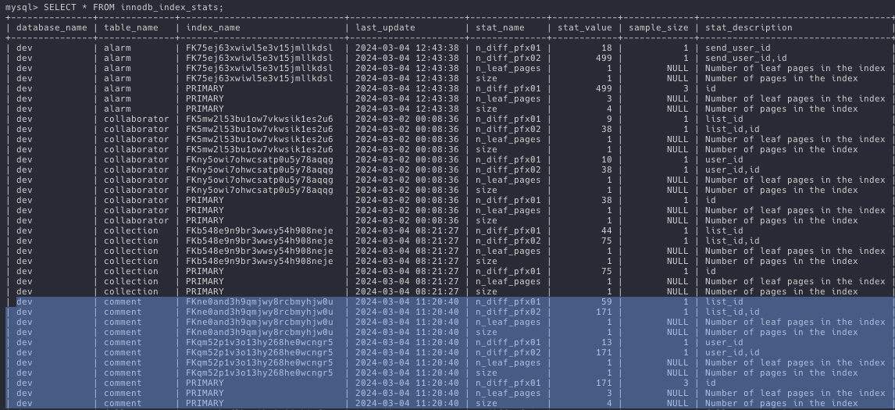
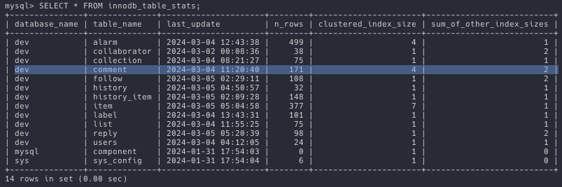
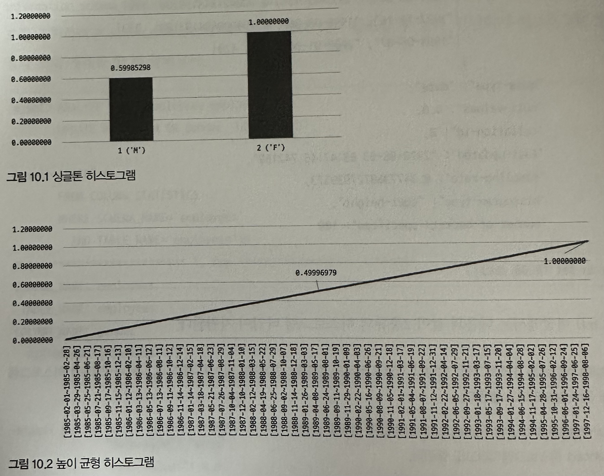
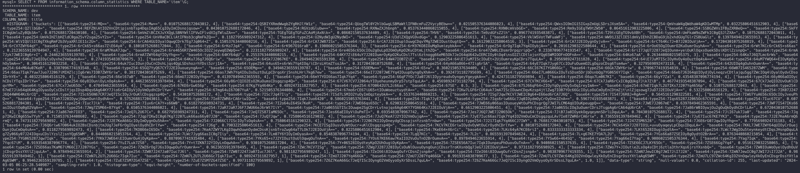
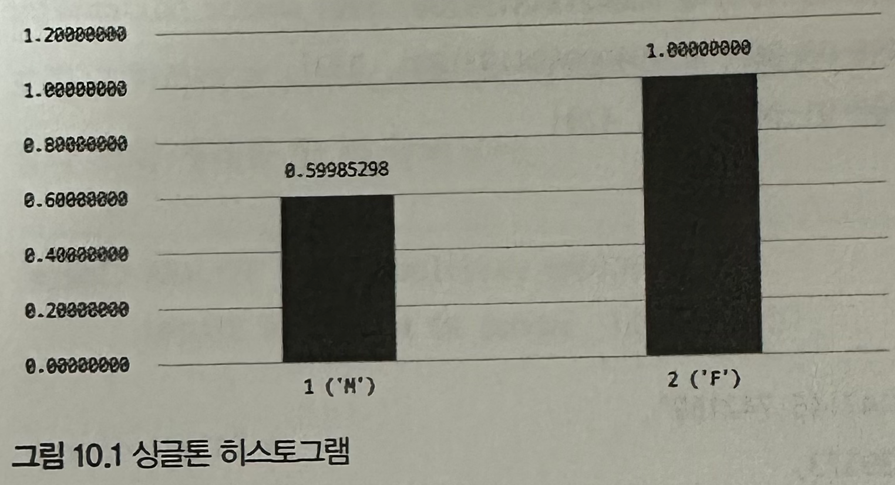
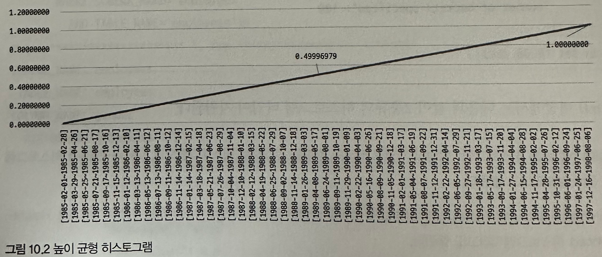

## 들어가며

MySQL에서 쿼리가 실행되는 과정 중에, 주어진 쿼리를 효율적으로 실행하기 위해 어떻게 실행할 지 계획을 짜는 과정이 포함된다.<br>
이 과정을 **옵티마이저**가 수행한다. 하지만 옵티마이저는 만능이 아니다.

개발자가 의도하는 대로 옵티마이저가 계획을 잘 수립했는지 확인하기 위해서는 `EXPLAIN` 명령어를 통해 현재의 실행 계획을 확인할 수 있다.

따라서 이번 장에서는 MySQL 서버의 실행 계획에 가장 큰 영향을 미치는 통계 정보에 대해 간략히 살펴보고 실행 계획을 읽는 순서와 출력되는 키워드, 그리고 알고리즘에 대해 살펴보자.

## 통계 정보

MySQL에서 통계 정보는, 다음과 같은 내용들이 포함된다.

- 테이블 크기 및 인덱스 통계
  - 각 테이블의 레코드 수, 데이터 크기, 인덱스 크기와 같은 정보

- 쿼리 실행 통계
  - 쿼리 실행 시간, 횟수, 사용된 인덱스, 스캔 횟수 등과 같은 정보

- 인덱스 효율성
  - 각 인덱스의 사용률, 중복 키 수, 인덱스 히트 등과 같은 정보

- 잠금 및 워터마크 통계
  - 발생한 락의 수, 워터마크 정보 (공간 사용량) 과 같은 정보

전반적으로 테이블, 인덱스, 쿼리와 관련되어 수치화할 수 있는 정보들이 통계 정보에 포함된다.

MySQL 5.7 버전 전까지는 개괄적인 정보를 가지고 실행 계획을 수립했다. 이로 인해 실행 계획의 정확도가 떨어지는 경우가 많았다.<br>
MySQL 8.0 버전부터는 **인덱스되지 않은 칼럼들에 대해서 데이터 분포도를 수집해서 저장하는 히스토그램 정보**가 도입됐다.

이 히스토그램 정보는 다시 언급하지만 **인덱스되지 않은 칼럼들에 대해 데이터 분포도를 수집해 저장하는 정보이다.**<br>

> 데이터 분포도란, 특정 칼럼에 어떤 데이터 값이 얼만큼 존재하는 지에 대한 정보이다.<br>
> 즉, **히스토그램 정보란 인덱스되지 않은 칼럼에 어떤 값들이 얼만큼 존재하는지에 대한 정보**이다.

따라서, 기존의 **테이블이나 인덱스의 통계 정보와 다른 정보로 봐야한다.**

### 테이블 및 인덱스 통계 정보

Cost 기반 최적화에서 가장 중요한 것이 **통계 정보**이다.<br>
만약 1억 건의 레코드가 저장된 테이블의 통계 정보가 갱신되지 않아 레코드가 10건 미만인 것처럼 돼 있다면 옵티마이저는 Table Full Scan을 실행할 것이다.

#### MySQL 5.6 버전부터

MySQL 5.5 버전 전까지는 각 테이블의 통계 정보가 메모리에만 관리되었고 `SHOW INDEX` 명령으로만 테이블의 인덱스 칼럼의 분포도를 볼 수 있었다. 중요한 점은 통계 정보가 메모리에서만 관리되었기에 서버 재부팅 시에는 그동안 수집했던 통계 정보가 모두 날라가게 되는 문제가 있었다.

이러한 문제를 해결하기 위해 5.6 버전 부터는 통계 정보를 영구적으로 관리할 수 있도록 개선되었다.

#### 통계 정보를 영구적으로 관리하도록 설정하는 방법

설정 방법은 테이블을 생성할 때 `STATS_PERSISTENT` 옵션을 설정하여 설정할 수 있다.<br>
```sql
# 예시 쿼리
CREATE TABLE users (
    id BIGINT PRIMARY KEY AUTO_INCREMENT,
    name VARCHAR(50)
) STATS_PERSISTENT={ 0 | 1 | DEFAULT };
```

- STATS_PERSISTENT = 0
  - 테이블의 통계 정보를 5.5 버전 이전 방식대로 관리한다. (인메모리 방식)

- STATS_PERSISTENT = 1
  - 테이블의 통계 정보를 mysql 데이터베이스의 innodb_index_stats 테이블과 innodb_table_stats 테이블에 저장한다.

- STATS_PERSISTENT = DEFAULT
  - `STATS_PERSISTENT` 옵션을 설정하지 않은 것과 동일하다.
  - 테이블의 통계 정보를 영구적으로 관리할 것인지에 대한 결정은 `innodb_stats_persistente` 시스템 변수에 따라 결정된다.
  - `innodb_stats_persistetce` 시스템 변수의 default 값은 ON이다. 결국, 모든 설정의 default 값은 테이블의 통계 정보를 영구적으로 관리하게 된다.

`ALTER TABLE users STATS_PERSISTENT=?` 명령어로 이미 만들어진 테이블에 설정을 변경할 수 있다.

#### 통계 정보를 확인하는 방법

그리고 `SELECT * FROM innodb_index_stats;` 명령어로 인덱스 통계 정보를 확인할 수 있고 `SELECT * FROM innodb_table_stats` 명령어로 테이블 통계 정보를 확인할 수 있다.



- stat_name 칼럼
  - n_diff_pfx%: 해당 인덱스가 가지는 유니크한 값의 수
    - `comment` 테이블의 `n_diff_pfx01`: list_id 칼럼의 외래키 인덱스가 가지는 유니크한 값의 수
  - n_leaf_pages: 인덱스의 리프 노드 페이지 수
    - `comment` 테이블의 `n_leaf_pages`: list_id 칼럼의 외래키 인덱스가 가지는 리프 노드 페이지의 수
  - size: 인덱스 트리의 전체 페이지 수
    - `comment` 테이블의 `size`: list_id 칼럼의 외래키 인덱스가 가지는 전체 페이지의 수



- n_rows: 테이블의 전체 레코드 수
- clustered_index_size: 프라이머리 키의 크기 (InnoDB 페이지 개수)
  - == `innodb_index_stats`에서 `comment` 테이블의 `PRIMARY` 인덱스에서 `size`랑 동일한 값이다.
- sum_of_other_index_sizes: 프라이머리 키를 제외한 인덱스의 크기 (InnoDB 페이지 개수)
  - == `PRIMARY` 인덱스를 제외한 인덱스의 전체 페이지 수
  - 테이블의 `STATS_AUTO_RECALC` 옵션에 따라 0으로 보일 수 있다. 이때는 `ANALYZE TABLE {database}.{table};` 명령어로 통계값을 재계산하면 된다.

#### 통계 정보를 자동으로 갱신하거나 끄거나

`innodb_stats_auto_recalc` 시스템 변수를 ON 혹은 OFF로 설정함에 따라 통계 정보를 자동으로 갱신하거나 끌 수 있다.<br>
default 값은 ON으로 설정되어 있다.

테이블에 따라 통계 정보를 자동으로 수집할 지 여부를 설정할 수 있다.

- STATS_AUTO_RECALC=0: `ANALYZE TABLE` 명령으로만 갱신한다. 즉, 수동으로 갱신한다.
- STATS_AUTO_RECALC=1: 자동 수집한다.
- STATS_AUTO_RECALC=DEFAULT: 따로 STATS_AUTO_RECALC 옵션을 설정하지 않은 것과 같다. `innodb_stats_auto_recalc` 시스템 변수 값에 따라 결정된다.

이 통계 정보를 수집하거나 갱신할 때 얼마만큼의 데이터 샘플을 가져올 것인지를 정하는 옵션도 존재한다.

- `innodb_stats_trasient_sample_pages`
  - default 값은 8이다.
  - **자동으로** 통계 정보 수집이 실행될 때 8개 페이지만 임의로 샘플링해서 분석하고 그 결과를 통계 정보로 활용한다.

- `innodb_stats_persistent_sample_pages`
  - default 값은 20이다.
  - **ANALYZE TABLE** 명령을 통해 수동으로 통계 정보 수집이 실행될 때 20개의 페이지만 임의로 샘플링하여 분석하고 그 결과를 영구적인 통계 정보 테이블에 저장하고 활용한다.

만약, 영구적인 통계 정보를 사용하고 있다면 `innodb_stats_persistent_sample_pages` 값을 높게 설정하여 MySQL 서버의 점검이나 사용량이 많지 않은 시간대를 활용해 더 정확한 통계 정보를 수집할 수 있다.<br>
하지만 물론 그만큼 더 많은 시간이 소요된다.

### 히스토그램

MySQL에서 **히스토그램 정보란 인덱스되지 않은 칼럼에 어떤 값들이 얼만큼 존재하는지에 대한 정보**다.

아래 그림은 히스토그램 정보 이해를 돕는 예시 사진이다.



#### 히스토그램 정보 수집하기

MySQL 8.0 버전부터 히스토그램 정보는 **칼럼 단위로 관리된다.**<br>
이는 자동으로 수집하진 않고 `ANALYZE TABLE ... UPDATE HISTOGRAM` 명령을 통해 수동으로 수집 및 관리할 수 있다.

수집한 히스토그램 정보는 시스템 딕셔너리에 함께 저장되고 MySQL 서버가 시작될 때 딕셔너리에 저장된 히스토그램 정보를 `information_schema` 데이터베이스의 `column_statistics` 테이블로 로드한다.<br>
따라서 실제 수집된 히스토그램 정보는 `information_schema.column_statistics` 테이블을 SELECT해서 조회할 수 있다.

실제로 히스토그램 정보를 수집하고 결과를 조회해보자.<br>
~~조회 결과는 우리가 봤을 땐 유용하지 않아보인다.~~



<details>
  <summary>조회 결과 이쁘게 보기</summary>

```text
SCHEMA_NAME: dev
 TABLE_NAME: item
COLUMN_NAME: title
  HISTOGRAM: {
  "buckets": [
    [
      "base64:type254:MQ==",
      "base64:type254:Mw==",
      0.010752688172043012,
      4
    ],
    [
      "base64:type254:QSBIYXRmdWwgb2YgRHJlYW1z",
      "base64:type254:QUogTWl0Y2hlbGwgLSBMaWtlIFN0cmFuZ2VycyBEbw==",
      0.021505376344086023,
      4
    ],
    [
      "base64:type254:QWxsIG9mIG15IGxpZmUgLSDrsJXsm5A=",
      "base64:type254:QmVnaW4gQWdhaW4gKDIwMTMp",
      0.03225806451612903,
      4
    ],
    [
      "base64:type254:Q2llbG8=",
      "base64:type254:REFZNiAtIO2VnCDtjpjsnbTsp4DqsIAg65CgIOyImCDsnojqsow=",
      0.043010752688172046,
      4
    ],
    [
      "base64:type254:RGVzdGlubw==",
      "base64:type254:RXNwZXJhbnph",
      0.053763440860215055,
      4
    ],
    [
      "base64:type254:RXN0cmVsbGE=",
      "base64:type254:Rm9yIGEgTW9tZW50",
      0.06451612903225806,
      4
    ],
    [
      "base64:type254:SSBGZWVsIFByZXR0eQ==",
      "base64:type254:SkFYIC0gUmluZyBQb3A=",
      0.07526881720430108,
      4
    ],
    [
      "base64:type254:SmVmZiBCZXJuYXQgLSBNYWtlIFVwIFlvdXIgTWluZA==",
      "base64:type254:TGEgTGEgTGFuZCAoMjAxNik=",
      0.08602150537634409,
      4
    ],
    [
      "base64:type254:THV6",
      "base64:type254:Tm9zdGFsZ2lh",
      0.0967741935483871,
      4
    ],
    [
      "base64:type254:T29tcGEgTG9vbXBh",
      "base64:type254:UmFkaW9oZWFkIC0gQ3JlZXA=",
      0.10752688172043011,
      4
    ],
    [
      "base64:type254:UmVkIHZlbHZldC0ga25vY2sga25vY2s=",
      "base64:type254:UnV0aCBCLiAtIFNsb3cgRmFkZQ==",
      0.11827956989247312,
      4
    ],
    [
      "base64:type254:U2NydWIgU2NydWI=",
      "base64:type254:U3dlZXQgVG9vdGg=",
      0.12903225806451613,
      4
    ],
    [
      "base64:type254:VklWSVotTWFuaWFj",
      "base64:type254:WW91J3ZlIE5ldmVyIEhhZCBDaG9jb2xhdGUgTGlrZSBUaGlz",
      0.13978494623655913,
      4
    ],
    [
      "base64:type254:WlVIQUlSIC0gTXkgRmF2b3VyaXRlIE11c2U=",
      "base64:type254:6rCA64GUIOyalOqwgCDrk7Eg7Jq064+Z",
      0.15053763440860216,
      4
    ],
    [
      "base64:type254:6rCA7JW87ISx",
      "base64:type254:6rCA7J2EIOuplOuwgCDqvYMg7ZWEIOustOugtQ==",
      0.16129032258064516,
      3
    ],
    [
      "base64:type254:6rCA7J2EIOygnOyjvA==",
      "base64:type254:6rCT64Kc7J+B7J20IOuVjA==",
      0.17204301075268819,
      4
    ],
    [
      "base64:type254:6rCV7ZWY64qY",
      "base64:type254:6rCk65+s66as7ZiE64yA",
      0.18010752688172044,
      3
    ],
    [
      "base64:type254:6rKo7Jq4",
      "base64:type254:6rK967O16raB",
      0.19086021505376344,
      3
    ],
    [
      "base64:type254:6rK97KO8IOuMgOumieybkA==",
      "base64:type254:6rOg7Iqk7Yq4IOybjA==",
      0.20161290322580644,
      4
    ],
    [
      "base64:type254:6rOo65OgIOumrO2KuOumrOuyhA==",
      "base64:type254:6rWt7KCc6rCk65+s66as",
      0.21236559139784947,
      4
    ],
    [
      "base64:type254:6raM7KeA7Jqw",
      "base64:type254:6re4656R7ZW465OcIO2ZjeywqO2WpQ==",
      0.22311827956989247,
      4
    ],
    [
      "base64:type254:6re4656c65OcIOu2gOuLpO2OmOyKpO2KuCDtmLjthZQ=",
      "base64:type254:6re47ZW0LCDsmrDrpqzripQ=",
      0.23387096774193547,
      4
    ],
    [
      "base64:type254:6riI7JqU7J287JeQIOunm+yeiOuKlOqxsOuekSDsiKDtlZzsnpQ=",
      "base64:type254:6rmA7Jyk7JWEIC0g6r+I",
      0.2446236559139785,
      4
    ],
    [
      "base64:type254:6rmA7ZWY64qYIOyYhg==",
      "base64:type254:64KY64qU",
      0.2553763440860215,
      4
    ],
    [
      "base64:type254:64KY7ZiE64uY7J20IOumrOyKpO2KuCDsl7Tsi6ztnogg66eM65Ok7JeI64qU642wIERCIOy0iOq4\nsO2ZlCDtlojsnYQg65WMIOOFnOOFnA==",
      "base64:type254:64Ko67aA",
      0.26344086021505375,
      3
    ],
    [
      "base64:type254:64Ko7J6Q7Lmc6rWs",
      "base64:type254:64Ku7JeQIOyCsOyxhe2VmOq4sA==",
      0.27419354838709675,
      3
    ],
    [
      "base64:type254:64Ku7J6g7J6Q6riw",
      "base64:type254:64Sk7J2067KE",
      0.2849462365591398,
      4
    ],
    [
      "base64:type254:64W47IOB7ZiE",
      "base64:type254:64iE7JuM7IScIOuEt+2UjOumreyKpCDrs7TquLA=",
      0.2956989247311828,
      4
    ],
    [
      "base64:type254:64iE7JuM7IScIOyHvOy4oOuztOq4sA==",
      "base64:type254:64uM7YWQ64+EIOyKpOychOy5mA==",
      0.3064516129032258,
      4
    ],
    [
      "base64:type254:64uk7IucIOunjOuCnCDshLjqs4QgLSDshozrhYDsi5zrjIA=",
      "base64:type254:64us65+s6rWs7Yq4IOq/iCDrsLHtmZTsoJA=",
      0.3172043010752688,
      4
    ],
    [
      "base64:type254:64yA66a866+47Iig6rSA",
      "base64:type254:64yE7Iqk7Jyg67CcIOuFuOuemO2LgOqzoCDsg6Tsm4w=",
      0.3279569892473118,
      4
    ],
    [
      "base64:type254:642UIOq4gOuhnOumrA==",
      "base64:type254:64+M64u07KeR",
      0.3387096774193548,
      4
    ],
    [
      "base64:type254:65GQ7YyQ67CY7J2EIOuoueyngA==",
      "base64:type254:65OEMg==",
      0.34946236559139787,
      4
    ],
    [
      "base64:type254:65OEMw==",
      "base64:type254:65+w",
      0.3602150537634409,
      4
    ],
    [
      "base64:type254:66CI67KI7YG066Gc",
      "base64:type254:66Gk7ZWY6riw",
      0.3709677419354839,
      4
    ],
    [
      "base64:type254:66W07IS465287ZWM",
      "base64:type254:66as7Iqk7Yuw7Juo7J2067iMIHZlcjIg6rWs7IOB7ZWY6riw",
      0.3817204301075269,
      4
    ],
    [
      "base64:type254:66as7JWh7Yq4IOu3sOuztOuLpCDrqoXrj5nshLHri7kg67ew",
      "base64:type254:66eI7J207JWE7Yq4IOuupOyngOyXhA==",
      0.3924731182795699,
      4
    ],
    [
      "base64:type254:66eI7Lm066GxIOuTsSDsm5DrjbDsnbQg7YG0656Y7Iqk",
      "base64:type254:66eb7J6I64qUIOydjOyLneqzvCDtlajqu5gg7ZWcIOq4iOyalOydvCDsoIDrhYE=",
      0.4032258064516129,
      4
    ],
    [
      "base64:type254:66el67aB",
      "base64:type254:66mU7J20IOyYhg==",
      0.41397849462365593,
      4
    ],
    [
      "base64:type254:66mY7YOI66as7Iqk7Yq4",
      "base64:type254:66qF7YOc7Ja07J6lIOyyreudvOyngeyYgeygkA==",
      0.42473118279569894,
      4
    ],
    [
      "base64:type254:66qo7Lm067KI",
      "base64:type254:66yY7Zal",
      0.43548387096774194,
      4
    ],
    [
      "base64:type254:66y066aOIOychCDslYTqsIDrlYw=",
      "base64:type254:66y8IOuniOyLnOq4sA==",
      0.44623655913978494,
      4
    ],
    [
      "base64:type254:66y86rCQIO2EsO2KuOumsCDsgqzsp4Q=",
      "base64:type254:67CV67CV7J2064uYIOyeheunmyDrp57stpTquLA=",
      0.45698924731182794,
      4
    ],
    [
      "base64:type254:67CV7KCV66+8",
      "base64:type254:67Ck7JaR6rCxIC0gQUkg7Jik7ZiB",
      0.46774193548387094,
      4
    ],
    [
      "base64:type254:67Ck7JeQIO2UvOuKlCDqvYM=",
      "base64:type254:67Cx7JeU65Oc",
      0.478494623655914,
      4
    ],
    [
      "base64:type254:67KE6rGw656p",
      "base64:type254:67Kg7Yq464Ko",
      0.489247311827957,
      4
    ],
    [
      "base64:type254:67O0642U7L2c66as",
      "base64:type254:67SE",
      0.5,
      3
    ],
    [
      "base64:type254:67SJ66qF64+ZIOyYqOyynOy5vOq1reyImA==",
      "base64:type254:67mE7Iqk7L2U7IKs7J207Yq4656p",
      0.510752688172043,
      4
    ],
    [
      "base64:type254:67mE7Jik64qU64KgIOyasOyCsCDslYjqsIDsp4Dqs6Ag64KY7Jio6rG4IOyVjOyVmOydhCDrlYw=",
      "base64:type254:67mg64uI67O07YuA",
      0.521505376344086,
      4
    ],
    [
      "base64:type254:67mo6rCE67iU65+tIOuWoeuztuydtA==",
      "base64:type254:7IKw7LGF6rCU64uk7JmA7IScIOuwnCDqvKzsp4jtlZwg7IOB7YOc66GcIOyLoOuCmOyEnCDtmZjt\nlZjqsowg7JuD7J2EIOuVjA==",
      0.532258064516129,
      4
    ],
    [
      "base64:type254:7IK07J247J6Q44WH64Kc6rCQ",
      "base64:type254:7ISc656N67CR7JeQ7IScIOyJrOuKlCDsgqzsp4Q=",
      0.543010752688172,
      4
    ],
    [
      "base64:type254:7ISc7Jq47Iiy",
      "base64:type254:7ISd7LSMIO2YuOyImOqzteybkA==",
      0.553763440860215,
      4
    ],
    [
      "base64:type254:7ISg7Jqw7KCV7JWEIC0g64+E66ed6rCA7J6Q",
      "base64:type254:7IS47J6R8J+RgA==",
      0.5645161290322581,
      4
    ],
    [
      "base64:type254:7IWU7YuA656c65OcIOyJveuPhQ==",
      "base64:type254:7Iah7J20IOywjOqwnOuniOydhA==",
      0.5752688172043011,
      4
    ],
    [
      "base64:type254:7Ie87ZWR6rCA6riwIQ==",
      "base64:type254:7Iqk7Juo6420",
      0.5860215053763441,
      4
    ],
    [
      "base64:type254:7Iqk7JyE7Iqk",
      "base64:type254:7Iqs6riw66Gc7Jq0IOydmOyCrOyDne2ZnA==",
      0.5967741935483871,
      4
    ],
    [
      "base64:type254:7Iqs65287J2065Oc67CV7Iqk",
      "base64:type254:7Iuc67CU",
      0.6075268817204301,
      4
    ],
    [
      "base64:type254:7Iuc7Jik",
      "base64:type254:7Iux6rCA7Y+s66W0",
      0.6182795698924731,
      4
    ],
    [
      "base64:type254:7I2o64uI64Sk7KeR",
      "base64:type254:7JWE66qs65Oc",
      0.6290322580645161,
      4
    ],
    [
      "base64:type254:7JWE66y066asIOuoueyWtOuPhCDsgrQg7JWI7LCM64qUIOuKpeugpQ==",
      "base64:type254:7JWE7J2067mE",
      0.6397849462365591,
      4
    ],
    [
      "base64:type254:7JWF7IS47IKs66asIOuztOq0gO2VqA==",
      "base64:type254:7JWg7ZSM66+87Yq4",
      0.6505376344086021,
      4
    ],
    [
      "base64:type254:7JaR7JaR7J6F7JWU66eJ6rWt7IiY",
      "base64:type254:7Ja065SU7IScIOuwpe2SgCDrrLvtnojqs6Ag64KY7YOA64Ks7J2EIOuVjA==",
      0.6612903225806451,
      4
    ],
    [
      "base64:type254:7Ja065ScIOq3uOumrCDrsJTsgpAg6rCA64qU6rCA",
      "base64:type254:7Ja86rW0IOywjOu2gOuQkOydhCDrlLA=",
      0.6720430107526881,
      4
    ],
    [
      "base64:type254:7Ja867mh7IO3",
      "base64:type254:7JeQ7L2U67Cx",
      0.6827956989247311,
      4
    ],
    [
      "base64:type254:7JeQ7ZS87IaM65Oc",
      "base64:type254:7Jes66aEIOyViOuPmTI=",
      0.6935483870967742,
      4
    ],
    [
      "base64:type254:7Jes7J6Q7JWE7J2065Ok",
      "base64:type254:7JiB7Ja0IOyekOqyqeymnSDrlLDquLA=",
      0.7043010752688172,
      4
    ],
    [
      "base64:type254:7JiI67uk7Ja0",
      "base64:type254:7Jqp7IKwIC0g65Sw7Yyh",
      0.7150537634408602,
      4
    ],
    [
      "base64:type254:7Jqp7IKwIC0g67Kg7J207Luk66as66y07J20",
      "base64:type254:7JuQ7Jqw",
      0.7258064516129032,
      4
    ],
    [
      "base64:type254:7JuQ7KeA7J2YIO2VmOujqA==",
      "base64:type254:7JyE7Iuc66as7Iqk7Yq4IO2VmOuCmCDsgqzquLAv7Ie87ZWR6rCA6riw",
      0.7365591397849462,
      4
    ],
    [
      "base64:type254:7JyE7Iuc67KE7YK3",
      "base64:type254:7J2E7KeA6rmQ6rmQ",
      0.7473118279569892,
      4
    ],
    [
      "base64:type254:7J2E7KeA66GcIOyImOygnOu5hA==",
      "base64:type254:7J2066Cl7IScIOyTsOq4sA==",
      0.7580645161290323,
      4
    ],
    [
      "base64:type254:7J2067KIIOyDneydgCDsspjsnYzsnbTrnbw=",
      "base64:type254:7J217Iqk7Yq466CJ7IWY",
      0.7688172043010753,
      4
    ],
    [
      "base64:type254:7J247ZSM6528",
      "base64:type254:7J6E6rG07JqwIOyYhg==",
      0.7795698924731183,
      4
    ],
    [
      "base64:type254:7J6Q6riw67O064ukIO2BsCDsnbjtmJUg7JeF6rOgIOyeiOydhCDrlYw=",
      "base64:type254:7J6g",
      0.7903225806451613,
      4
    ],
    [
      "base64:type254:7KCE7ISgIOusvOyWtOucr+uKlCDsgqzsp4Q=",
      "base64:type254:7KCV7KCE6riwIOydvOyWtOuCrOydhCDrlYw=",
      0.8010752688172043,
      4
    ],
    [
      "base64:type254:7KCk64Sk7J287IO1L+uvuOyaqeyLpCDqsIDquLA=",
      "base64:type254:7KKL7JWE7ZWY64qUIOyCrOuejOunjOuCmOq4sA==",
      0.8118279569892473,
      4
    ],
    [
      "base64:type254:7KO866eI65Ox",
      "base64:type254:7KeA7ZWY7LKgIOqwhOuwnOydmCDssKjsnbTroZwg64aT7LOk7J2EIOuVjA==",
      0.8225806451612904,
      4
    ],
    [
      "base64:type254:7KeE64+X6rCc",
      "base64:type254:7LKc64yA7KCE6riI",
      0.8333333333333334,
      4
    ],
    [
      "base64:type254:7LKt6528IOugiOydtA==",
      "base64:type254:7LWc7JWgIOu5teynkeydtCDqsJHsnpDquLAg7Zy066y07J24IOqxuCDslYzslZjsnYQg65WM",
      0.8440860215053764,
      4
    ],
    [
      "base64:type254:7LWc7Jyg66asIC0g7Iiy",
      "base64:type254:7Lm07Y6YIOyImOyasA==",
      0.8548387096774194,
      4
    ],
    [
      "base64:type254:7LqQ7KCc",
      "base64:type254:7L2c",
      0.8655913978494624,
      4
    ],
    [
      "base64:type254:7L+g67KE7YOA7L2U",
      "base64:type254:7YGs66a87ZSEIOy8gOydtO2BrA==",
      0.8763440860215054,
      4
    ],
    [
      "base64:type254:7YG065287Jqw7Iqk",
      "base64:type254:7YKk7JWE64iEIOumrOu4jOyKpA==",
      0.8870967741935484,
      4
    ],
    [
      "base64:type254:7YKs65+s7J2YIOuztOuUlOqwgOuTnA==",
      "base64:type254:7YOs67KE66aw7KaIIO2VuOuTnO2BrOumvA==",
      0.8978494623655914,
      4
    ],
    [
      "base64:type254:7YSw66+464SQ",
      "base64:type254:7Yag66eI7Yag",
      0.9086021505376344,
      4
    ],
    [
      "base64:type254:7Yag7Iqk",
      "base64:type254:7Yqc67iM",
      0.9193548387096774,
      4
    ],
    [
      "base64:type254:7YuI7Luk7ZS8",
      "base64:type254:7Y+t7ZKN7J2YIOyLnOqwhA==",
      0.9301075268817204,
      4
    ],
    [
      "base64:type254:7Y+06528IOydteyKpO2UhOugiOyKpA==",
      "base64:type254:7ZSE656A7Iuc7IqkIOunpeuPhOuovOuTnA==",
      0.9408602150537635,
      4
    ],
    [
      "base64:type254:7ZSE66CJ7LKY65Oc",
      "base64:type254:7ZSE66Gg7Yq4",
      0.9516129032258065,
      4
    ],
    [
      "base64:type254:7ZSE66as7KaM67iM66CI7J207YGs",
      "base64:type254:7ZWZ6rOg7J6sIOqwpOufrOumrA==",
      0.9623655913978495,
      4
    ],
    [
      "base64:type254:7ZWc7KCV7ISg",
      "base64:type254:7ZWg7J287J20IOyCsOuNlOuvuOyngOunjCDssrTroKXsnbQg7JeG7J2EIOuVjA==",
      0.9731182795698925,
      4
    ],
    [
      "base64:type254:7ZWo7Y+JIOutie2LsOq4sCDtj6ztla3thrXqs6jrsYXsnbQ=",
      "base64:type254:7ZW0IOuWoOyeiOydhOuVjCDsgrDssYXtlZjquLA=",
      0.978494623655914,
      2
    ],
    [
      "base64:type254:7ZW07J247Ja07Iuc7J6l",
      "base64:type254:7ZW07J247Ja07Iuc7J6l",
      0.9811827956989247,
      1
    ],
    [
      "base64:type254:7ZeI66i8IOuwgOufrCDsnZjsnpA=",
      "base64:type254:7ZeI66i8IOuwgOufrCDsnZjsnpA=",
      0.9838709677419355,
      1
    ],
    [
      "base64:type254:7ZmN7JewIC0g7JWI7JiI7J2A",
      "base64:type254:7ZmN7JewIC0g7JWI7JiI7J2A",
      0.9865591397849462,
      1
    ],
    [
      "base64:type254:7ZmN7L2U7L2U66Gc7Iqk7Iuc",
      "base64:type254:7ZmN7L2U7L2U66Gc7Iqk7Iuc",
      0.989247311827957,
      1
    ],
    [
      "base64:type254:7ZmU7J207Yq466Gk",
      "base64:type254:7ZmU7J207Yq466Gk",
      0.9919354838709677,
      1
    ],
    [
      "base64:type254:7ZmU7LC97ZWc64KgIO2VnOqwleyXkOyEnCDsgrDssYXtlaAg65WM",
      "base64:type254:7ZmU7LC97ZWc64KgIO2VnOqwleyXkOyEnCDsgrDssYXtlaAg65WM",
      0.9946236559139785,
      1
    ],
    [
      "base64:type254:7ZuE7ZSM7ZG47ZSE",
      "base64:type254:7ZuE7ZSM7ZG47ZSE",
      0.9973118279569892,
      1
    ],
    [
      "base64:type254:7Z6Z7KeA66Gc7JeQ7IScIOyngO2VmOyyoOyXrSDssL7quLA=",
      "base64:type254:7Z6Z7KeA66Gc7JeQ7IScIOyngO2VmOyyoOyXrSDssL7quLA=",
      1,
      1
    ]
  ],
  "data-type": "string",
  "null-values": 0,
  "collation-id": 255,
  "last-updated": "2024-03-05 06:25:28.540987",
  "sampling-rate": 1,
  "histogram-type": "equi-height",
  "number-of-buckets-specified": 100
}
1 row in set (0.00 sec)
```
</details>

#### 히스토그램 종류

히스토그램에는 두 종류가 있다.

- Singleton(싱글톤 히스토그램)
  - 칼럼값 개별로 레코드 건수를 관리한다.
    > 칼럼값: 특정 칼럼이 가지는 고유 값
  - Value-Based 히스토그램 또는 도수 분포라고도 한다.



- Equi-Height(높이 균형 히스토그램)
  - 칼럼값의 범위를 균등한 개수로 구분해서 관리한다.
  - Height-Balanced 히스토그램이라고도 한다.
  


#### 히스토그램 이해하기

히스토그램은 버킷 (Bucket) 단위로 구분되어 레코드 건수나 칼럼값의 범위가 관리된다.

싱글톤 히스토그램은 레코드 값별로 버킷이 할당되며, 높이 균형 히스토그램에서는 개수가 균등한 칼럼값의 범위별로 하나의 버킷이 할당된다.

싱글톤 히스토그램은 각 버킷이 칼럼의 값과 발생 빈도의 비율 값을 가진다.<br>
높이 균형 히스토그램은 각 버킷이 범위 시작 값과 마지막 값, 그리고 발생 빈도율과 각 버킷에 포함되는 유니크한 값의 개수를 가진다.

위 사진을 다시 보면, 싱글톤 히스토그램은 성별을 나타내는 `gender` 칼럼에 대한 히스토그램 정보이고<br>
높이 균형 히스토그램은 채용일을 나타내는 `hire_date` 칼럼에 대한 히스토그램 정보이다.

싱글톤 히스토그램은 `ENUM('M', 'F')` 타입인 gender 칼럼이 가질 수 있는 2개의 값에 대해 누적된 레코드 건수의 비율을 나타낸다.<br>
이처럼 싱글톤 히스토그램은 주로 코드 값과 같이 유니크한 값의 개수가 상대적으로 적은 경우 사용된다.<br>
위 사진에서는 값이 'M'인 레코드 비율은 약 0.5998이며, 값이 'F'인 레코드의 비율은 1로 표시되고 있다. 하지만 **히스토그램의 모든 레코드 건수 비율은 누적으로 표시**된다. 다시 말해, 그래프의 x축이 커질수록 그 값이 누적된다는 말이다.<br>
따라서 값이 'M'인 레코드의 비율은 '1 - 0.5998' 로 계산해야 한다.

높이 균형 히스토그램은 칼럼값의 각 범위에 대해 레코드 건수 비율이 누적으로 표시된다.<br>
그래서 히스토그램의 버킷 범위가 뒤로 갈수록 비율이 높아지는 것처럼 보이지만, 사실 범위별로 비율이 같은 수준에서 `hire_date` 칼럼의 범위가 선택된 것이다.<br>
그래프의 기울기가 일정한 것을 통해 모든 범위에 대한 레코드 건수 비율이 모두 비슷한 값을 가진다는 것을 눈치챌 수 있다.

추가로 `information_schema.column_statistics` 테이블의 HISTOGRAM 칼럼이 가지는 나머지 필드들은 다음과 같은 정보를 가진다.

- sampling-rate
  - 히스토그램 정보를 수집하기 위해 스캔한 페이지의 비율이다.
  - 이 비율이 높을 수록 정확한 결과를 얻을 수 있지만 그만큼 더 많은 리소스를 사용한다.
  - default로, `histogram_generation_max_mem_size` 시스템 변수에 설정된 메모리 크기에 맞게 샘플링된다.
  - 이 값은 20MB로 초기화돠어 있다.

- histogram-type
  - 히스토그램의 종류이다.

- number-of-buckets-specified
  - 히스토그램을 생성할 때 설정했던 버킷의 개수이다.
  - 히스토그램을 생성할 때 별도로 버킷의 수를 지정하지 않았다면 기본적으로 100개의 버킷이 사용된다.
  - 버킷은 최대 1024개 설정할 수 있지만 일반적으로 100개의 버킷이면 충분한 것으로 알려져있다.

> 주의 🚨<br>
> MySQL 8.0.19 미만 버전까지는 히스토그램 생성 시 sampling-rate,histogram_generation_max_mem_size 시스템 변수 크기와 상관없이 풀 스캔을 통해 데이터 페이지를 샘플링하여 히스토그램을 생성했다.<br>
> 하지만 MySQL 8.0.19 버전부터 InnoDB 스토리지 엔진 자체적으로 샘플링 알고리즘을 구현했으며, 더이상 풀 스캔을 통해 히스토그램을 생성하지 않는다.<br>
> 따라서 MySQL 8.0.18 버전까지는 히스토그램 생성 시 주의가 필요하다.

#### 히스토그램 삭제하기

생성한 히스토그램은 `ANALYZE TABLE {database}.{table} DROP HISTOGRAM ON {columns}` 다음과 같이 삭제할 수 있다.

```sql
# 예시
mysql> ANALYZE TABLE employees.employees DROP HISTOGRAM ON gender, hire_date;
```

히스토그램 삭제는 데이터를 참조하지 않고 딕셔너리 내용만 삭제하기 때문에 다른 쿼리 처리 성능을 해치지 않는다.

#### 히스토그램은 있지만 옵티마이저가 사용하지 않게 하기

히스토그램을 삭제하지 않고 옵티마이저가 히스토그램을 사용하지 않게 하려면 아래 쿼리를 참고하자

```sql
# 모든 쿼리에 적용
mysql> SET GLOBAL optimizer_switch='condition_fanout_filter=off';

# 현재 커넥션에서 실행되는 쿼리만 적용
mysql> SET SESSION optimizer_switch='condition_fanout_filter=off';

# 현재 쿼리에만 적용
mysql> SELECT /*+ SET_VAR(optimizer_switch='condition_fanout_filter=off') */ *
       FROM ...
```

#### 히스토그램의 용도

히스토그램은 특정 칼럼이 가지는 모든 값에 대한 분포도 정보를 가지지는 않지만 각 버킷 별로 레코드의 건수나 유니크한 값의 개수 정보를 가지므로 훨씬 정확한 예측을 할 수 있다.

히스토그램 정보가 없으면 옵티마이저는 데이터가 균등하게 분포되어 있을 것으로 예측한다. 하지만 히스토그램 정보가 있으면 특정 범위의 데이터가 많고 적음을 어느정도 미리 유추할 수 있게 된다.

### 히스토그램과 인덱스

옵티마이저가 쿼리 실행 계획을 수립할 때 사용 가능한 인덱스들로부터 조건절에 일치하는 레코드 건수를 대략 파악하고 최종적으로 가장 나은 실행 계획을 선택한다.<br>
이때 조건절에 일치하는 레코드 건수를 예측하기 위해 옵티마이저는 실제 인덱스의 B-Tree를 샘플링해서 살펴본다.<br>
이를 **인덱스 다이브**(Index Dive)라고 표현한다.

일반적으로 검색 조건으로 많이 사용되는 칼럼은 인덱스로 설정한다.<br>
그런데 이렇게 인덱스로 설정한 칼럼에 대해 히스토그램 정보를 수집해두는 것이 좋을까?<br>
아래 쿼리를 통해 알아보자.

```sql
# 참고: first_name 칼럼만 인덱스로 설정되어 있다.
SELECT *
FROM employees
WHERE first_name='Tonny' AND birth_date BETWEEN '1954-01-01' AND '1955-01-01';
```

이러한 쿼리라면 옵티마이저는 first_name 칼럼의 인덱스와 birth_date 칼럼의 히스토그램 정보를 사용할까?<br>
MySQL 8.0부터는 인덱스된 칼럼을 검색 조건으로 사용하는 경우 그 칼럼의 히스토그램은 사용하지 않고 인덱스 다이브를 통해 직접 수집한 정보를 활용한다.<br>
이는 실제 검색 조건의 대상 값으로 직접 샘플링을 실행하는 것이므로 항상 히스토그램보다 더 정확한 결과를 기대할 수 있기 때문이다.

그래서 MySQL 8.0 버전부터는 히스토그램을 주로 인덱스되지 않은 칼럼에 대한 데이터 분포도를 참조하는 용도로 사용된다.