## 들어가며

며칠 전, [리스티웨이브](https://listywave.com) 프로젝트를 진행하며 특정 조건의 데이터를 모두 삭제 할 일이 있었습니다. 
하지만 실수로 해당 테이블의 데이터가 모두 삭제되는 일이 있었는데요..! 
이를 복원하기 위해 MySQL이 지원하는 바이너리 로그를 이용해봤습니다.

이번 글에서는 위 과정을 정리하고 바이너리 로그를 통해 복원하는 방법에 대해 정리해보겠습니다.

> MySQL 버전은 8.3.0이며 Homebrew로 설치해 로컬에서 진행했습니다.

## 바이너리 로그

우선 복구를 진행함에 앞서 바이너리 로그를 이해해야 합니다.

바이너리 로그는 테이블 생성이나 데이터 변경과 같은 DB 변경 사항을 설명하는 *이벤트* 가 기록되는 로그입니다. 
데이터에 영향을 주지 않는 SELECT 나 SHOW 같은 처리는 기록되지 않습니다. 
이러한 바이너리 로그를 통해 **DB 복제(레플리케이션)** 이나 **데이터 복구 작업**을 수행할 수 있습니다.

MySQL 서버는 기본적으로 바이너리 로그를 기록합니다. 
서버가 시작되거나 종료될 때, 서버가 로그를 flush 할 때, 혹은 로그 파일의 크기가 `max_binlog_size`에 도달할 때마다 새로운 로그 파일을 자동으로 만들며 기록합니다.

기록된 바이너리 로그 파일을 보고 싶다면 MySQL 서버에 접속해서 `SHOW BINARY LOGS;` 를 입력하면 확인할 수 있습니다.
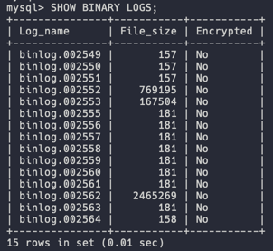

현재 기록중인 바이너리 로그 파일을 확인하고 싶다면 `SHOW MASTER STATUS;` 를 입력하면 됩니다.
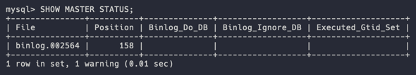

로그 파일이 저장되는 위치는 기본적으로 `datadir` 에 저장됩니다. 
`--log-bin` 시스템 옵션을 통해 절대 경로를 지정하여 위치를 변경할 수 있습니다. 
저는 따로 설정해주지 않아 _/var/mysql_ 아래에 저장되어 있습니다.
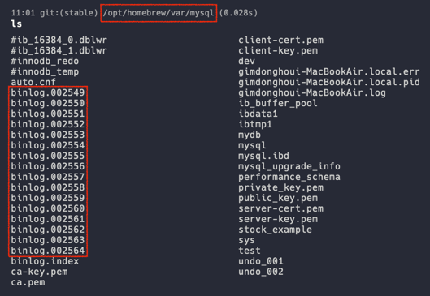

## mysqlbinlog

바이너리 로그는 이름 그대로 **이진 데이터를 기록하는 로그 파일**입니다. 
즉, 사람이 로그 파일을 읽고 쓸 수 없습니다. 
하지만 MySQL이 기본으로 제공하는 **_mysqlbinlog_ 를 이용하면 사람이 읽을 수 있는 형식으로 출력**해줍니다. 
또한 바이너리 로그를 `.txt`, `.sql`과 같은 확장자를 가진 파일로 변환도 가능하게 해줍니다.

사용법은 어렵지 않습니다. 
로그 파일이 있는 폴더에서 `mysqlbinlog [options] {log_files}` 를 입력하면 해당 파일을 출력해줍니다.
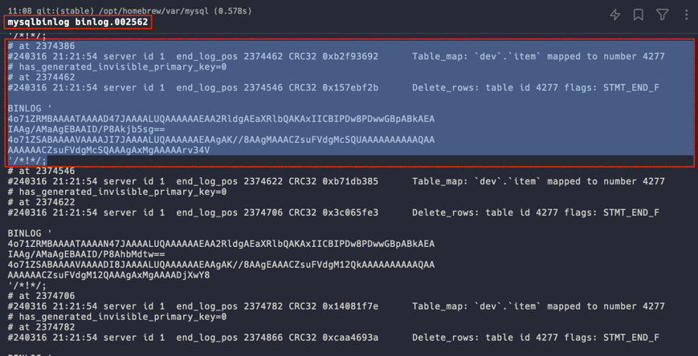

로그 형식은 STATEMENT 기반인지 Row 기반인지에 따라 달라집니다. 
기본적으로 Row 기반 출력이며 이때의 출력 형식은 SQL 문이 아닌, 행 변경의 과정이 기록됩니다.

읽는 방법은 다음과 같습니다.

각 이벤트 앞에는 추가 정보를 제공하는 주석이 존재합니다.
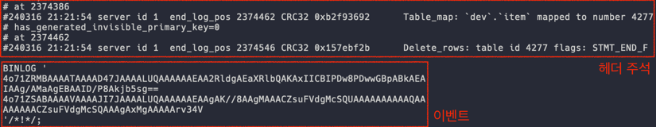

- 첫 번째 줄 (# at 2374386)
  - at 뒤에 오는 숫자는 바이너리 로그 파일에서 이벤트의 오프셋 또는 시작 위치를 나타냅니다.

- 두 번째 줄 (#240316 21:21:54 server id 1 end_log_pos 2374462)
  - 이벤트가 발생한 날짜와 시간, 서버의 id, 다음 이벤트가 시작되는 위치 값을 나타냅니다.
  - end_log_pos 2374462: 다음 이벤트의 오프셋의 번호가 2374462 라는 의미입니다.

또한 Row Based 출력 형식이라면 options에 `-v`, `-vv`를 입력함으로써 좀 더 자세한 내용을 확인할 수 있습니다. 
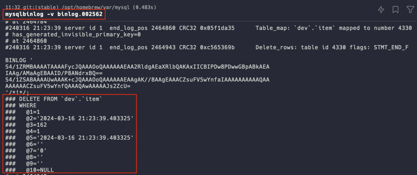
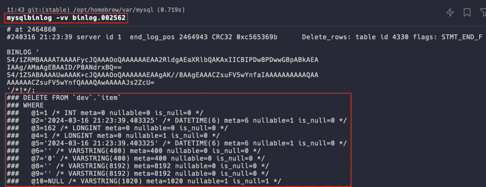

## 이제 진짜 복구해보기

우선 실제로 복구했던 환경과 최대한 비슷하게 세팅을 하겠습니다. 
(~~사실 뒤에 나올 내용은 세팅 환경이 중요하지 않습니다.~~)

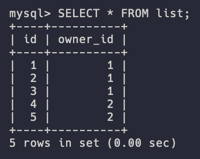
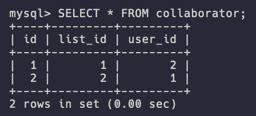

궁금해서 바이너리 로그를 출력해보니 모두 잘 기록되어 있네요 👍
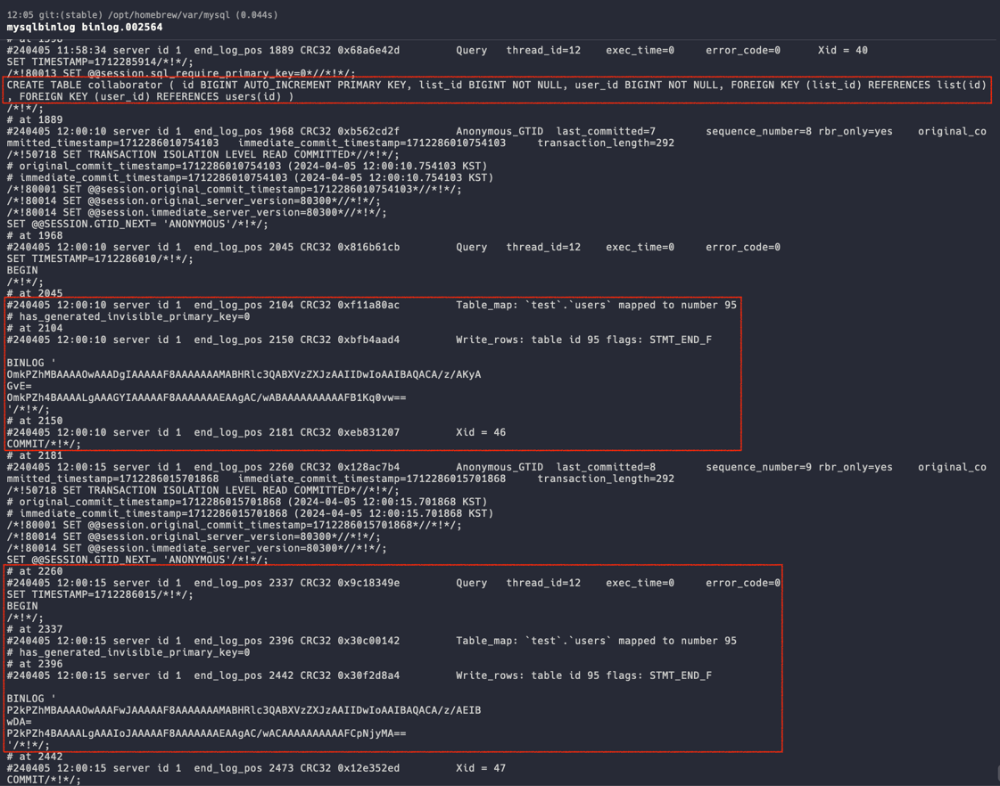

이제 실수를 가정하고 collaborator의 모든 데이터를 삭제해보겠습니다. 
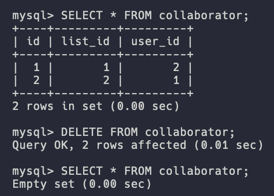

복구를 시작하기에 앞서 가장 먼저 **현재 바이너리 로그 파일의 이름**을 알아야 합니다. 
`mysql> SHOW MASTER STATUS;` 을 통해 현재 바이너리 로그 파일의 이름을 확인합니다. 
복구에 이용될 로그 파일 이름은 _binlog.002564_ 이네요.
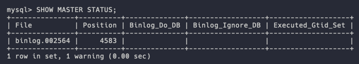

그리고 위 파일을 확실하게 기록하고 저장하기 위해 `mysql> FLUSH LOGS;` 명령어를 통해 현재 로그를 기록해줍니다. 
새로운 로그 파일이 생기는 것을 확인할 수 있습니다.

이제 `local> mysqlbinlog binglog.002564 | mysql -u root -p` 명령어를 통해 복구를 진행할 수 있습니다. 
이때, 중요한 점은 _binglog.002564_ 파일에 있는 모든 이벤트들이 mysql 서버에서 재실행이 되는 구조입니다. 
따라서 경우에 따라 아래같이 에러가 발생해 실패하는 경우가 있습니다. 
`test` 데이터베이스에 `item` 이라는 테이블이 없는데 `DROP` 하려는 명령어때문에 발생한 오류이네요.

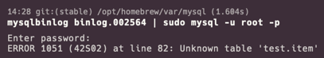

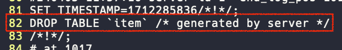

이럴 땐 **이벤트 번호를 통해 원하는 곳을 지정**할 수 있습니다. 
간단한 예시로 `fruits` 테이블을 만들고 `fruit`로 이름을 수정하고 테이블을 삭제하는 케이스가 있다고 가정하겠습니다.  
이제 `mysqlbinlog` 명령어로 아래 그림처럼 복구를 희망하는 시작 지점의 이벤트 번호 (237) 과 종료 시점의 이벤트 번호 (681)을 확인합니다.
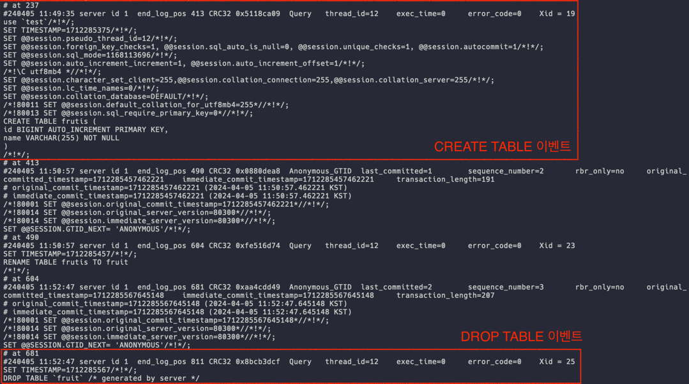

그리고 `--start-point`, `--end-point` 옵션을 통해 원하는 구간의 이벤트만 재실행하도록 합니다.

그 결과 fruit 테이블이 복구되는 것을 확인할 수 있습니다. 
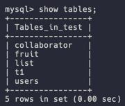

그럼 이제 원래 목적인 collaborator 데이터를 복구해보겠습니다. 
바이너리 로그를 이용한 복구 방법에는 다양한 방법이 있습니다. 
위에서 해봤던 position을 이용해 원하는 부분만 재실행하는 방법, 그리고 **모든 바이너리 로그 파일을 sql 파일로 저장하고 해당 파일을 수정한 뒤 mysql 서버에 실행하는 방법**

position을 이용한 방법은 위에서 해봤으니 이번엔 sql 파일을 통해 복구를 해보겠습니다.

우선 지금까지의 모든 바이너리 로그 파일을 하나의 sql 파일로 저장합니다. 
`local> mysqlbinlog binlog.00* > binlog.sql`

그리고 vim을 통해 파일을 수정해줍니다. 
> 참고로 vim 편집기에서 `Shift + g` 를 누르면 맨 마지막 줄로 커서가 이동합니다.

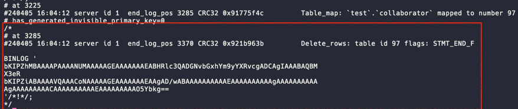
문제가 되는 부분을 찾아 주석처리 해줍니다.

이제 `$> mysql -u root -p -f < binlog.sql` 을 입력하면 그동안 수행된 모든 로그들이 재실행됨으로써 복구할 수 있습니다.
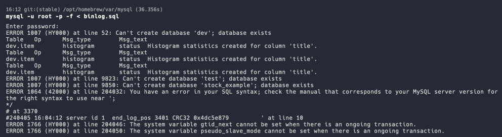
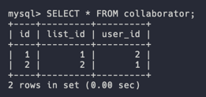

> `-f` 옵션은 로그 재실행 중에 발생하는 에러를 출력만하고 무시하고 계속해서 진행하는 옵션입니다.

사실 위 방법은 모든 바이너리 로그를 재실행한다는 점에서 운용중인 DB에 사용하면 서비스 장애를 초래할 수 있습니다. 
따라서 사용자가 많이 없는 시간을 이용하거나 이벤트 position을 통해 정말 필요한 부분만 재실행 할 필요가 있겠습니다. 
혹은 복구용 데이터베이스를 만들고 복구를 마친 다음, 서버 애플리케이션이 복구된 데이터베이스를 바로보도록 하는 등의 방식이 안전할 것 같습니다. 

바이너리 로그를 이용해 복구하는 방법에는 여러 방법이 있으니 취사 선택하시면 될 것 같습니다.

## 마치며

지금까지 MySQL이 제공하는 바이너리 로그를 이용해 데이터 복구 하는 방법에 대해 알아보았습니다. 
막상 어렵지는 않지만 실제 상황에서 잘못 데이터를 날려 복구해야 하는 상황이라면 뇌가 하얘지고 손발이 달달 떨릴 것 같습니다.. 
그럴 일이 없길 바라며 마치겠습니다.

감사합니다.

## Reference
> - https://dev.mysql.com/doc/refman/8.0/en/mysqlbinlog.html#option_mysqlbinlog_start-datetime
> - https://dev.mysql.com/doc/refman/8.0/en/point-in-time-recovery-positions.html
> - https://dev.mysql.com/doc/refman/8.0/en/binary-log.html
