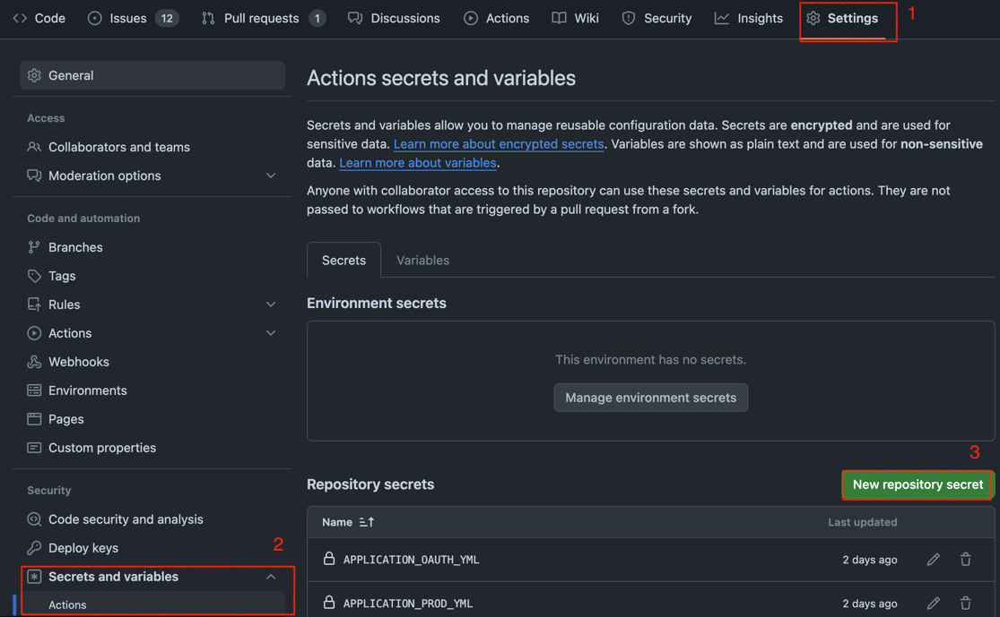

Github Actions와 Docker를 이용해 배포 자동화하는 방법에 대해 정리해보겠습니다.

Github Actions, Docker, EC2에 대한 기초적인 내용은 모두 알고 있다는 전제하에 설명을 할 것입니다.<br>
따라서 잘 모르겠거나, 이 부분은 왜 이렇게 해야 하는지? 궁금하다면 직접 구글링을 하거나 댓글로 질문을 남겨주세요. 

실제 적용 결과는 [해당 태그](https://github.com/8-Sprinters/ListyWave-back/commit/ab176bee2f3722c29a9f92826b4b6f13bd01989e)에서 확인할 수 있습니다.

## 0. 동작 흐름

우선 전체적인 숲을 보며 어떤 식으로 동작이 흘러가는지 큰 그림을 그려보겠습니다.


## 1. CD Workflow

작성한 CD Workflow는 다음과 같습니다.

각 step 별로 name을 한글로 적었으니, 코드 별로 어떤 처리를 하는 지 대강 파악할 수 있을 것입니다.

```yaml
name: Deploy to PROD

on:
  workflow_dispatch:
  push:
    branches: [ "prod" ]

jobs:
  deploy:
    runs-on: ubuntu-latest
    steps:
      - name: Github Actions 호스트 IP 가져오기
        id: ip
        uses: haythem/public-ip@bdddd92c198b0955f0b494a8ebeac529754262ff

      - name: AWS 로그인
        uses: aws-actions/configure-aws-credentials@e3dd6a429d7300a6a4c196c26e071d42e0343502
        with:
          aws-access-key-id: ${{ secrets.AWS_ACCESS_KEY_ID }}
          aws-secret-access-key: ${{ secrets.AWS_SECRET_ACCESS_KEY }}
          aws-region: ${{ secrets.AWS_DEFAULT_REGION }}

      - name: IP 허용
        run: |
          aws ec2 authorize-security-group-ingress --group-id ${{ secrets.AWS_SECURITY_GROUP_ID }} --protocol "tcp" --port "${{ secrets.PROD_EC2_PORT }}" --cidr "${{ steps.ip.outputs.ipv4 }}/32"
        env:
          AWS_ACCESS_KEY_ID: ${{ secrets.AWS_ACCESS_KEY_ID }}
          AWS_SECRET_ACCESS_KEY: ${{ secrets.AWS_SECRET_ACCESS_KEY }}
          AWS_DEFAULT_REGION: ${{ secrets.AWS_DEFAULT_REGION }}

      - name: 저장소 Checkout
        uses: actions/checkout@a5ac7e51b41094c92402da3b24376905380afc29

      - name: 자바 17 셋업
        uses: actions/setup-java@99b8673ff64fbf99d8d325f52d9a5bdedb8483e9
        with:
          java-version: '17'
          cache: 'gradle'
          distribution: 'corretto'

      - name: 설정 파일 추가
        run: |
          cd ./src/main/resources/
          
          cat <<EOF > application-prod.yml
          ${{ secrets.APPLICATION_PROD_YML }}
          EOF
          
          cat <<EOF > application-oauth.yml
          ${{ secrets.APPLICATION_OAUTH_YML }}
          EOF
          
          cat <<EOF > application-storage.yml
          ${{ secrets.APPLICATION_STORAGE_YML }}
          EOF

      - name: 애플리케이션 빌드
        run: |
          cd /home/runner/work/ListyWave-back/ListyWave-back/
          ./gradlew bootJar

      - name: 도커 이미지 빌드
        run: docker build -t ${{ secrets.DOCKER_HUB_USERNAME }}/${{ secrets.IMAGE_NAME }}:${{ secrets.PROD_TAG }} ./

      - name: 도커 허브에 로그인
        uses: docker/login-action@0d4c9c5ea7693da7b068278f7b52bda2a190a446
        with:
          username: ${{ secrets.DOCKER_HUB_USERNAME }}
          password: ${{ secrets.DOCKER_HUB_TOKEN }}

      - name: 도커 허브에 Push
        run: docker push ${{ secrets.DOCKER_HUB_USERNAME }}/${{ secrets.IMAGE_NAME }}:${{ secrets.PROD_TAG }}

      - name: 인스턴스 접속 및 배포 스크립트 실행
        uses: appleboy/ssh-action@029f5b4aeeeb58fdfe1410a5d17f967dacf36262
        with:
          host: ${{ secrets.PROD_EC2_HOST }}
          username: ${{ secrets.PROD_EC2_USERNAME }}
          key: ${{ secrets.PROD_EC2_PRIVATE_KEY }}
          script: |
            docker stop "${{ secrets.PROD_CONTAINER_NAME }}"
            docker rm -f "${{ secrets.PROD_CONTAINER_NAME }}"
            docker rmi "${{ secrets.DOCKER_HUB_USERNAME }}/${{ secrets.IMAGE_NAME }}:${{ secrets.PROD_TAG }}"
            docker pull "${{ secrets.DOCKER_HUB_USERNAME }}/${{ secrets.IMAGE_NAME }}:${{ secrets.PROD_TAG }}"
            docker run -d -p 8080:8080 --name "${{ secrets.PROD_CONTAINER_NAME }}" "${{ secrets.DOCKER_HUB_USERNAME }}/${{ secrets.IMAGE_NAME }}:${{ secrets.PROD_TAG }}"

      - name: IP 제거
        if: ${{ always() }}
        run: |
          aws ec2 revoke-security-group-ingress --group-id "${{ secrets.AWS_SECURITY_GROUP_ID }}" --protocol "tcp" --port "${{ secrets.PROD_EC2_PORT }}" --cidr "${{ steps.ip.outputs.ipv4 }}/32"
        env:
          AWS_ACCESS_KEY_ID: ${{ secrets.AWS_ACCESS_KEY_ID }}
          AWS_SECRET_ACCESS_KEY: ${{ secrets.AWS_SECRET_ACCESS_KEY }}
          AWS_DEFAULT_REGION: ${{ secrets.AWS_DEFAULT_REGION }}
```

Github Repository - Actions Secrets에 본인 환경에 맞는 값들을 빠짐없이 넣어줍니다!<br>
~~필자는 하나를 빠트려 2시간을 날렸다..~~


## 2. Dockerfile

작성한 Dockerfile은 다음과 같습니다.

```dockerfile
FROM arm64v8/amazoncorretto:17-alpine-jdk

COPY ./build/libs/listywave.jar listywave.jar

ENV TZ=Asia/Seoul

ENTRYPOINT ["java", "-Dspring.profiles.active=prod,oauth,storage", "-jar", "listywave.jar"]
```

본인 프로젝트에 맞게 적절히 값을 수정해주면 되겠습니다.

Dockerfile의 위치는 프로젝트 경로 맨 위에 위치시키면 됩니다.

### Docker Private Repository 만들기

여기선 따로 정리하진 않지만 Docker Image를 저장할 Private Repository를 만들어야 합니다!<br>
이 내용도 많은 블로그에서 이미 정리가 잘 되어 있으니 참고하시면 되겠습니다.

## 3. WAS에서 Docker Login 해놓기

Workflow를 보면 Actions 호스트에서 WAS에 SSH 접속 후, 미리 작성해놓은 스크립트를 수행합니다.<br>
이때, 중요한 점은 Actions 호스트에서만 Docker에 Login을 했고 WAS 에서는 Login을 하지 않아 `docker pull` 명령어를 수행할 때 실패한다는 것입니다.

따라서 미리 WAS에서 Docker에 Login을 해놓으면 되겠습니다.

## 마무리

사실 위 작업들만 빠짐없이 꼼꼼히 해주어도 한 번에 될 것으로 예상합니다.<br>
하지만, 인프라 및 클라우드 작업은 사소한 설정 하나만 틀려도 실패하는데요.<br>
이럴 때는 침착하게 로그를 보면서 원인을 분명하게 파악하고, 해당 문제를 해결하기 위한 검색만이 답인 것 같습니다.

위에서 설명한 작업들 뿐만 아니라 기본적으로 해주어야 하는 작업들은 있지만, 해당 내용들은 다른 블로그에서 잘 작성해두었으니 참고하면 되겠습니다.<br>
실제로 저 또한, 위 작업을 약 이틀 동안 삽질하면서 여러 블로그 및 공식 문서를 참고해가며 이렇게도 해보고 저렇게도 해보면서 해결했습니다!<br>

너무 대충 정리한 것 같긴 하지만, 어디서부터 어디까지 정리해야 할 지 감이 안잡히기에 이렇게만 정리하겠습니다.

자세한 질문이나 문제가 생겼다면 댓글이나 [카카오톡 오픈 채팅방](https://open.kakao.com/o/sDdYkMhf)을 통해 질문해주길 바라겠습니다.

감사합니다.