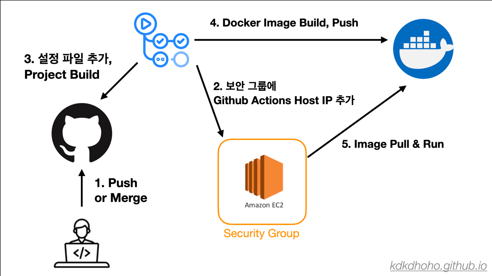

Github Actions와 Docker를 이용해 배포 자동화하는 방법에 대해 정리해보겠다.

Github Actions, Docker, EC2에 대한 기초적인 내용은 모두 알고 있다는 전제하에 설명을 할 것이다.

따라서 잘 모르겠거나, 이 부분은 왜 이렇게 해야 하는지? 궁금하다면 직접 구글링을 하거나 댓글로 질문을 남겨주면 되겠다. 

실제 적용 결과는 [본 링크](https://github.com/8-Sprinters/ListyWave-back/commit/ab176bee2f3722c29a9f92826b4b6f13bd01989e)에서 확인할 수 있다.

## 1. 동작 흐름

우선 전체적으로 배포가 어떤 식으로 동작하는지 큰 그림을 먼저 보겠다.



1. Push 혹은 Merge가 일어나면 Github Actions를 통해 Deploy Workflow가 수행한다.
2. Docker Hub에서 Image를 Pull하기 위해 Github Actions Host에서 EC2 인스턴스에 접속해야 한다.<br>
이를 위해서는 EC2 Security Group에 현재 수행 중인 Github Actions의 Host IP를 허용해야 한다.
3. Docker Image를 만들기 전, 프로젝트 설정 파일을 추가하고 프로젝트를 빌드한다.
4. 프로젝트 빌드의 결과물을 Dockerfile을 이용해 Image로 만들고 Docker Hub에 Push 한다.
5. EC2 인스턴스에 접속해 Docker Hub에 올려놓은 Image를 Pull 하고 실행시킨다.

## 2. Docker Private Repository 만들기

여기선 따로 만드는 법을 정리하진 않는다.<br>ㄴ
하지만 이미 많은 블로그에 정리가 잘 되어 있으니 참고하면 되겠다.

## 3. WAS에서 Docker Login 해놓기

전체 동작 흐름을 보면 Actions Host에서 EC2 인스턴스에에 SSH로 접속 후, 미리 작성해놓은 스크립트를 수행한다.<br>
이때, DockerHub에서 Image를 Pull 받는 과정에서 실패할 수 있다.<br>
따라서 미리 EC2 인스턴스에서 Docker에 Login 해놓자.

따라서 미리 WAS에서 Docker에 Login을 해놓으면 되겠습니다.

## 4. Dockerfile

Docker Image로 만들기 위한 Dockerfile은 다음과 같다.

```dockerfile
FROM arm64v8/amazoncorretto:17-alpine-jdk

COPY ./build/libs/listywave.jar listywave.jar

ENV TZ=Asia/Seoul

ENTRYPOINT ["java", "-Dspring.profiles.active=prod,oauth,storage", "-jar", "listywave.jar"]
```

본인 프로젝트에 맞게 적절히 값을 수정해주면 된다.<br>
필자는 EC2 인스턴스의 CPU 아키텍처가  _arm64v8_ 라서 추가해주었다.

`"-Dspring.profiles.active=prod,oauth,storage"`의 경우도 본인 프로젝트에 맞게 작성해주면 되겠다.

Dockerfile의 위치는 프로젝트 경로 맨 위에 위치하면 된다.

## 5. CD Workflow

이제 최종적으로 전체 동작을 수행하는 Workflow는 다음과 같다.

각 step 별로 name을 한글로 적었으니, 각각 어떤 처리를 하는 지 대강 파악할 수 있을 것이다.

```yaml
name: Deploy to PROD

on:
  workflow_dispatch:
  push:
    branches: [ "prod" ]

jobs:
  deploy:
    runs-on: ubuntu-latest
    steps:
      - name: Github Actions 호스트 IP 가져오기
        id: ip
        uses: haythem/public-ip@bdddd92c198b0955f0b494a8ebeac529754262ff

      - name: AWS 로그인
        uses: aws-actions/configure-aws-credentials@e3dd6a429d7300a6a4c196c26e071d42e0343502
        with:
          aws-access-key-id: ${{ secrets.AWS_ACCESS_KEY_ID }}
          aws-secret-access-key: ${{ secrets.AWS_SECRET_ACCESS_KEY }}
          aws-region: ${{ secrets.AWS_DEFAULT_REGION }}

      - name: IP 허용
        run: |
          aws ec2 authorize-security-group-ingress --group-id ${{ secrets.AWS_SECURITY_GROUP_ID }} --protocol "tcp" --port "${{ secrets.EC2_PORT }}" --cidr "${{ steps.ip.outputs.ipv4 }}/32"
        env:
          AWS_ACCESS_KEY_ID: ${{ secrets.AWS_ACCESS_KEY_ID }}
          AWS_SECRET_ACCESS_KEY: ${{ secrets.AWS_SECRET_ACCESS_KEY }}
          AWS_DEFAULT_REGION: ${{ secrets.AWS_DEFAULT_REGION }}

      - name: 저장소 Checkout
        uses: actions/checkout@v4

      - name: 설정 파일 추가
        run: |
          cd ./src/main/resources/

          cat <<EOF > application-prod.yml
          ${{ secrets.APPLICATION_PROD_YML }}
          EOF

          cat <<EOF > application-oauth.yml
          ${{ secrets.APPLICATION_OAUTH_YML }}
          EOF

          cat <<EOF > application-storage.yml
          ${{ secrets.APPLICATION_STORAGE_YML }}
          EOF

      - name: 디렉터리 이동
        run: cd /home/runner/work/ListyWave-back/ListyWave-back/

      - name: Gradle 셋업, 빌드, 캐싱
        uses: burrunan/gradle-cache-action@3bf23b8dd95e7d2bacf2470132454fe893a178a1
        with:
          arguments: bootJar

      - name: 도커 이미지 빌드
        run: docker build -t ${{ secrets.DOCKER_HUB_USERNAME }}/${{ secrets.IMAGE_NAME }}:${{ secrets.PROD_TAG }} ./

      - name: 도커 허브에 로그인
        uses: docker/login-action@0d4c9c5ea7693da7b068278f7b52bda2a190a446
        with:
          username: ${{ secrets.DOCKER_HUB_USERNAME }}
          password: ${{ secrets.DOCKER_HUB_TOKEN }}

      - name: 도커 허브에 Push
        run: docker push ${{ secrets.DOCKER_HUB_USERNAME }}/${{ secrets.IMAGE_NAME }}:${{ secrets.PROD_TAG }}

      - name: 인스턴스 접속 및 배포 스크립트 실행
        uses: appleboy/ssh-action@029f5b4aeeeb58fdfe1410a5d17f967dacf36262
        with:
          host: ${{ secrets.PROD_EC2_HOST }}
          username: ${{ secrets.EC2_USERNAME }}
          key: ${{ secrets.PROD_EC2_PRIVATE_KEY }}
          script: |
            docker stop "${{ secrets.CONTAINER_NAME }}"
            docker rm -f "${{ secrets.CONTAINER_NAME }}"
            docker rmi "${{ secrets.DOCKER_HUB_USERNAME }}/${{ secrets.IMAGE_NAME }}:${{ secrets.PROD_TAG }}"
            docker pull "${{ secrets.DOCKER_HUB_USERNAME }}/${{ secrets.IMAGE_NAME }}:${{ secrets.PROD_TAG }}"
            docker run -d -p 8080:8080 --name "${{ secrets.PROD_CONTAINER_NAME }}" "${{ secrets.DOCKER_HUB_USERNAME }}/${{ secrets.IMAGE_NAME }}:${{ secrets.PROD_TAG }}"

      - name: IP 제거
        if: ${{ always() }} # 반드시 추가해야 한다. 추가하지 않으면 보안 그룹에 추가한 IP가 삭제되지 않는다!!
        run: |
          aws ec2 revoke-security-group-ingress --group-id "${{ secrets.AWS_SECURITY_GROUP_ID }}" --protocol "tcp" --port "${{ secrets.EC2_PORT }}" --cidr "${{ steps.ip.outputs.ipv4 }}/32"
        env:
          AWS_ACCESS_KEY_ID: ${{ secrets.AWS_ACCESS_KEY_ID }}
          AWS_SECRET_ACCESS_KEY: ${{ secrets.AWS_SECRET_ACCESS_KEY }}
          AWS_DEFAULT_REGION: ${{ secrets.AWS_DEFAULT_REGION }}
```

## 6. Github Repository에 Secret 값 넣어주기

이제 위 Workflow를 **천천히!** **차근차근!** 보면서<br>
Github Repository -> Actions Secrets에 본인에 맞는 값들을 빠짐없이 넣어준다!<br>
~~필자는 하나를 빠트려 2시간을 날렸다..~~


## 마무리

사실 위 작업들만 빠짐없이 꼼꼼히 해주어도 한 번에 될 것으로 예상한다.

하지만 Docker나 Github Actions가 익숙하지 않으면 분명 매우매우 어려울 것이다.<br>
게다가 인프라 및 클라우드 작업은 사소한 설정 하나만 틀려도 실패한다.<br>
이럴 때는 침착하게 Actions의 로그를 보면서 원인을 분명하게 파악하고, 해당 문제를 하나씩 해결하가면 될 것이다.

위에서 설명한 작업들 뿐만 아니라 기본적으로 해주어야 하는 작업들이 있지만, 해당 내용은 다른 블로그에서 이미 잘 작성해주었으니 참고하면 되겠다.<br>
실제로 나 또한, 위 작업을 약 이틀 동안 삽질하면서 여러 블로그 및 공식 문서를 참고해가며 이렇게도 해보고 저렇게도 해보면서 해결했다!<br>

질문이나 문제가 생겼다면 댓글이나 [카카오톡 오픈 채팅방](https://open.kakao.com/o/sDdYkMhf)을 통해 질문해주면 감사하겠다.