## 들어가며

이번 글은 AWS EC2 인스턴스를 생성하고 수작업으로 Spring Boot를 실행시키는 방법을 정리한 글입니다.

개발 환경은 `MacOS`, `Warp(Terminal)` 입니다.

따라서 윈도우의 경우 인스턴스에 접속하는 방법이 약간 다릅니다.<br>
윈도우에서 접속하는 방법은 [해당 글](https://wookim789.tistory.com/34)을 참고해주세요.

## AWS 계정 생성

우선 가장 먼저 AWS 계정을 생성해줍니다.

기존에 있다면 그대로 사용해주시고 없다면 새로 회원가입 해주세요.

이 부분은 따로 포함하지 않겠습니다.

## EC2 인스턴스 생성

이제 바로 EC2 인스턴스를 생성해봅시다.

그 전에 **리전을 서울로** 설정합니다.

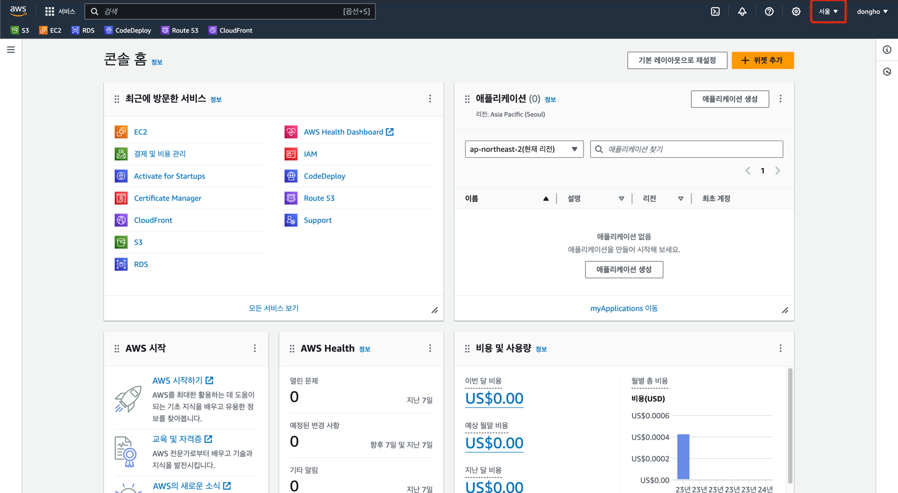

> 참고: [AWS - 리전 및 가용 영역](https://aws.amazon.com/ko/about-aws/global-infrastructure/regions_az/)

그리고 좌측 상단 검색창에 `EC2` 를 검색해서 클릭하면 아래와 같이 EC2 대시보드 페이지가 나옵니다.

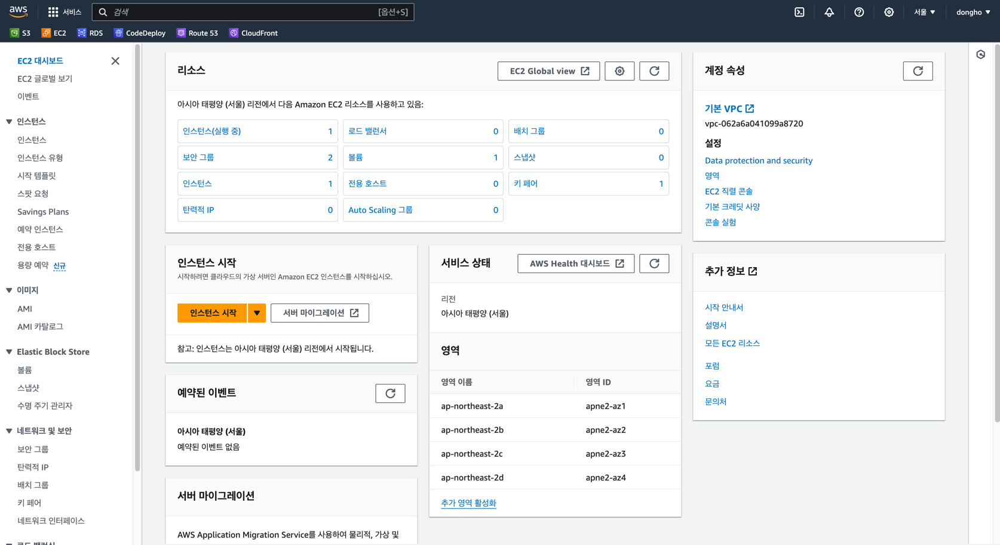

그리고 화면에 유일하게 주황색으로 강조되어 있는 *인스턴스 시작* 을 누르고 생성 페이지로 이동합니다.

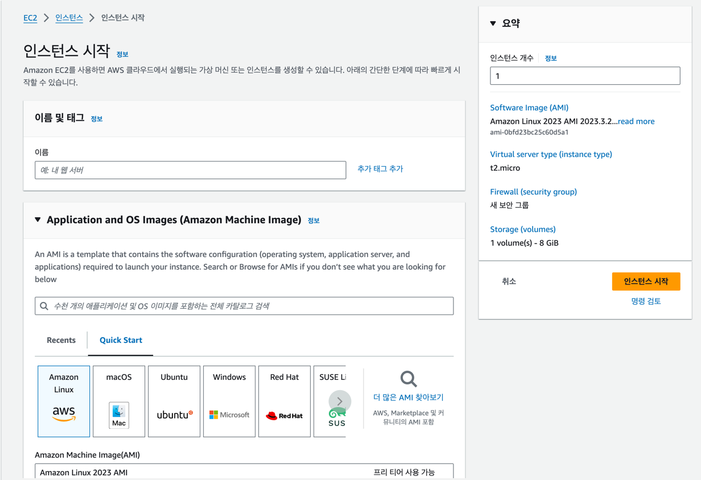

이제 하나하나 설정해보겠습니다.

---

### 이름

**EC2 인스턴스의 이름**입니다.

저의 경우 `ec2-${project_name}` 같이 짓습니다.

 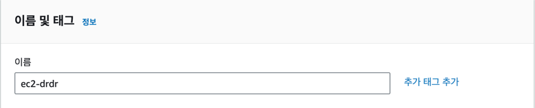

### AMI 설정

**인스턴스의 운영체제**입니다.

아래와 같이 Linux 계열인 `Ubuntu`를 설정하고 아키텍처는 `64비트(Arm)`을 설정합니다.

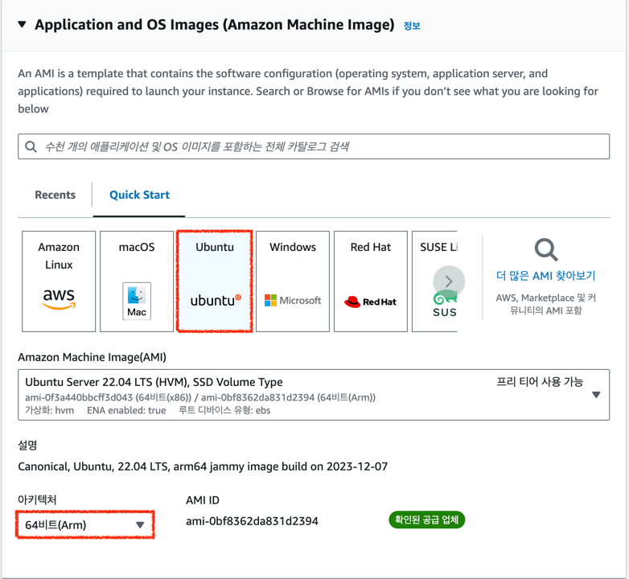

> [CPU 아키텍처란?](https://kdkdhoho.github.io/what-is-ami-architecture-of-ec2)

### 인스턴스 유형

**EC2 인스턴스의 성능**입니다.<br>
서버를 띄우는 목적과 비용에 따라 선택하면 됩니다.

본문에서는 프리티어를 선택하도록 하겠습니다.

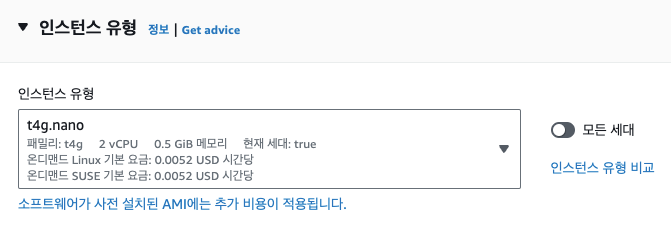

> [프리티어?](https://aws.amazon.com/ko/free/?all-free-tier.sort-by=item.additionalFields.SortRank&all-free-tier.sort-order=asc&awsf.Free%20Tier%20Types=*all&awsf.Free%20Tier%20Categories=*all)

### 키 페어

**로컬 PC에서 인스턴스로 원격 접속할 때 사용**되는 키 페어입니다.

`새 키 페어 생성`을 눌러 다음과 같이 설정합니다.

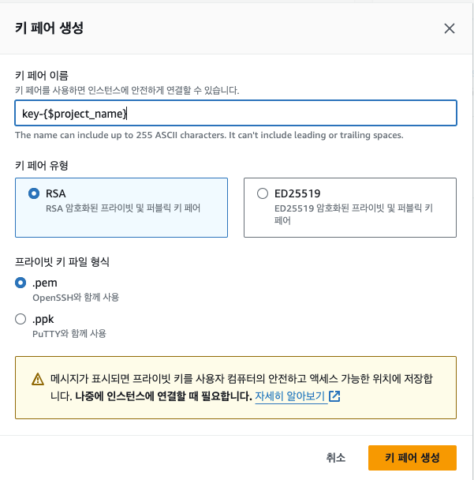

그리고 생성한 키 페어를 선택합니다.

> ### ⚠️ 주의 ⚠️<br>
> 키 페어는 한번 생성하면 재발급이 되지 않습니다.<br>
> 따라서 개인 로컬 PC에 잘 저장해둬야 합니다.<br>
> 그리고 해당 키로 언제든지 인스턴스로 접속 가능하기에 보안에 주의해야 합니다.

### 네트워크 설정

**인스턴스에 접속을 허용할 네트워크 범위**를 설정합니다.

우선 우측 상단의 `편집`을 눌러줍니다.

그리고 우선 다음과 같이 설정합니다.

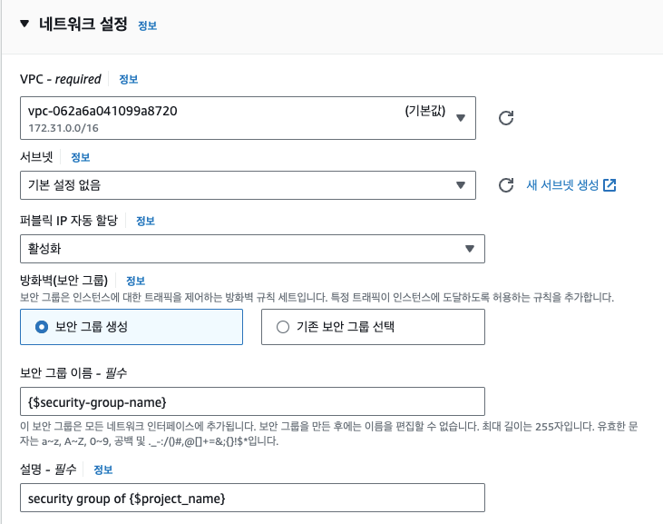

그 다음 중요한 **인바운드 보안 그룹 규칙**에 대해 자세히 살펴보겠습니다.

인바운드 보안 그룹 규칙에 따라 인스턴스가 허용할 트래픽의 범위를 지정합니다.<br>
다시 말해, **인스턴스에 접근 가능한 네트워크 및 장소를 설정**하는 것입니다.

우선 인스턴스에 ssh 연결은 필수이니 ssh 먼저 설정하겠습니다.<br>
이때, 특정 장소의 네트워크를 통해서만 접근할 수 있도록 하려면 아래와 같이 소스 유형 - 원본에 해당 장소 네트워크의 IP를 입력해줍니다.

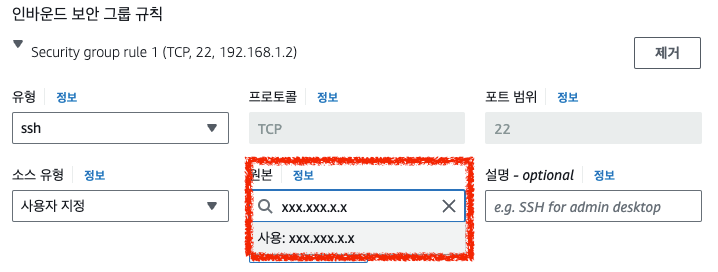

만약 그렇지 않고 모든 장소에서 들어갈 수 있게 하려면 `위치 무관`으로 설정해주세요.

그리고 `보안 그룹 규칙 추가`를 눌러 아래와 같이 새로운 허용 범위를 설정합니다.<br>
추후 실행시킬 스프링에 접속할 수 있도록 미리 설정하는 것입니다.

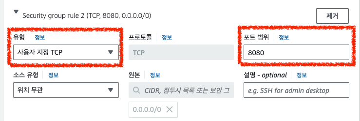

> 지금은 간단히 ssh와 TCP 연결을 모든 곳에 설정해두었습니다.<br>
> 하지만 보안을 위해 특정 장소에서만 접속이 가능하게 하려면 인바운드 보안 그룹 규칙을 설정해서 접속 가능 범위를 좁혀야 합니다.

### 스토리지 구성

디스크의 크기를 설정합니다.

이 부분은 기본 설정값 그대로 진행하겠습니다.

그리고 `인스턴스 생성`을 누르면 끝입니다.

---

## 접속

드디어 EC2 인스턴스가 생성됐습니다.

이제 해당 인스턴스로 접속해서 스프링을 실행해보겠습니다.

터미널을 띄우고, 아래 명령어를 입력합니다.

```
> chmod 400 ${key_path}
> ssh -i ${key_path} ${instance_public_ip}
```

- `chmod 400 ${key_path}`: 키 페어 파일에 대한 운영체제 내의 접근 권한을 설정합니다.
    > 참고
    > - [SSH 접속 시 UNPROTECTED PRIVATE KEY FILE! 에러 해결](https://www.lesstif.com/lpt/ssh-unprotected-private-key-file-80249001.html)<br>
    > - [리눅스 chmod 명령어 사용법 - 파일 권한 변경](https://recipes4dev.tistory.com/175)

- `${key_path}`: 인스턴스를 생성할 때 만든 키 페어의 경로입니다.
- `${instance_public_ip}`: 생성한 인스턴스의 퍼블릭 IPv4 주소입니다. 아래 그림을 통해 확인하면 됩니다. 참고로 인스턴스를 중지하고 다시 키면 IP 주소가 바뀝니다.
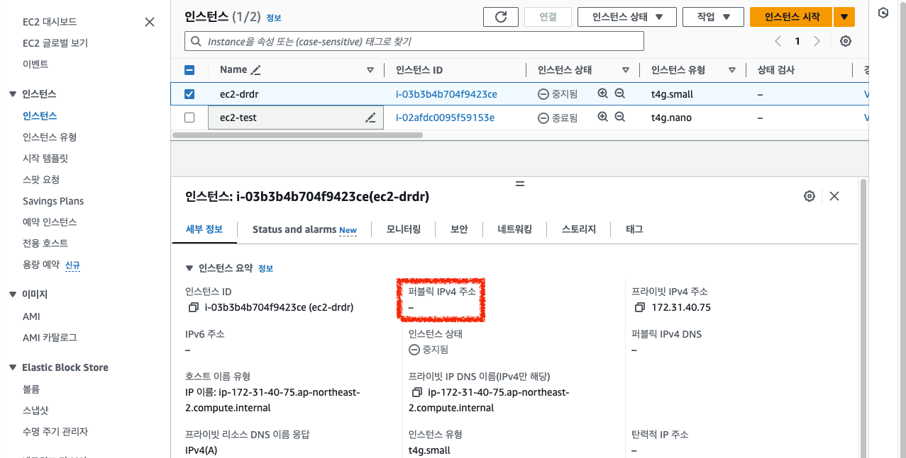

위 명령어를 입력하고 아래와 같은 화면이 뜨면 성공입니다.

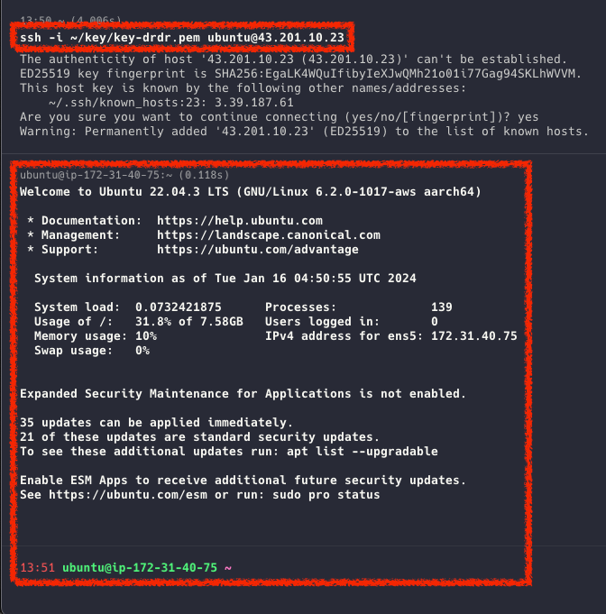

## 스프링 실행하기

이제 스프링을 실행해보겠습니다.

### JDK 설치

그 전에 먼저 JDK를 설치합니다.

저는 JDK 17을 설치하겠습니다.

아래 명령어를 입력합니다.

```text
> wget -O - https://apt.corretto.aws/corretto.key | sudo gpg --dearmor -o /usr/share/keyrings/corretto-keyring.gpg && \
echo "deb [signed-by=/usr/share/keyrings/corretto-keyring.gpg] https://apt.corretto.aws stable main" | sudo tee /etc/apt/sources.list.d/corretto.list

> sudo apt-get update; sudo apt-get install -y java-17-amazon-corretto-jdk
```

대충 설치되는 화면이 완료되면 명령어 `java -version`을 통해 확인해봅니다.

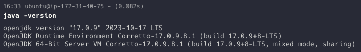

### 스프링 실행하기

이제 진짜 스프링을 실행하겠습니다.

우선 프로젝트 레포지토리를 EC2 내에 clone 합니다.<br>
clone이 완료되면 `ls` 명령어를 통해 성공적으로 clone 됐는지 확인합니다.

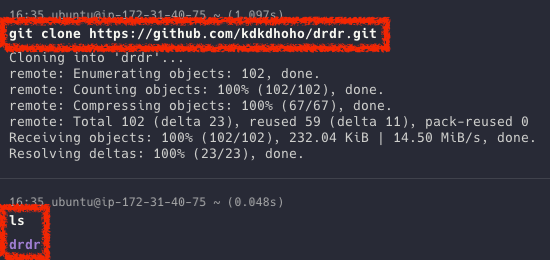

그 다음 프로젝트 디렉터리로 들어가 명령어 `./gradlew bootJar`를 통해 Build 합니다.

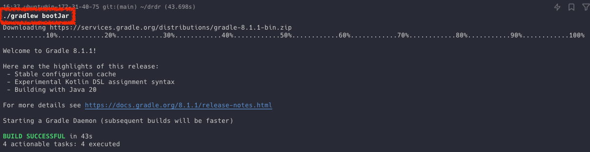

> `gradle build` 명령어로도 프로젝트를 빌드할 수 있습니다. 하지만 테스트와 같은 작업이 포함됩니다.<br>
> 따라서 단순히 프로젝트 build만 하고 싶으면 Spring Boot가 지원하는 명령어인 `gradlew bootJar`를 사용합니다.<br>
> <br>
> 참고<br>
> [Stack Overflow - gradle build와 bootJar의 차이](https://stackoverflow.com/questions/64747475/difference-between-gradle-build-and-gradle-bootjar)<br>
> [Spring Boot 공식문서](https://docs.spring.io/spring-boot/docs/current/gradle-plugin/reference/htmlsingle/)<br>
> [Gradle 공식문서 - Build Lifecyle](https://docs.gradle.org/current/userguide/build_lifecycle.html)

그럼 build의 결과물로 `build` 디렉터리가 생성됩니다.

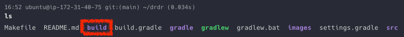

### jar 파일 실행하기

이제 build 결과물인 jar 파일을 실행하면 끝입니다.

`> cd build/libs` 명령어를 통해 해당 디렉터리로 들어가면 아래처럼 jar 파일이 생성되어 있습니다.

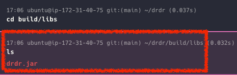

> 아마 jar 파일 이름이 `${project_name}-0.0.1-SNAPSHOT.jar` 으로 되어있을 수 있습니다.<br>
> 이는, `build.gradle`에 작성된 `version`에 따라 이름이 POSTFIX로 붙어서 나오는 겁니다.<br>
> 불편하다면 제거하고 다시 build하면 위처럼 깔끔하게 나옵니다.

이제 `java -jar ${project_name}.jar` 명령어 통해 실행합니다. 

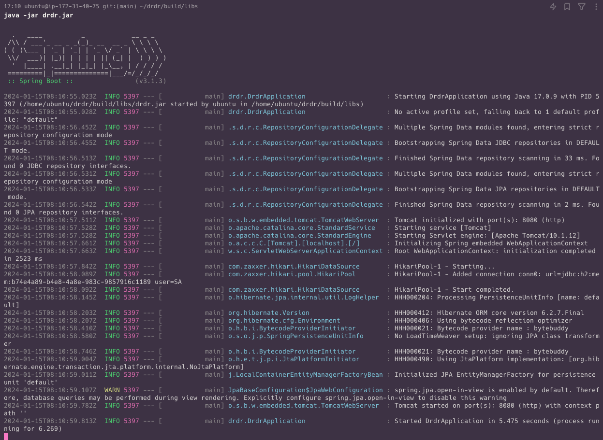

위와 같이 정상 작동되면 성공입니다!

이제 브라우저를 통해 스프링으로 접속해보고 아래와 같은 화면이 뜨면 성공적으로 EC2에 스프링 애플리케이션을 배포한겁니다.

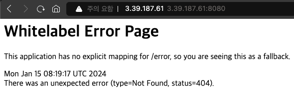

## 마치며

이번에는 직접 인스턴스에 접속해서 프로젝트를 clone하고 build하고 jar 파일을 실행했습니다.

하지만 배포를 할 때마다 이 작업을 매번 수행하는 것은 개발을 지속하기 힘들게 만들 것입니다.

따라서 다음엔 배포를 조금 더 간편하게 하기 위해 셸 스크립트를 작성해서 배포해보겠습니다.

감사합니다.

### Reference
> - [리눅스 chmod 명령어 사용법 - 파일 권한 변경](https://recipes4dev.tistory.com/175)
> - [EC2에 JDK 설치](https://docs.aws.amazon.com/corretto/latest/corretto-17-ug/downloads-list.html)
> - [SSH 접속 시 UNPROTECTED PRIVATE KEY FILE! 에러 해결](https://www.lesstif.com/lpt/ssh-unprotected-private-key-file-80249001.html)
> - [EC2 인스턴스 유형](https://aws.amazon.com/ko/ec2/instance-types/)