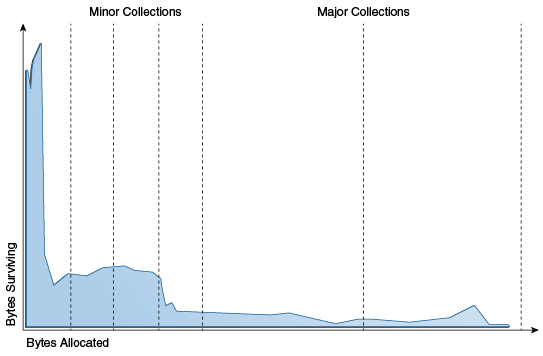
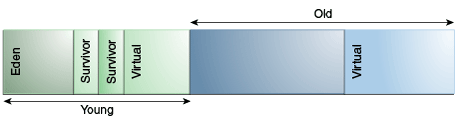

## Garbage Collection를 알아야 하는 이유

Garbage Collection(이하 GC)을 공부하다보니, **GC를 너무 믿어서는 안되겠다**고 생각됐다.

[우형에서 발생한 일](https://techblog.woowahan.com/2628/)도 그렇고 [토스에서 발생한 일](https://www.youtube.com/watch?v=w4fWgLgop5U)을 보니

모두 애플리케이션의 메모리 관련 치명적 에러는 모두 이 *GC*와 관련이 있었기 때문이다.

더군다나 [네이버 D2 글](https://d2.naver.com/helloworld/1329)에서도 **GC에 대해 잘 알고 있을수록 실력이 좋은 Java 개발자**라고 하셨다.

실력이 좋은 Java 개발자가 되기 위해 이 GC에 대해 알아보자.

## GC란?

GC는 **JVM 기반 애플리케이션에서 동적으로 할당되는 메모리를 알아서 관리해주는 기술**이다.

> JVM의 메모리 구조는 [static을 더 잘 사용하기](https://kdkdhoho.github.io/static-with-memory-structure/) 글 참고

프로세스가 실행하다보면 필연적으로 새로운 메모리를 malloc 및 free 하게 된다.

C, C++의 경우 Native하게 Memory를 직접 관리할 수 있다.

하지만 우리의 JAVA는 탄생 배경부터 개발자로 하여금 OS에 직접 의존하지 않아도 되도록, 중간 계층인 JVM을 통해 시스템 자원에 접근하게 된다.

따라서 malloc 되었지만 더이상 사용하지 않아 필요없어진 쓰레기 메모리들을 대신 처리해주는 역할이 필요하다.

그 작업을 GC가 해주는 것이다.

## GC의 장단점

### 장점

1. 개발자가 개발 중간중간 메모리를 관리할 필요가 없어진다.
2. (완벽하진 않지만) 자체적으로 메모리 누수를 관리해준다.

### 단점

1. GC가 동작할 때 ❗️ **STOP THE WORLD** ❗️가 발생한다.
> Stop the world: GC 쓰레드가 동작하는 순간에, 다른 쓰레드들은 동작하지 않는 현상이다. 
> GC를 튜닝한다는 말은 주로 이 Stop the world 시간이 짧아지도록 한다는 말이다.

## GC의 기본 동작 원리

이 GC는 다양한 알고리즘이 존재한다.

하지만 뒤에 나올 ZGC를 제외한 모든 알고리즘은 **Generational Collection**이라는 기술을 사용한다.

Generational Collection이란, ~~직역하면 세대로 수집한다는 의미~~ 대부분의 애플리케이션에서 경험적으로 관찰된 몇 가지 속성을 활용하여, 사용하지 않는 객체를 회수하는 데 필요한 작업을 최소화하는 기술이다.

관찰된 몇 가지 속성 중 가장 핵심적인 것은 **Weak Generational Hypothesis**이다.

Weak Generational Hypothesis이란 대부분의 객체는 잠깐 동안만 필요하다는 가설이다.

아래 그림은 객체의 수명에 대한 분포도인데, 간단하게 X축은 객체의 수명, Y축은 분포도이다.

즉, **애플리케이션에서 수명이 짧은 객체들이 훨씬 많이 분포한다**는 의미이다.

따라서 이러한 경험적 관찰 결과를 통해, Heap 영역에 있는 모든 객체에 대해 검사하지 않고 객체의 수명에 기반한 Collecting을 통해 보다 효율적인 방법을 모색한 것이다.

> ~~객체 세상은 요절의 비율이 높다~~

그렇다면 이 나이는 어떻게 측정해서 수집한다는 건지 보다 자세히 알아보자.

일단 기본적으로 메모리 구조는 다음과 같다.

자세히 살펴보면 Young, Old로 크게 한번 나뉜다. 
쉽게 유추할 수 있듯이 상대적으로 젊은 객체는 Young, 늙은 객체는 Old에 저장된다.

이제 Young을 자세히 들여다보자. 
1개의 `Eden`과 2개의 `Survivor` 영역으로 나뉜다.

> 각 영역 별 특징으로는 다음과 같다.
> - Eden 영역에는 처음 생성되는 대부분의 객체가 저장된다.
> - Survivor 영역은 적어도 하나는 항상 비어있다.

이 구조를 기반으로 나이를 증가하는 과정은 다음과 같다.

1. 처음 생성된 객체는 Eden 영역에 쌓인다.
2. 쌓이다보면 모두 차게 되는데, 이때 Eden에 존재하는 객체 중 유효한 객체만이 Survivor 영역으로 이동한다.
3. 이때!! 이동하는 객체에 나이를 증가시킨다.
4. 마찬가지로 Survivor 영역이 모두 차게 되면, 유효한 객체만이 반대편의 Survivor 영역으로 이동한다. 바로 이때!! 나이가 증가한다.

자, 그럼 위 과정을 계속해서 반복해서 GC의 동작 원리를 상세히 알아보자.

1. Eden 혹은 Survivor 영역이 모두 차면 Young Generation 영역만 수집하는 **Minor Collection**이 발생한다. 
   (적은 양의 객체만 참조하기에 Minor Collection은 비교적 빠르게 수행된다.)
2. Minor Collection이 진행되면서 특정 나이가 된 객체는 Old 영역으로 이동한다.
3. 진행되다 보면 Old Generation이 모두 차게 된다. 이때는 전체 영역을 Collecting하는 **Major Collection**이 발생한다. 
   (전체 객체를 확인해야 하기에 Minor에 비해 상당한 시간이 걸린다.)

## 이어서

다음으로는 GC 알고리즘의 종류와 각 특징에 대해 알아보자.

> ### 참고
> - https://youtu.be/FMUpVA0Vvjw?feature=shared  
> - https://youtu.be/vZRmCbl871I?feature=shared  
> - https://mangkyu.tistory.com/118  
> - https://docs.oracle.com/en/java/javase/17/gctuning/available-collectors.html#GUID-45794DA6-AB96-4856-A96D-FDE5F7DEE498  
> - https://stackoverflow.com/questions/70664562/criteria-for-default-garbage-collector-hotspot-jvm-11-17  
> - https://medium.com/javarevisited/java-17-vs-java-11-exploring-the-latest-features-and-improvements-6d13290e4e1a  
> - https://www.optaplanner.org/blog/2021/09/15/HowMuchFasterIsJava17.html  
> - https://www.baeldung.com/jvm-garbage-collectors  