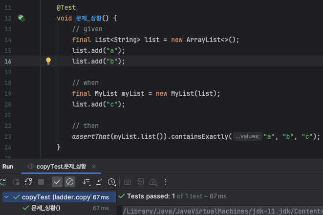
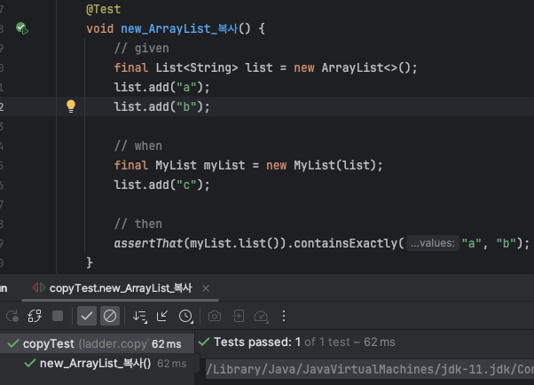
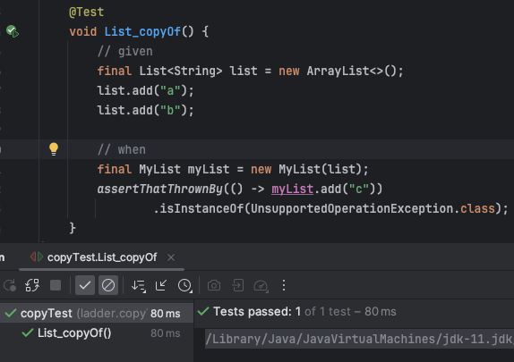
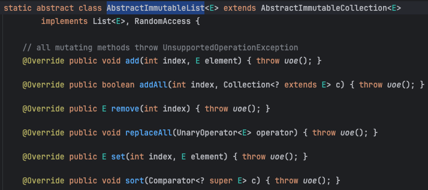
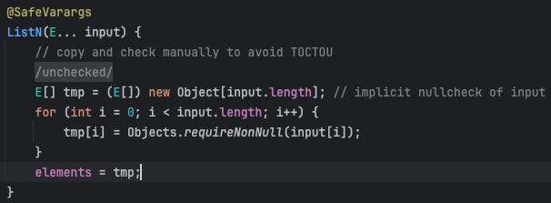
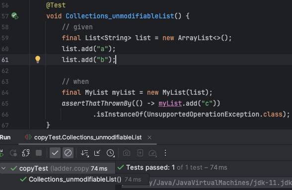
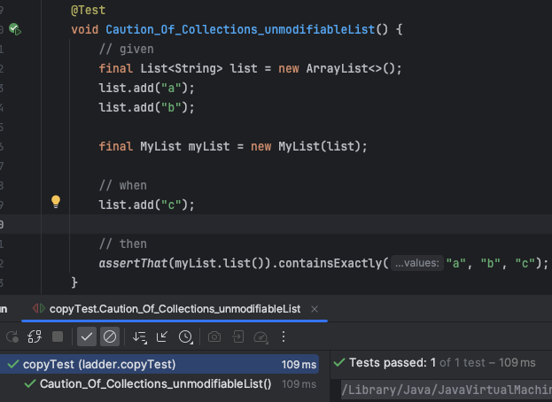
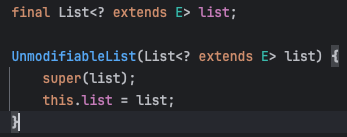

## 문제 상황

```java
public final class MyList {

    private final List<String> list;

    public MyList(List<String> list) {
        this.list = list;
    }

    public void add(String value) {
        list.add(value);
    }
    
    public int size() {
        return list.size();
    }
    
    public List<String> list() {
        return list;
    }
}
```

인스턴스 필드로 List만을 가지는 일급 컬렉션 객체가 있습니다.

필드에 `final`  키워드가 존재하기 떄문에 항상 초기화를 해줘야 합니다.

따라서 객체를 생성하려면 생성자를 List를 항상 주입받아야 합니다.

이때, 문제가 발생합니다.



위 테스트 코드를 보면 MyList 인스턴스를 생성할 때, `list` 라는 List가 생성자 파라미터로 전달됩니다.

그렇게 `myList` 라는 이름의 인스턴스가 생성된 후, `list`에 "c"를 추가합니다.

그런데 검증문을 보면, `myList` 인스턴스의 필드에는 `a, b, c`가 존재합니다.

이 문제는 `myList`가 가지는 필드와, `list` 컬렉션이 **같은 참조 값을 가지기 때문입니다.**

> 참조 값에 대한 내용은 [테코톡 - 히이로의 불변](https://www.youtube.com/watch?v=AjpJS9WrDrs) 추천드립니다

결국 객체 내부의 참조값과 외부의 참조값을 끊어주는 작업이 필요합니다.

이를 **방어적 복사**라고 합니다.

## 방어적 복사 첫 번째 방법: 새로운 객체 할당 (new)

```java
public final class MyList {

    private final List<String> list;

    public MyList(List<String> list) {
        this.list = new ArrayList<>(list);
    }
}
```

메서드 파라미터로 외부의 컬렉션이 들어올 때, **새로운 컬렉션을 만들어** 그 안에 값을 복사하는 방식으로 해결할 수 있습니다.



## List.copyOf()

또 다른 방식으로 `List.copyOf()` 메서드가 있습니다.

```java
public final class MyList {

    private final List<String> list;

    public MyList(List<String> list) {
        this.list = List.copyOf(list);
    }
}
```



하지만 이 메서드의 경우, 위 테스트 코드에서 볼 수 있듯이 값을 쓰거나 수정하거나 삭제하는 메서드에 대해서는 `UnsupportedOperationException`을 발생합니다.

그 이유로는 `copyOf()` 메서드를 까보면 최종적으로 `ImmutableCollections.ListN<>()` 메서드가 호출되는데요.<br>
`ImmutableCollections.ListN<E>`는 `AbstractImmutableList<E>`를 상속하고 있으며<br>
`AbstractImmutableList<E>`는 아래와 같이 쓰기 작업에 대해 예외를 던지고 있기 때문입니다.



추가로 `List.copyOf()`도 새로운 객체가 생성되고 값을 복사하는 *방어적 복사*가 이루어집니다.

아래 사진은 `ImmutableCollections.ListN<>()`의 생성자입니다.



가변 인자로 값을 받고 새로운 객체를 만들고 모든 요소에 대해 null 체크를 하며 값을 복사합니다.

결과적으로 다른 객체가 생성되어 외부 컬렉션과 참조가 끊어집니다.

## Collections.unmodifiableList()

이 메서드를 사용하면 읽기 전용 컬렉션을 만들 수 있습니다.

```java
public final class MyList {

    private final List<String> list;

    public MyList(List<String> list) {
        this.list = Collections.unmodifiableList(list);
    }
}
```



하지만 `List.copyOf()`와 비교해서 한 가지 중요한 점이 있습니다.

아래 테스트 코드처럼, 외부에 존재하는 컬렉션의 값을 수정하면 그대로 `myList`에 반영이 된다는 사실입니다.



그 원인은 다음과 같습니다.



파라미터로 넘어오는 외부 컬렉션인 `list`를 아무런 조치없이 그대로 할당하는 것을 볼 수 있습니다.

따라서, 내부적으로는 값의 변경이 막혀있지만, 외부의 컬렉션과는 같은 레퍼런스를 참조하고 있다는 것을 확인할 수 있습니다.