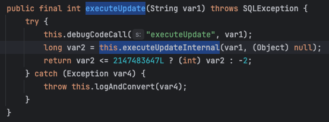
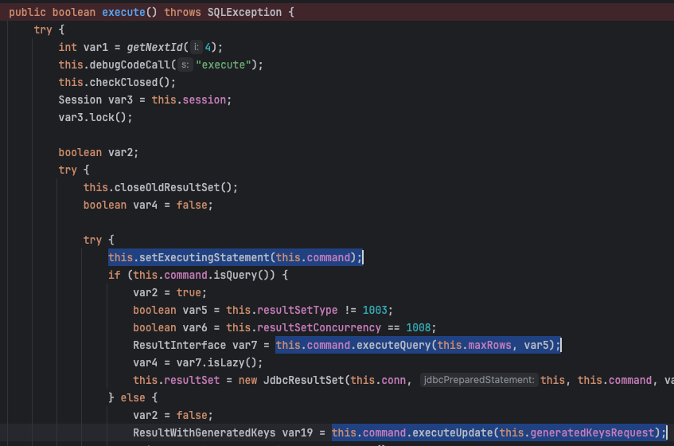

## TL;DR

execute(String)와 executeUpdate(String)은 Statement 인터페이스의 메서드이다.<br>
execute()와 executeUpdate()는 PreparedStatement 인터페이스의 메서드이다.<br>
Statement 인터페이스의 두 메서드는 내부적으로 Statement의 구현체만이 실행할 수 있도록 보장되어 있다.<br>
PreparedStatement 인터페이스는 이름처럼 미리 내부적으로 SQL 문을 만들어 놓고 곧바로 실행하는 식으로 동작한다.

## 문제 상황

JDBC를 복습 중이었다.<br>
간단한 Member 테이블을 만들고 DriverManager로 Connection을 맺은 다음, PreparedStatement 인터페이스로 쿼리를 실행하는 것을 테스트 중이었다.<br>
하지만 이상하게 execute(sql) 와 executeUpdate(sql)를 호출하면 쿼리가 나가지 않았다.<br>
반대로 execute() 와 executeUpdate()를 호출하면 쿼리가 실행되었다.<br>
심지어 execute(sql) 와 executeUpdate(sql)를 호출하면 "This method is not allowed for a prepared statement; use a regular statement instead." 라는 로그가 기록된다.

생성한 Member 테이블은 다음과 같다.
```sql
create table member (
    member_id varchar(10),
    money integer not null default 0,
    primary key (member_id)
);
```

작성한 코드는 다음과 같다.
```java
@Slf4j
public class MemberRepositoryV0 {

    public Member save(Member member) {
        String sql = "INSERT INTO member(member_id, money) VALUES (?, ?)";

        try (
                Connection conn = DbConnectionUtil.getConnection();
                PreparedStatement pstmt = conn.prepareStatement(sql)
        ) {
            log.info("Current Connection: {}", conn);

            pstmt.setString(1, member.getMemberId());
            pstmt.setInt(2, member.getMoney());

            pstmt.execute(); // 쿼리 실행.
//            pstmt.execute(sql); // 실행 X. This method is not allowed for a prepared statement; use a regular statement instead.
//            pstmt.executeUpdate(); // 실행.
//            pstmt.executeUpdate(sql); // 실행 X. This method is not allowed for a prepared statement; use a regular statement instead.
        } catch (SQLException e) {
            log.info(e.getMessage());
        }

        return member;
    }
}
```

테스트 코드는 다음과 같다.
```java
class MemberRepositoryV0Test {

    private final Member member = new Member("hi1", 1000);
    private final MemberRepositoryV0 memberRepository = new MemberRepositoryV0();

    @Test
    void saveTest() {
        memberRepository.save(member);
    }
}
```

## 원인 분석

일단 execute()는 PreparedStatement 인터페이스에 선언되어 있다.<br>
반면 execute(String)는 Statement 인터페이스에 선언되어 있다.

executeUpdate() 또한 PreparedStatement 인터페이스에,<br>
executeUpdate(sql)는 Statement 인터페이스에 선언되어 있다.

아래와 같이 분류할 수 있겠다.<br>
Statement - execute(String), executeUpdate(String)<br>
PreparedStatement - execute(), executeUpdate()

PreparedStatement는 Statement를 상속받는다.<br>
Statement에 대해 먼저 알아보자.

### Statement

인터페이스에 대한 설명으로 다음과 같다.<br>
> "The object used for executing a static SQL statement and returning the results it produces."

정적인 SQL 문을 실행하고 결과를 반환한다고 한다.

execute(String)에 대한 설명도 보자.<br>

> Executes the given SQL statement, which may return multiple results.
> In some (uncommon) situations, a single SQL statement may return multiple result sets and/ or update counts.
> Normally you can ignore this unless you are (1) executing a stored procedure that you know may return multiple results or
> (2) you are dynamically executing an unknown SQL string.
> The execute method executes an SQL statement and indicates the form of the first result.
> You must then use the methods getResultSet or getUpdateCount to retrieve the result, and getMoreResults to move to any subsequent result(s).
> Note: This method cannot be called on a PreparedStatement or CallableStatement.<br>
> <br>
> Params:<br>
> sql – any SQL statement<br>
> Returns:<br>
> true if the first result is a ResultSet object; false if it is an update count or there are no results<br>
> Throws:<br>
> SQLException – if a database access error occurs, this method is called on a closed Statement, the method is called on a PreparedStatement or CallableStatement<br>
> SQLTimeoutException – when the driver has determined that the timeout value that was specified by the setQueryTimeout method has been exceeded and has at least attempted to cancel the currently running Statement<br>
> See Also:<br>
> getResultSet, getUpdateCount, getMoreResults

주어진 SQL 문을 실행하고 그 결과가 ResultSet이면 true, 아니면 false를 반환한다고 한다.<br>
또한 PreparedStatement 또는 CallableStatement에서는 호출할 수 없다고 한다.<br>
정말로 그럴까?<br>
실제로 디버깅으로 살펴본 결과, 아래 사진과 같았다.

메서드를 호출하는 객체는 PreparedStatement이므로 `this`는 JdbcPreparedStatement 임을 확인할 수 있다.<br>
따라서 해당 조건문에 의해, 메서드를 호출하는 주체가 Statement가 아니면 쿼리를 실행할 수 없는 것이다.

executeUpdate(String) 또한 동일한 로직으로 처리된다.



반면, PreparedStatement#execute()는 아래 사진처럼 미리 만들어놓은 SQL 문을 곧바로 실행한다. 

> PreparedStatement에 선언된 setXXX() 메서드를 통해 개발자가 인자로 건넨 값이 어떻게 바인딩 되는지 보는 것도 꽤 재밌다.

## 분석 결과

Statement의 execute(String), executeUpdate(String)은 설명에 나와있듯이 PreparedStatement 또는 CallableStatement에서는 호출할 수 없도록 구현되어 있다.<br>
PreparedStatement는 이름 그대로 미리 준비해놓은 SQL 문을 곧바로 실행하는 구조이다.<br>
따라서 pstmt.execute(sql); 와 pstmt.executeUpdate(sql); 을 호출했을 때 쿼리가 나가지 않은 것이었다.

## 마치며

덕분에 헷갈렸던 execute()와 execute(String), executeUpdate()와 executeUpdate(String)의 차이에 대해 알게 되었다.<br>
또한 PreparedStatement가 어떻게 값을 바인딩하는 지에 대해서도 알게 되었다.