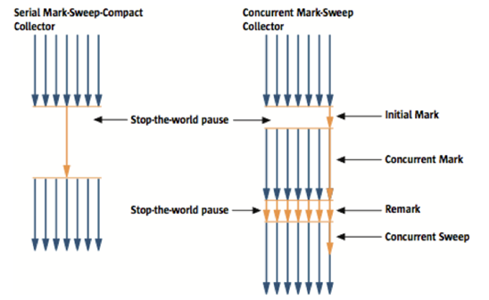
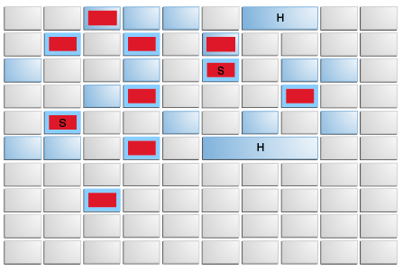
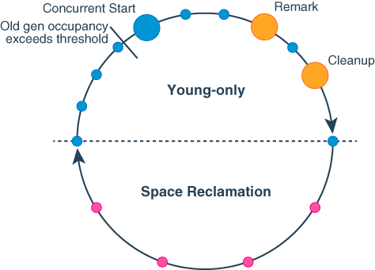

지난 번엔 [Garbage Collection과 동작 원리](https://kdkdhoho.github.io/about-garbage-collection/)에 대해 알아보았다. 
이번 글에선 GC에 어떤 알고리즘이 있고, 각 알고리즘의 특징에 대해 살펴보자.

## 1. Serial Collector

**단일 쓰레드를 사용하여 모든 GC 작업을 수행**하므로 작업 중, 쓰레드 간 통신 오버헤드가 없다.

> 쓰레드 간 통신은 데이터를 전송하고 조율하는 과정을 의미한다. 
> 다른 의미로는 쓰레드 간 동기화 작업이 수행된다고 할 수 있다. (== 오버헤드 발생)

결과적으로 **Serial GC 쓰레드의 작업 시간이 프로그램의 응답 시간에 직접적인 영향을 준다**.

싱글 프로세서 환경에 적합한 알고리즘이다. 
하지만 처리하는 데이터의 용량이 최대 약 100MB로 매우 작은 경우 멀티 프로세서에서도 유용하게 쓰일 수 있다.

Serial Collector는 특정 하드웨어 및 OS 구성에서 default로 선택되거나, 
`-XX:+UseSerialGC` 옵션을 통해 명시적으로 사용할 수 있다.

Java 8, 11, 17 버전에서 사용 가능하다.

추가로 Major Collection 이후 파편화 된 메모리를 압축해 Hole을 최대화 하는 _Compaction_ 과정이 발생한다.

## Parallel Collector

_Throughput GC_ 라고도 부른다.

*Serial Collector*와 유사하게 동작한다. 하지만 Parallel Collector의 경우 **멀티 쓰레드로 GC 작업을 진행한다**는 점에서 큰 차이가 있다. 
따라서 멀티 프로세서 환경에 적합한 알고리즘이다.

`-XX:+UseParallelGC` 옵션을 통해 명시적으로 사용할 수 있다.

Java 8, 11 17 버전에서 사용 가능하다.

## CMS Collector

*Concurrent Mark Sweep*의 약자로, **필요하지 않은 객체를 Mark 하고 제거하는 과정인 Sweep을 다른 쓰레드와 동시에 처리한다**.

아래 그림은 *Serial Collector* 와 비교하는 그림이다. 
그림에서 볼 수 있듯이, Initial Mark 와 Remark 시간을 제외하고는 GC 작업이 다른 쓰레드와 동시에 처리된다. 

그림에서 알 수 있듯이 **Stop the world 시간이 매우 짧다**. 따라서 응답성이 매우 중요한 프로그램의 경우 좋은 선택지가 될 수 있다. 
하지만, 다른 GC 방식에 비해 **더 많은 CPU와 메모리를 사용**하게 되고, 무엇보다 **Memory Compaction이 이루어지지 않아 더 큰 문제가 발생할 수 있다**.

Java 9 버전부터는 Deprecated 되어 Java 8 버전에서만 사용 가능하다.

## G1 Collector

**대용량의 메모리와 멀티 프로세스 환경을 위해 탄생한 알고리즘**이다. 
지금까지의 알고리즘 중, **성능 면에서 가장 뛰어난 알고리즘**이다. 
이로 인해 **Java 9부터 Default GC로 설정되었다.**

G1 Collector의 경우 **GC 작업이 효율이 좋은 Young Generation에 집중**된다.

처리량 향상을 위해 일부 연산은 항상 Stop-the-world 상태에서 수행한다.   
하지만 Global Marking 과 같은 힙 영역 전체를 대상으로 하는 작업은 다른 쓰레드와 병렬적으로 수행된다. 

가장 큰 특징은, **이전의 프로그램 동작과 GC로 인한 Stop-the-world 정보를 추적**한다. 
추적한 정보를 바탕으로 Stop-the-world 상태에서 수행할 작업의 양을 조절한다. 
즉, **Garbage가 많이 차있는 영역과 같이 효율적인 영역을 우선적으로 처리**한다. 
*Garbage First Collector*라고 불리는 이유가 여기에 있는 것이다.

Memory Compacting 작업을 수행한다.

G1 Collector는 기존 Heap 메모리 구조를 물리적으로 나누어 각 영역 별로 관리하던 방식과는 다르다. 
아래 그림처럼 **Heap 영역을 동일한 크기의 논리적인 Region으로 나누어 각 영역을 관리**한다.

위 그림에서 빨간색으로 칠해진 Region은 Young Genration, 파란색은 Old Generation이다.

빨간색 중에서도 "S"가 존재하는 영역은 Survivor 영역이다.

파란색 중에서도 "H"가 존재하는 영역은 *Homongous*로, 여러 영역에 걸쳐 존재하는 영역임을 의미한다. 
이 영역은 애플리케이션에서 직접 할당하는 거대한 객체이다.

위 구조에서 G1 Collector의 GC 작업은 크게 *Young-only* 와 *Space Reclamation* 으로 나뉜다.

- Young-only
  1. 일반적인 Minor Collection으로 시작한다.
  2. 이때, Old Generation의 힙 점유율이 임계값을 넘으면 Space Reclamation으로 전환한다.
  3. 동시에 Minor Collection 대신 *Concurrent Start Minor Collection*을 수행한다.

> _Concurrent Start Minor Collection_ 
> Minor Collection 외에도 Marking 작업을 수행한다. 
> 위에서의 Marking 작업은 Space-Reclamation 작업을 위해 **Old Generation**에서 Reachable한 객체들은 유지한다.

- Space-Reclamation
  1. 이 단계에서는 여러 개의 Collection이 혼합되어 구성된다. 즉, Old Generation에 존재하는 객체들도 GC 작업에 포함된다.
  2. G1이 더 이상 Old Generation을 작업해도, 가치있는 공간이 확보되지 않는다고 판단하면 종료된다.
  3. 이 단계가 끝나면 Young-only 단계가 다시 시작된다.

백업의 개념으로, 필요없어진 객체를 찾다가 메모리가 부족해지면 다른 Collector와 마찬가지로 *Full GC*를 수행한다.

`-XX:+UseG1GC` 옵션을 통해 명시적으로 사용할 수 있다.

Java 11, 17에서 사용 가능하다.

> ### 참고
> - https://youtu.be/FMUpVA0Vvjw?feature=shared  
> - https://youtu.be/vZRmCbl871I?feature=shared  
> - https://mangkyu.tistory.com/118  
> - https://mangkyu.tistory.com/119  
> - https://mangkyu.tistory.com/120  
> - https://docs.oracle.com/en/java/javase/17/gctuning/available-collectors.html#GUID-45794DA6-AB96-4856-A96D-FDE5F7DEE498  
> - https://stackoverflow.com/questions/70664562/criteria-for-default-garbage-collector-hotspot-jvm-11-17  
> - https://medium.com/javarevisited/java-17-vs-java-11-exploring-the-latest-features-and-improvements-6d13290e4e1a  
> - https://www.optaplanner.org/blog/2021/09/15/HowMuchFasterIsJava17.html  
> - https://www.baeldung.com/jvm-garbage-collectors  