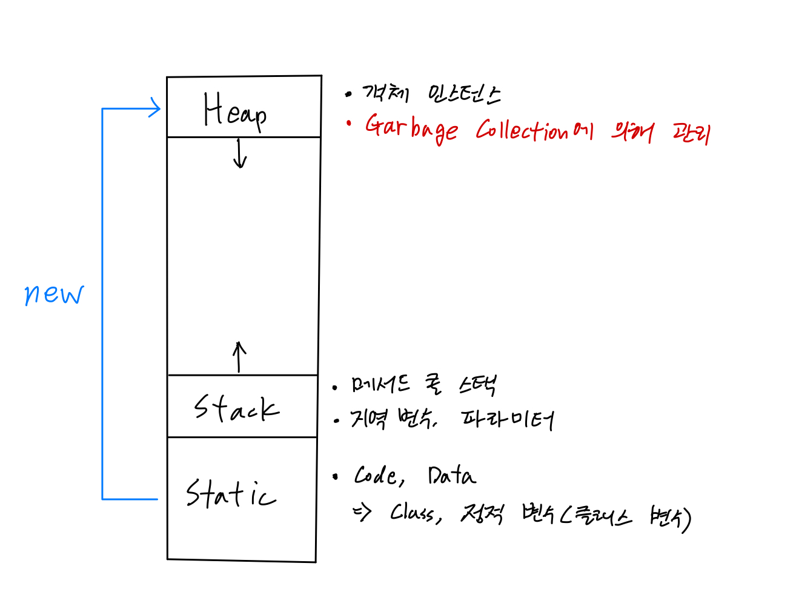
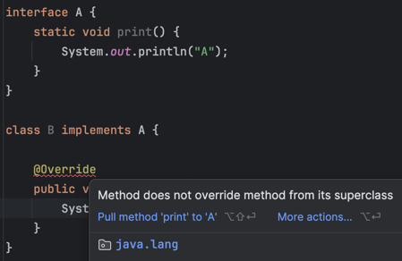

## JVM의 메모리 구조

우선 static에 대해 이해하기 전에 JVM이 실행될 때 메모리에 어떻게 적재되는 지부터 살펴보자.



크게 세 공간으로 나뉜다.

1. Heap 영역
   - new 키워드를 사용해 **동적으로 생성한 객체의 인스턴스**가 담기는 공간이다.
   - **Garbage Collection**에 의해 관리된다.

2. Stack 영역
   - 메서드 콜 스택이나, 지역 변수 혹은 변수 파라미터가 저장되는 공간이다.
   - 주로 메서드와 관련이 있으며 메서드가 호출될 때 새로운 영역이 할당되고 반환될 때 영역도 반환된다.
   - `StackOverflow`가 발생하는 이유도 메모리 관점에서 생각해보면 알 수 있다.

3. Static 영역
   - 운영체제에서의 Code, Data 영역이다.
     - 동일한 프로세스 내에서 언제 어디서든 접근할 수 있다.
   - 우리가 작성한 Class나 정적 변수(클래스 변수)가 이 영역에 저장된다.
   - 이 곳에 담긴 데이터들은 프로그램이 종료되기 전까지 유지된다.

## Java의 static 키워드

이제 Java의 static 키워드에 대해 알아보자

Java에서 static 키워드를 변수, 메서드, 클래스에 추가할 수 있다.

static을 붙여 변수를 생성하거나 메서드나 클래스를 선언하게 되면, **프로그램 실행 시**에 **딱 한 번 생성**되어 위 메모리 구조의 **`Static` 영역에 포함**된다.

따라서, 우리가 객체를 생성하지 않고도 static 변수를 참조하거나 메서드를 호출할 수 있는 것이다.

## static을 많이 사용하게 된다면?

이러한 static 변수, 메서드, 클래스를 많이 사용하게 되면 어떤 일이 발생할까?

결론부터 말하면 **프로그램에 부작용을 초래할 확률이 증가**한다.

메모리 관점에서 생각해보자.

운영체제는 메모리에 Java 프로그램의 공간을 내어줄 때 무한정으로 제공하지 않는다.<br>
따라서 제한된 영역 내에서 프로그램을 실행해야 한다.

그런데 Static 영역이 Heap과 Stack 영역에 비해 더 많은 공간을 차지하게 된다면, `StackOverflow`나 `OutOfMemoryError` 가 발생할 확률이 증가한다.

아무리 GC가 Heap 영역을 관리해 준다 한들, 사용할 수 있는 공간 자체가 적다면 GC의 역할에도 한계가 있을 것이다.

추가로 사용되지 않음에도 static으로 선언되었다는 이유로, 불필요하게 메모리를 차지하게 될 경우도 분명 존재할 것이다.

## 어느 상황에 static을 사용하면 좋을까?

그렇다면 어느 상황에서 static을 적절히 사용하면 좋을까?

단순히 생각해서 객체를 매번 만들 필요가 없는 경우에만 사용하면 좋을 것이다.

즉, 프로그램을 실행할 때 딱 한 번만 메모리에 올려놓고 계속해서 사용하는 경우이다.

다시 말해, Java 프로그램이 실행되면 딱 한 번만 메모리에 올려놓고 사용하는 경우가 될 것이다.

### 상수

상수는 변하지 않는 값을 의미한다.

이러한 상수는 런타임으로 새로운 변수가 계속해서 만들어질 필요가 없다.

가령, 회원가입 시에 1,000 포인트를 기본적으로 제공한다는 예시가 있다고 가정해보자.

```java
public class Member {
   private static final int WELCOME_POINT = 1_000; // 상수
   
   public Member(...) {
      // ...
      this.point = WELCOME_POINT;
      // ...
   }
}
```

위 코드의 `WELCOME_POINT` 처럼, Member 객체를 만들 때마다 새로 만들어 줄 필요도 없는 값의 경우 사용하면 효율적일 것이다.

#### 번외: 상수의 접근 제어자의 범위를 어떤 기준으로 지정하면 좋을까?

위 예시에서는 `private`로 선언을 했는데, `public`으로 한다면 어떨까?

메모리 영역에서 생각해 봤을 때 `Static` 영역으로 올라가고, 이 영역은 같은 프로세스 내의 모든 곳에서 접근이 가능하다.

그렇지만 위 상수가 다른 클래스에서 범용적으로 쓰이지 않는 한, 불필요하게 public으로 열어둘 필요는 없어보인다.

필요하다면 private으로 선언 후, getter를 통해 값을 반환하는 게 코드를 작성하고 이해하는 데에 훨씬 도움이 될 것이라고 생각한다.

최대한 작은 범위로 설정하자.

### util성 메서드 (static 메서드)

흔히 **유틸성 클래스**라고 하는 곳에 존재하는 메서드들에 `static` 키워드를 붙여 사용한다.

이는 인스턴스를 만들지 않고도 사용할 수 있고, 어디에서든 호출할 수 있다.

다만, 인스턴스로 쓰이는 클래스에 static 메서드가 존재할 수 있는데, 이때 조심해야 할 점이 있다.

바로 static 메서드는 재정의가 불가능 하다는 것이다.




추가로 광범위하게 사용되는 특징을 가진 Util성 메서드인 만큼, 클래스의 변경 가능성이 증가한다는 특징이 있다.

가급적 Util성 클래스에 static 메서드를 모아서 사용하도록 하자.

> ## Reference
> - [망나니 개발자 블로그](https://mangkyu.tistory.com/47)
> - [Java의 정석](https://www.yes24.com/Product/Goods/24259565)
> - [AT&T Israel Tech Blog](https://medium.com/att-israel/should-you-avoid-using-static-ae4b58ca1de5)