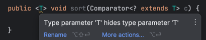
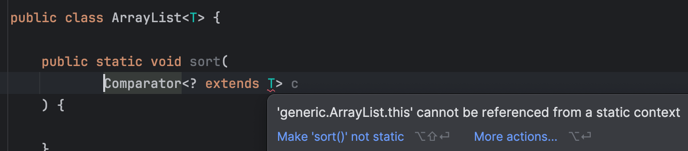

## 제네릭

제네릭은 **다양한 타입을 다룰 수 있는** **클래스나 메서드**를 사용할 때,<br>
런타임이 아닌 **컴파일 단계에서 타입 체크**를 강제하고 **자동으로 형변환**을 해주는 자바의 기능이다.

### 제네릭을 사용하지 않았을 때

제네릭이 없었을 시절, `ArrayList`는 아래와 같은 코드였을 것이다.

```java
public class ArrayList {

    private Object[] elementData;
    private int index;
    private int size;
    
    ...

    public boolean add(Object e) {
        ...
    }
    
    public Object get(int index) {
        ...
    }
}
```

저장할 값이 어떤 타입이든 상관없이 모두 담기 위해 `Object[]` 을 필드로 가졌을 것이다.

해당 클래스를 사용하는 개발자는 다음과 같은 코드를 작성해야 할 것이다.

```java
public void foo() {
    ArrayList list = new ArrayList();
    list.add("1");
    list.add("2");
    list.add("3");
    list.add("4");
    list.add(1);
    list.add(true):
    
    String first = (String) list.get(0);
    String second = (String) list.get(1);
    String third = (String) list.get(2);
    String fourth = (String) list.get(3);
}
```

어떤 타입이든 `ArrayList`에 포함될 수 있는 점 때문에, 개발자는 **어떤 타입의 값이 들어가는지 신경쓰면서 사용**해야 한다.<br>
만약 개발자가 실수로 타입 캐스팅에 실수한다면 **런타임에** `ClassCastException`이 발생할 것이다.<br>

바로 이러한 문제를 해결하기 위해 제네릭이 탄생되었다.<br>
이제, 위 코드를 제네릭을 사용하여 개선해보자.

```java
public class ArrayList<T> { // <T> 추가함으로써 제네릭 클래스 선언

    private Object[] elementData; // 배열의 공변성과 실체화 때문에 제네릭 타입 배열은 사용하지 않는 것이 좋다.
    private int index;
    private int size;
    
    ...

    public boolean add(T e) {
        ...
    }

    public T get(int index) {
        ...
    }
}
```

기존에 `Object`로 값을 받고 저장하던 `ArrayList`에 `<T>`를 추가해주었다.<br>
그리고 메서드 파라미터의 타입과 메서드의 반환 타입 또한 `T`로 수정했다.<br>
이렇게만 작성해주면 `ArrayList`는 제네릭 클래스로써 제네릭의 기능을 사용할 수 있는 것이다.

그럼 이제 다시, `ArrayList`를 사용하는 개발자의 코드를 살펴보자.

```java
ArrayList<String> list = new ArrayList<>(); // String을 제네릭 타입으로 전달한다. 컴파일러에게 String 타입만 사용할 것을 알려준다.
list.add("1");
list.add("2");
list.add("3");
list.add("4");
list.add(1); // 컴파일 에러. 컴파일러가 ArrayList 타입의 인스턴스 변수 list에는 String 만을 사용하는 것으로 알고 있기 때문이다.

String first = list.get(0); // 형변환 또한 컴파일러가 자동으로 처리해준다.
String second = list.get(1);
String third = list.get(2);
String fourth = list.get(3);
```

`ArrayList` 타입의 인스턴스 _list_ 를 생성할 때, String을 제네릭 타입으로 생성한다.<br>
이로 인해 컴파일 단계에 강제적으로 `String` 타입만 저장하고 사용할 수 있게 된다.

이렇게 제네릭을 사용함으로써 **컴파일 단계에 타입 체크를 강제하고 형변환을 생략**할 수 있게 되어 프로그램을 안전하게 만들어준다.

<br>

---

<br>
<br>

제네릭은 클래스와 메서드에 선언할 수 있다.<br>
제네릭 클래스와 제네릭 메서드에 대해 알아보자.

## 제네릭 클래스

제네릭 기능을 사용하는 클래스를 작성하려면 클래스 명 바로 옆에 `<T>` 를 추가해주면 된다.

```java
class MyClass<T> {}
```

### 타입 매개변수

이때, `T`는 _타입 매개변수_ 라고 부른다.<br>
이 타입 매개변수는 `T` 뿐만 아니라, `K`, `U`, `V`, `E` 등 어떤 문자도 상관없다.<br>
하지만 기본적으로 **단일 문자이며 대문자**로 작성하는 것이 컨벤션이며,<br>
`T`는 Type, `E`는 Element의 첫 글자로써 **의미있는** 이름으로 하는 것이 좋다. [[^1]]

[^1]: https://docs.oracle.com/javase/tutorial/java/generics/types.html

타입 매개변수를 1개 이상 선언할 수 있다. 이때, 중복해서 선언할 수는 없다.

```java
class MyClass<T, U, V> {} // OK
class MyClass<T, T> {} // Fail
```

### 제네릭 객체 생성과 매개변수화된 타입

제네릭 클래스를 객체로 생성하려면 다음과 같이 작성하면 된다.

```java
ArrayList<String> stringList = new ArrayList<>();
ArrayList<Integer> intList = new ArrayList<>();
```

제네릭 클래스로 선언된 `ArrayList` 클래스에 `String` 타입과 `Integer` 타입을 타입 매개변수로 전달한다.<br>
따라서 `ArrayList<String>`과 `ArrayList<Integer>` 타입의 두 인스턴스가 생성되는데, 이들을 **매개변수화된 타입**이라고 부른다.

이때 **두 인스턴스(`stringList`, `intList`)는 서로 다른 타입이 아니다.**

이를 잘 설명하는 예시로, 다음 코드가 있다.

```java
public void foo(List<String> strings) {
    
}

public void foo(List<Integer> ints) {
    
}
```

얼핏 봤을 땐, 제네릭 타입을 다르게 하여 메서드 오버라이딩을 한 것처럼 보인다.<br>
하지만 `List<String>`과 `List<Integer>`는 서로 다른 타입이 아니다. 같은 타입이다.

이는 제네릭이 컴파일 단계에서 소거되는 특징 때문인데, [공변, 불공변. 그리고 PECS 관련 글](https://kdkdhoho.github.io/covariant-invariant-and-pecs)에서 자세히 다룬다. 

### 제네릭의 사용 제한

```java
public class Box<T> {

    private T nonStaticElement; // OK
    private static T staticElement; // 컴파일 에러
}
```

제네릭 클래스에 제네릭 타입을 가지는 필드를 선언할 수 있다.<br>
하지만 **`static` 키워드를 추가할 수 없다.**

제네릭은 일종의 인스턴스 변수와도 같다.<br>
위에서 `stringList`와 `intList`를 통해 살펴봤듯이, 두 객체가 동일한 `ArrayList` 타입일 뿐이지<br>
각각 다른 타입을 파라미터로 전달받아 타입을 강제했을 뿐이다.

하지만 `static`은 모든 객체에서 값이 동일해야 한다.<br>
이는 제네릭의 근본적인 목적을 달성할 수 없게 만든다.

만약 `firstElement` 필드에 `static`이 추가됐다고 가정한다면, `stringList`와 `intList` 두 객체에서 동일한 값을 가져야 한다.<br>
하지만 이는 제네릭을 사용함으로써 기대하는 동작이 전혀 아니게 된다.

<br>
<br>

또 다른 제약사항으로, **제네릭 배열을 생성할 수 없다**.<br>
제네릭 타입의 배열을 **선언**할 수는 있지만, **생성**이 불가능하다.

```java
public class ArrayList<T> {

    private T[] elementData; // 선언은 OK

    public ArrayList() {
        elementData = new T[0]; // 컴파일 에러. 생성은 불가.
    }
}
```

이유는 바로, `new` 연산자 때문이다.<br>
`new` 연산자는 컴파일 시점에 타입 `T`를 정확히 알아야 한다. 하지만 위 코드만 봤을 땐 어떤 타입이 선언될지 모르기 때문이다.<br>
이와 마찬가지의 이유로 `instanceOf` 키워드도 사용할 수 없다.

꼭 제네릭 배열을 생성해야 한다면, `Reflection API`의 `newInstance()`와 같이 동적으로 객체를 생성하거나<br>
`Object[]`을 생성해서 복사한 다음, `T[]`로 형변환을 하면 생성할 수 있다.<br>

```java
public ArrayList() {
    elementData = (T[]) new Object[0]; // OK
}
```

실제로 `ArrayList`의 `T[] toArray(T[] a)` 메서드 구현체를 살펴보면 `Arrays.copyOf()` 메서드로 `Object[]`로 복사한다음, `T[]`로 형변환하여 반환한다.

```java
public <T> T[] toArray(T[] a) {
    if (a.length < size)
        // Make a new array of a's runtime type, but my contents:
        // ⬇️ Object[] 배열로 복사한 다음, T[] 로 형변환을 수행한다. ⬇️
        return (T[]) Arrays.copyOf(elementData, size, a.getClass()); 
    System.arraycopy(elementData, 0, a, 0, size);
    if (a.length > size)
        a[size] = null;
    return a;
}
```

<br>

---

## 제한된 타입 매개변수(Bounded Type Parameters)

제네릭 클래스를 선언할 때, 매개변수로 받을 타입의 범위를 제한할 수 있다.<br>
**지정한 타입을 포함하여 해당 타입의 자식 타입만이 매개변수로 전달되도록 제한**한다는 의미이다.

바로 코드로 살펴보자.

만약 `ArrayList`를 숫자 타입으로만 받고 싶다면 아래처럼 작성하면 된다.

```java
public class ArrayList<T extends Number> {}
```

그럼 해당 클래스를 객체로 생성할 때, 매개변수로 전달하는 타입은 `Number` 클래스의 하위 클래스만이 가능하다.

```java
ArrayList<Integer> intList = new ArrayList<>();
ArrayList<Double> doubleList = new ArrayList<>();
ArrayList<String> stringList = new ArrayList<>(); // 컴파일 에러
```

만약 제한하려는 타입이 인터페이스도 구현해야 한다면 `&` 로 연결하면 된다.

```java
public class ArrayList<T extends Number & Comparator> {}
```

<br>

---

## 제네릭 메서드

제네릭은 클래스 뿐만 아니라 메서드에도 선언할 수 있다.<br>
제네릭 선언 위치는 반환 타입 바로 왼쪽이다.

```java
public <T> void foo(T t) {}
```

중요한 점은, **제네릭 클래스에 선언된 타입 매개변수와 제네릭 메서드에 선언된 타입 매개변수는 별개라는 것이다.**<br>
클래스와 메서드에 똑같이 `T`로 타입 매개변수를 선언해도 이 둘은 다르다.

또한 제네릭 클래스에서 필드에는 `static`과 제네릭 타입을 함께 선언할 수 없었지만, 메서드에는 가능하다.

> 참고 1) 클래스에 선언된 제네릭 매개변수와 `static` 메서드에 선언된 제네릭 매개변수가 동일한 경우 아무런 경고가 생기지 않지만,<br>
> `static`이 아닌 메서드에 동일하게 제네릭 매개변수를 선언하면 아래 사진과 같이 경고가 발생한다.<br>
> <br>
> 메서드의 제네릭 매개변수가 클래스의 제네릭 매개변수를 가린다는 뜻으로 해석된다.<br>
> 이럴 땐, 상황에 따라 메서드에 선언한 제네릭 타입 매개변수명을 변경하거나 애초에 클래스에 선언한 제네릭 타입 매개변수를 사용하자.

> 참고 2) static 메서드에는 클래스 제네릭 타입 매개변수를 사용할 수 없다.
> <br>

<br>

---

## 와일드카드

제네릭의 와일드카드는 메서드의 파라미터로 제네릭 클래스를 받을 때, 해당 클래스의 타입 매개변수로 전달 받을 타입의 범위를 정하는 기능이다. 

클래스에는 타입 매개변수의 상한만 정할 수 있었지만, 와일드카드는 하한도 정할 수 있다.

```java
<? extends T>: 타입 T와 자손 타입만 가능하다.
<? super T>: 타입 T와 그 조상 타입만 가능하다. 
<?>: 모든 타입이 가능하다. <? extends Object>와 같다.
```

와일드카드가 왜 필요한지? 그리고 어떻게 사용하는지 더 이해하기 위해<br>
`List` 타입을 파라미터로 받아 해당 값의 총합을 더하는 메서드를 작성해보자.

우선, 값을 더하려면 `Integer`, `Double`과 같은 타입을 파라미터로 받아야 한다.<br>
하지만 메서드 레벨에서 이를 제한하기 위해 제네릭 타입을 `Number`로 설정하면, `Number` 타입만이 파라미터로 넘어올 수 있다.<br>

```java
public static double getTotalSum(List<Number> list) {
    double result = 0.0;
    for (int i = 0; i < list.size(); i++) {
        Number number = list.get(i);
        result += number.doubleValue();
    }
    return result;
}
```

```java
List<Integer> intList = List.of(1, 2, 3);
List<Double> doubleList = List.of(1.1, 2.2);
MyArrayList.getTotalSum(intList); // 컴파일 에러
MyArrayList.getTotalSum(doubleList); // 컴파일 에러
```

그럼 `Integer`, `Double` 같은 타입을 모두 선언해보면 어떨까?

```java
public double getTotalSum(List<Integer> list) {
    double result = 0.0;
    for (int i = 0; i < list.size(); i++) {
        int number = list.get(i);
        result += number;
    }
    return result;
}

public double getTotalSum(List<Double> list) {
    double result = 0.0;
    for (int i = 0; i < list.size(); i++) {
        Double number = list.get(i);
        result += number;
    }
    return result;
}
```

일단 코드의 중복이 발생할 뿐더러, **애초에 컴파일 자체가 안된다**.<br>
왜냐하면 **제네릭은 컴파일 이후에 사라지기 때문에**, 결과적으로 기대했던 메서드 오버로딩이 아닌 메서드를 중복으로 선언한 셈이다.

이제 이를 와일드카드를 통해 해결해보자.

```java
public static double getTotalSum(List<? extends Number> list) {
    double result = 0.0;
    for (int i = 0; i < list.size(); i++) {
        Number number = list.get(i);
        result += number.doubleValue();
    }
    return result;
}
```

`List<? extends Number>`을 통해 `Number` 타입을 포함한 자식 타입만이 들어옴을 **보장**한다.<br>
와일드카드를 통해 효과적으로 해결할 수 있다.

> 참고)<br>
> 물론 아래와 같이 제한된 타입 파라미터로도 해결할 수 있다.
> ```java
> public static <V extends Number> double getTotalSum(List<V> list) {
>     double result = 0.0;
>     for (int i = 0; i < list.size(); i++) {
>         V v = list.get(i);
>         result += v.doubleValue();
>     }
>     return result;
> }
> ```
> 하지만 위의 경우, 타입이 `V` 라면 파라미터로 전달받은 list에 `add(v)`를 통해 값을 추가할 수 있다.<br>
> 반면, 와일드카드의 경우 `add(v)`를 호출하면 타입이 일치하지 않는다고 컴파일 에러가 발생한다.<br>
> 와일드카드는 주어지는 값이 제한된 타입임을 **보장할 뿐**이다.

와일드카드를 사용하는 대표적인 예로는 `Collections.sort()`이다.

```java
public static <T> void sort(List<T> list, Comparator<? super T> c)
```

위 메서드는 제네릭 타입 `<T>`가 선언된 제네릭 메서드이다.<br>
`List<T>`와 `Comparator<? super T>`를 파라미터로 전달받는다.<br>
이때, `Comparator<? super T>` 부분에 `T`를 기준으로 상한 와일드카드를 적용하는 것을 볼 수 있다.

> 참고)<br>
> 개인적으로 제한된 타입 매개변수와 와일드카드의 차이를 느낌으로 표현하자면<br>
> 제한된 타입 매개변수는 **값을 삽입할 때** 사용되는 느낌이고<br>
> 와일드카드는 **값을 꺼내어 사용할 때** 사용되는 느낌이다.<br>
> <br>
> 이 둘의 차이를 명확히 이해하기보단, 특징을 잘 파악하고 상황에 맞게 적절히 사용하는 것이 좋아보인다.

## 마치며

지금까지 제네릭이 무엇인지와 제네릭 클래스와 제네릭 메서드, 그리고 제한된 타입 매개변수와 와일드카드에 대해 알아보았다.

다음엔 공변, 불공변과 PECS에 대해 알아보겠다.
