## 들어가며

이번에는 JDBC에 대해 학습한 내용을 정리해보겠습니다.

## 1. JDBC란?

Java DataBase Connectivity, <u>JDBC는 Java 애플리케이션과 DB를 연결하고 통신할 수 있도록 제공하는 API</u> 입니다.<br>
JDBC 덕분에 우리는 어떤 DB 제품을 사용하더라도 JDBC에만 의존하여 애플리케이션을 개발할 수 있게 되었습니다.<br>
일종의 Application과 DB 사이에 위치하는 추상화 계층인 셈 입니다.

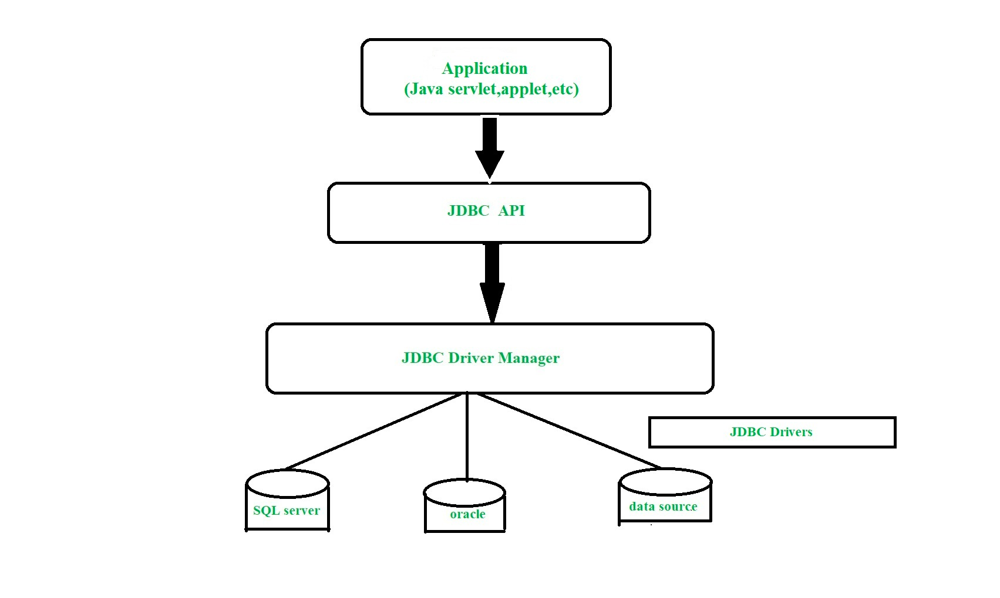

JDBC를 이해하기 위해선 `Connection`, `Statement`, `ResultSet`를 이해해야 합니다.

## 2. Connection

[Oracle 공식문서](https://docs.oracle.com/javase/8/docs/api/java/sql/Connection.html)에서는 `Connection` 객체를 다음과 같이 설명하고 있습니다.<br>
> "_A connection (session) with a specific database. SQL statements are executed and results are returned within the context of a connection._"<br>
> 
> "특정 DB와의 연결(세션)이다. 연결 컨텍스트 내에서 SQL 문이 실행되고 결과가 반환된다."

결국, 쿼리를 날리고 결과를 반환받기 위해선 이 `Connection` 객체가 필수로 생성되어야 합니다.

`Connection`이 제공하는 기능은 다음과 같습니다.

- 트랜잭션 경계 설정: `setAutoCommit(boolean)`
- 트랜잭션 격리 레벨 설정: `setTransactionIsolation(int)`
- ReadOnly 설정: `setReadOnly(boolean)`
  - ReadOnly를 true로 설정하면 `Connection`을 읽기 전용 모드로 설정하며 `Driver`에게 힌트로 제공하여 최적화를 활성화합니다. 
    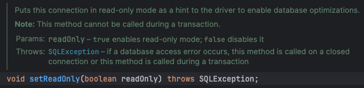<br>
    참고: [Optimizing InnoDB Read-Only Transactions - MySQL](https://dev.mysql.com/doc/refman/8.0/en/innodb-performance-ro-txn.html)

그렇다면 `Connection` 객체는 어떻게 생성할까요?<br>
총 2가지 방법이 존재하며 각각에 대해 알아보겠습니다.
 
### 2-1. DriverManager

Legacy한 방법의 `DriverManager` 입니다.

```java
public Connection getConnection(String url, String username, String password) {
    return DriverManager.getConnection(url, username, password);
}
```

참고로 JDBC 4.0 이전에는 `Class.forName` 메서드를 통해 JDBC 드라이버를 직접 등록해줘야 했습니다.<br>
하지만 이후부터 `DriverManager`가 주어진 url 값을 이용해 라이브러리에 등록된 Driver와 비교해 적절한 JDBC Driver를 찾아 제공합니다.

하지만 `DataSource`의 등장으로 잘 사용하지 않습니다.

### 2-2. DataSource

`DataSource`는 `DriverManager`에 비해 발전된 모델입니다.<br>
DB 연결 정보를 **코드가 아닌 properties로으로 값을 주입**할 수 있으며<br>
**Connection Pool, 분산 트랜잭션 기능을 지원**합니다.

```java
public Connection getConnection(String url, String username, String password) {
    return DataSourceBuilder.create()
                .url(url)
                .username(username)
                .password(password)
                .build();
```

DataSource 구현체는 각 벤더가 제공합니다.

### 2-3. Connection Pool

`DataSource`의 장점 중 하나인, _Connection Pool_ 에 대해 알아보고 Deep Dive 해보겠습니다.<br>
(이 부분은 개인적인 궁금증으로 작성했습니다. 꽤나 깊게 파고 들어가니 넘기셔도 좋습니다.)

Connection Pool은, 지정된 개수만큼 미리 `Connection` 객체들을 만들어놓고 해당 객체를 재사용하기 위해 만들어놓은 저장 공간을 의미합니다.

객체를 재사용하는 이유는 `Connection` 객체를 생성하고 삭제하는 비용이 비싸기 때문입니다.<br>
기본적으로 DB와 TCP/IP를 통한 네트워크 통신이 이루어져야 하고 쿼리가 모두 처리되면 해당 Connection 객체는 필요없어지기 때문에 GC에 의해 처리되는데 이때도 GC 비용을 생각해야 합니다.<br>
따라서 이 비싼 `Connection` 객체를 필요한만큼 만들어놓고 재사용하면 비용을 아낄 수 있지 않을까요?

H2에서 제공하는 JdbcConnectionPool을 직접 다뤄보며 조금 더 이해해보겠습니다.

```java
@Test
void testJdbcConnectionPool() throws SQLException {
    JdbcConnectionPool jdbcConnectionPool = JdbcConnectionPool.create(H2_URL, USER, PASSWORD);

    assertThat(jdbcConnectionPool.getActiveConnections()).isZero();

    try (var connection = jdbcConnectionPool.getConnection()) {
        assertThat(connection.isValid(1)).isTrue();
        assertThat(jdbcConnectionPool.getActiveConnections()).isEqualTo(1);
    }
    assertThat(jdbcConnectionPool.getActiveConnections()).isZero();

    jdbcConnectionPool.dispose();
}
```

1. `JdbcConnectionPool#create(String, String, String)`
    : 주어진 DB 연결 정보를 통해 `DataSource` 객체를 만들고 `JdbcConnectionPool` 객체를 초기화합니다.
    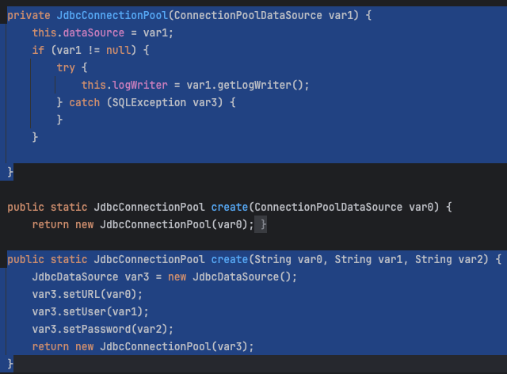

2. `assertThat(jdbcConnectionPool.getActiveConnections()).isZero();`
    : 초기 생성된 ConnectionPool은 Active 상태인 Connection이 0개 입니다.

3. `jdbcConnectionPool.getConnection()`
    : `JdbcConnectionPool` 객체 내부에 인스턴스 변수로 `AtomicInteger activeConnections`를 가집니다.<br>
    이 변수의 값을 1 증가하고, `volatile int maxConnections` 값과 비교해 이하인 경우에 `Connection` 객체를 반환합니다.<br>
    `JDBCConnectionPool`가 가지는 `maxConnections`의 default 값은 10 입니다.<br>
   `Connection` 객체를 반환할 때는 우선적으로 `Queue<PooledConnection> recycledConnections = new ConcurrentLinkedQueue()` `poll()` 하고,<br>
    아무 값이 존재하지 않을 경우엔 `DataSource`에서 `PooledConnection` 객체를 만들어 반환합니다.<br>
    해당 `Connection`이 close 되면 `recycledConnections`에 `Connection` 객체를 `add()` 해줍니다.<br>
    만약 `recycledConnections`에 재사용할 `Connection`이 존재한다면 `Connection`을 재사용합니다.
    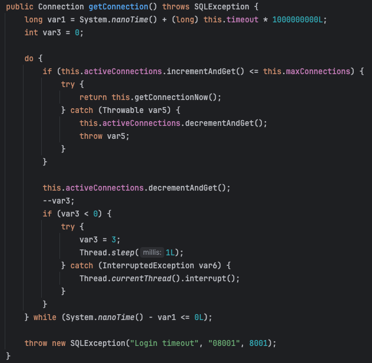
    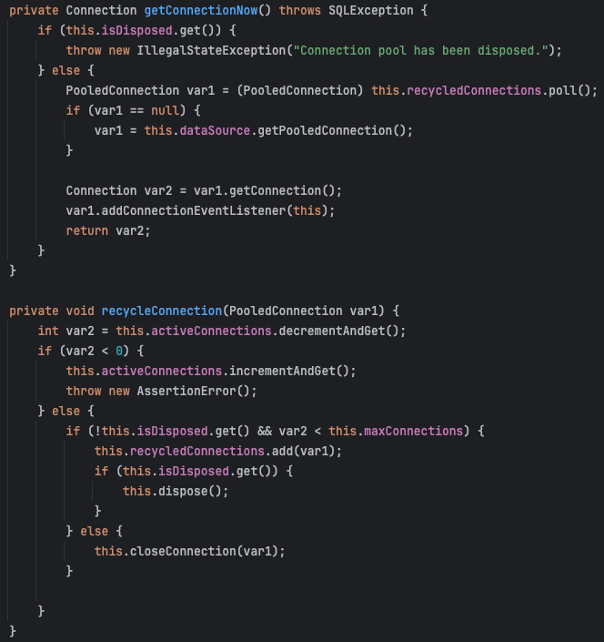

아래 사진을 통해 `Queue<PooledConnection> recycledConnections`에 `Connection` 객체가 존재하는 모습을 확인할 수 있습니다. 

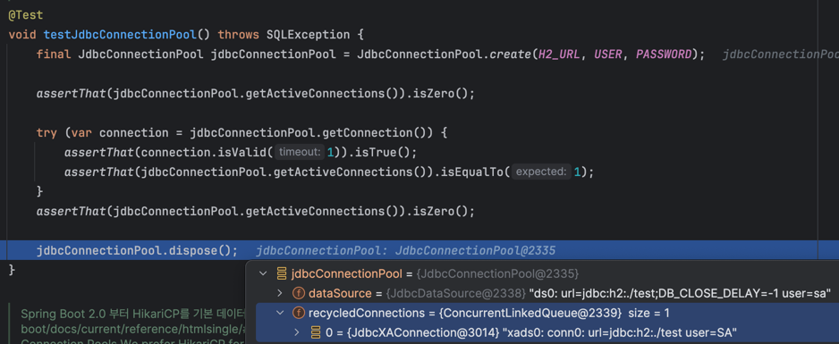

### 2-3-1. HikariCP

Spring Boot 2.0 부터 `DataSource`와 그에 상응하는 `Connection Pool`을 기본적으로 `HikariCP` 구현체를 사용합니다.<br>
[HikariCP](https://github.com/brettwooldridge/HikariCP)는 다른 `DataSource` 구현체들에 비해 매우 빠른 속도와 성능을 가지는 Connection Pool 구현체 중 하나입니다.

위 코드 상으로는 `ConnectionPool`을 직접 만들고, 그 안에서 `DataSource` 객체를 만들고, `Connection` 객체를 만들어 반환해주었습니다.<br>
하지만 기본적으로 DB 연결 정보만 제공해서 `DataSource` 객체만 만들면 아래와 같이 `HikariDataSource` 객체가 만들어집니다.

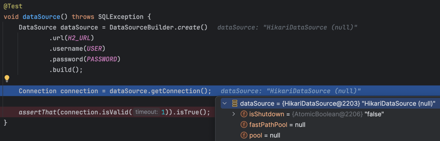

위 사진을 잘 보면, _pool_ 이 null로 초기화되어 있는데요. 이 객체가 커넥션 풀 객체입니다.<br>

그리고 처음 `getConnection()`을 호출하면 아래 메서드를 통해 _pool_ 이 초기화되고 해당 `HikariPool` 객체에서 `getConnection()` 메서드가 호출되어 최종적으로 `Connection` 객체가 반환되는 것입니다.

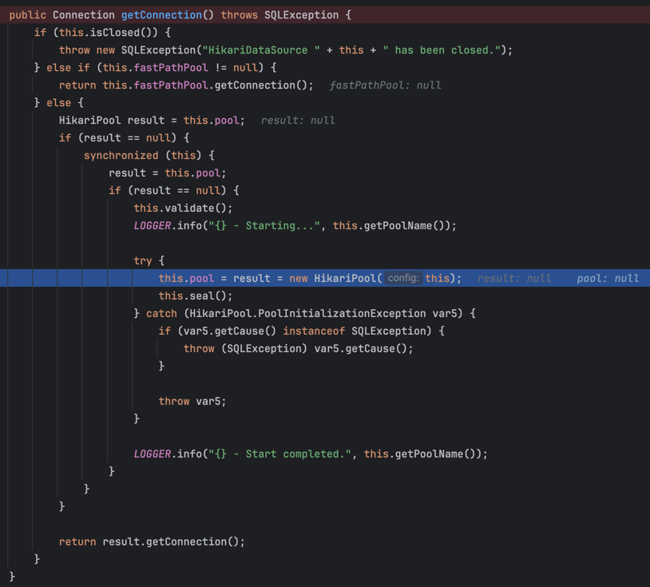

실제로 디버깅을 통해 HikariPool 내에 존재하는 Pool에 등록된 `Connection` 객체와 반환된 `Connection` 객체가 동일한 객체임을 확인할 수 있습니다.

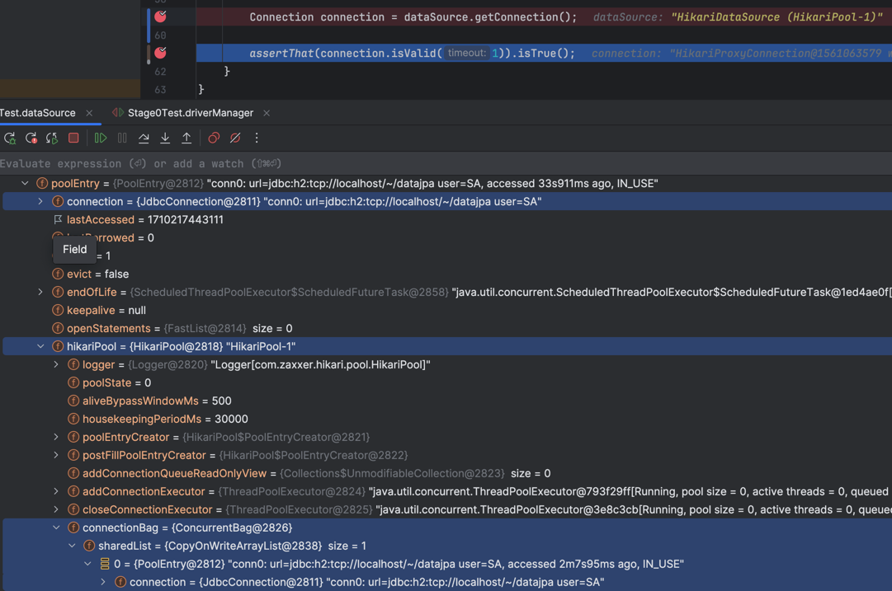

그런데 신기한 사실을 발견할 수 있었습니다. 테스트 메서드가 끝나기 전에, `Connection` 객체가 총 10개가 만들어지는 것을 확인할 수 있었는데요.

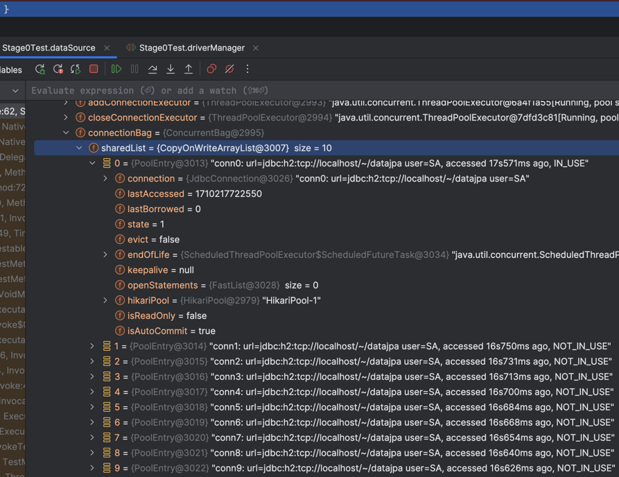

이를 이해하기 위해 조금 더 깊이 파보았지만 `DataSourceConfig` 객체에 선언된 `maxPoolSize`가 10으로 설정되어 있다는 정보 말고는 `maxPoolSize` 수 만큼 `Connection` 객체를 만들어 저장하는 부분을 찾지 못했습니다..<br>
(이 부분 어디서 확인할 수 있는지 아시는 분 댓글 부탁드립니다 😭)

어찌됐건 결과적으로 Spring Boot를 사용해서 properties에 DB 연결 정보를 입력하면 `Connection` 객체를 생성하기 위해 `HikariDataSource` 구현체가 사용되고, 그에 따라 _maxPoolSize_ 로 설정된 사이즈만큼 `Connection Pool`에 `Connection` 객체를 미리 만들어 놓은 다음 `Connection` 객체를 재사용하는 것까지 확인할 수 있었습니다.

HikariCP에 대한 자세한 이해는 따로 포스팅으로 정리하도록 하겠습니다.

### 분산 트랜잭션

Connection Pool 처럼 `DataSource` 객체로 만들어진 `Connection` 객체는 분산 트랜잭션에 참여할 수 있습니다.

분산 트랜잭션은 MSA에서 사용되는 개념이므로 여기선 패스하겠습니다..!

## 3. Statements

`Connection` 객체를 통해 DB와 세션을 맺었으면, 이제 쿼리를 날려볼 차례입니다.<br>
JDBC는 각 벤더 상관없이 SQL 문을 작성할 수 있도록 `Statement` 인터페이스를 제공합니다.<br>
좀 더 정확히 언급하면, 3종류의 `Statement`가 존재합니다.

- `Statement`: 순수 문자열로 이루어진 SQL 문입니다. 파라미터가 존재하지 않습니다.
- `PreparedStatement`: SQL 문에 파라미터가 존재할 때 사용됩니다. `Statement` 객체를 상속합니다.
- `CallableStatement`: 입력과 출력에 파라미터를 포함할 수 있는 스토어드 프로시저를 실행할 때 사용됩니다. `PreparedStatement`를 상속합니다.

아래 사진은 `Statement`와 `PreparedStatement`를 사용하는 예시 코드입니다.<br>
(`CallableStatment`는 사용해본 적이 없고 잘 사용하지 않는 것 같아 뺐습니다.)

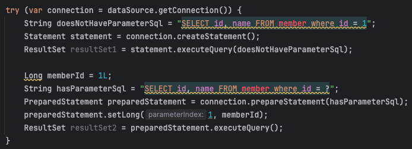

`Statement` 인터페이스에는 다음과 같은 메서드들이 있고, 이 메서드들은 DB에 쿼리를 날려주는 메서드입니다.

- `execute`: 주어진 SQL 문을 수행하고 그 결과가 `ResultSet`이면 true를, 그렇지 않고 결과값이 없거나 update count 인 경우 false를 반환합니다.

- `executeQuery`: SQL 문을 수행하고 `ResultSet` 객체를 반환합니다.

- `executeUpdate`: SQL 문이 수행되고 처리된 Row의 수를 반환합니다. `INSERT`, `DELETE`, `UPDATE` 문을 수행하는 경우 사용할 수 있습니다.

## 4. ResultSet

`Statement`의 결과, 즉 쿼리 결과로 `ResultSet` 객체가 반환됩니다.<br>
`ResultSet` 객체는 조회해온 결과에 접근할 수 있도록 하는 객체입니다.<br>
쿼리 결과로 2개 이상의 행이 조회될 수 있고, 각 행에 접근할 때 바로 이 `ResultSet`을 통해 접근하게 됩니다.

`ResultSet`에는 _커서_ 개념이 적용됩니다.<br>
쿼리 결과를 조회해오면 처음 커서의 위치는 -1이 됩니다. 그리고 `ResultSet#next()` 메서드를 통해 다음 행에 접근할 수 있습니다.<br>
행에 접근하면, `ResultSet#get???()` 메서드를 통해 값을 가져올 수 있습니다.<br>
만약 ID를 가져오려면 `resultSet.getLong(1);`을 호출하거나 `resultSet.getObject(1, Long.class);`를 호출하면 됩니다.<br>
이때 첫 번째 파라미터로 `columnIndex` 값이 들어가게 되는데 이 값은 `SELECT` 절에 있는 칼럼 순서를 나타냅니다. 여기서 주의할 점은 첫 번째 값이 0으로 시작하는 일반적인 index와 다르게 1부터 시작한다는 점입니다.

백문이 불여일타. 직접 코드로 이해해보겠습니다.

## 5. Connection 부터 ResultSet 까지 직접 코드로 확인해보기

`Member` 라는 테이블을 만들고 `id`, `name` 필드가 존재하는 상황을 만들고<br>
`Statement`를 통해 조회해서 값을 꺼내는 코드와 `PreparedStatement`를 통해 쿼리에 파라미터를 삽입하여 조회하는 상황을 코드로 작성하고 테스트로 검증해보겠습니다.

### 5-1. `Statement`를 이용해 결과 조회 

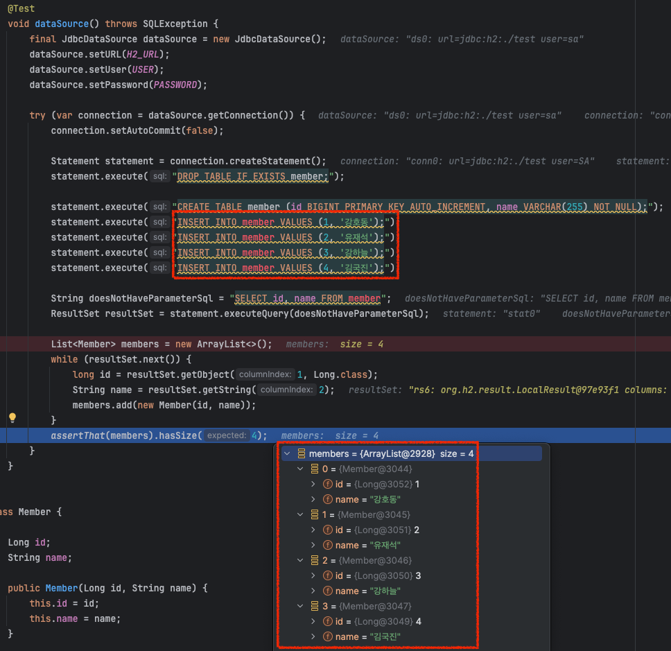

값이 잘 들어가있는 것을 확인할 수 있습니다.

### 5-2. `PreparedStatement`를 이용해 결과 조회

이번엔 성이 '강' 씨인 member를 조회하는 코드를 작성해보겠습니다.

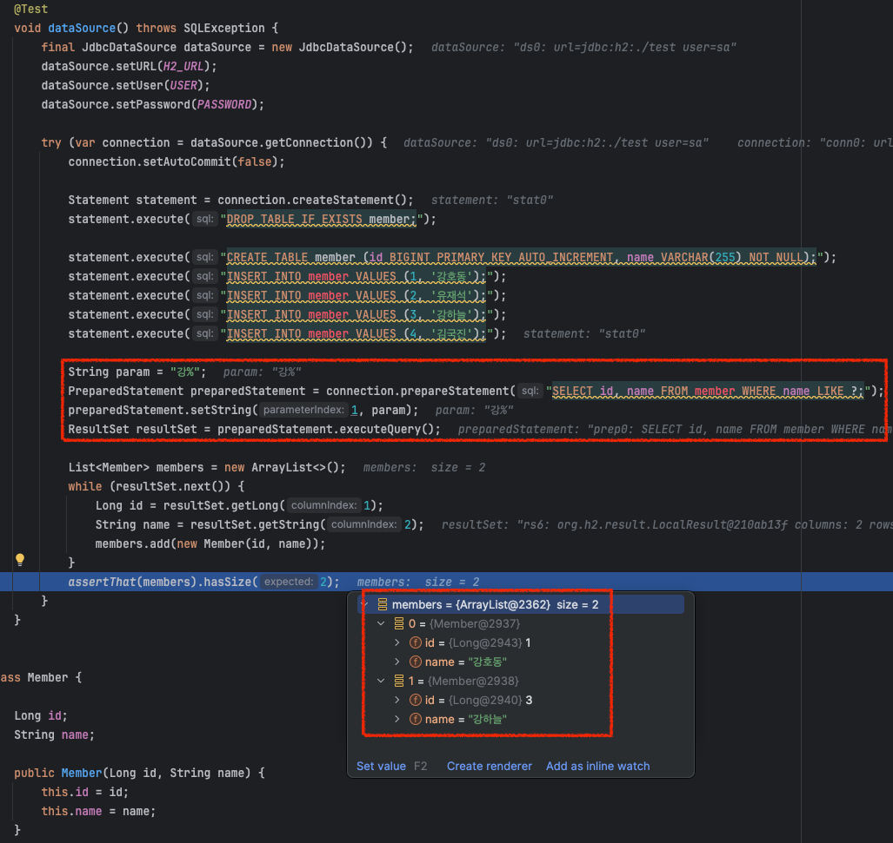

## 마치며

지금까지 JDBC를 이해하기 위해 `Connection`, `DriverManager`, `DataSource`, `ConnectionPool`, `Statement`, `ResultSet`에 대해 알아보았습니다.

최근까지 JPA, Spring Data JPA를 사용하다가 JDBC를 사용해보니, 확실히 쿼리를 실행하고 결과를 받아오기까지 많은 리소스가 들어가지만 DB 연결부터 쿼리 작성, 결과를 추출하기까지 수작업으로 하다보니 JPA가 데이터를 어떻게 가져올 지 그림이 그려지는 것 같습니다.<br>
JDBC는 데이터 접근 기술의 가장 근본이며 기본이므로 이번 기회에 확실히 이해했으면 좋겠습니다.

감사합니다.

### References
> - https://www.geeksforgeeks.org/introduction-to-jdbc/
> - https://docs.oracle.com/javase/tutorial/jdbc/basics/processingsqlstatements.html
> - https://docs.oracle.com/en/java/javase/11/docs/api/java.sql/javax/sql/package-summary.html