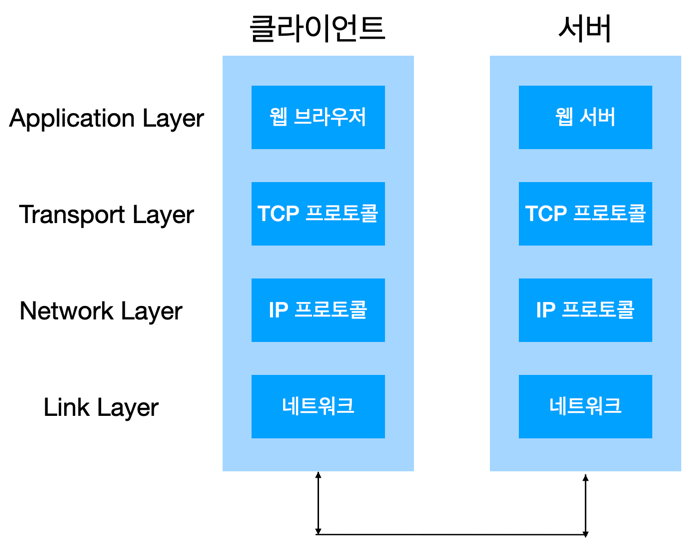
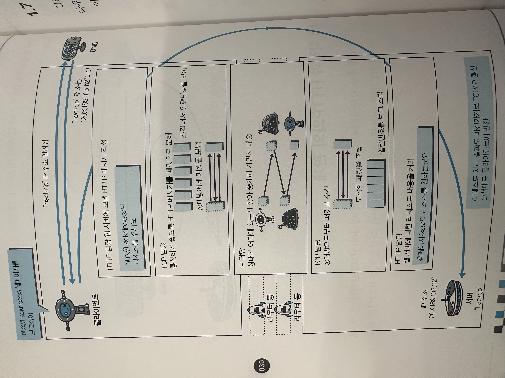

## 들어가며

이 글은 [그림으로 배우는 Http & Network Basic](https://m.yes24.com/Goods/Detail/15894097) 책을 읽으며 학습한 내용을 정리한 글입니다.

## 웹, 그리고 네트워크를 공부해야 하는 이유

> 책에는 없는 내용이지만 네트워크를 공부해야 하는 이유에 대해 생각해봤다.

웹, 그리고 네트워크는 **통신하는 방법에 대한 개념이다.**<br>
**통신은 게임, 쇼핑몰, IoT 분야 상관없이 IT 서비스에서는 필수다.**

따라서 우리가 어디가서 개발한다고 하려면 적어도 네트워크가 어떻게 구성되어 있고, 어떻게 동작하는지 알아야 한다고 생각한다.

## 클라이언트, 서버, 그리고 프로토콜

기본적으로 **네트워크 상에서 클라이언트와 서버가 HTTP 프로토콜을 이용해 통신한다.**

### 클라이언트

통신을 요청하는 장치

### 서버

받은 요청에 따라, 정보나 서비스를 제공하는 장치

### 프로토콜

서로 다른 장치들끼리 통신하는 방식을 미리 정의해놓은 약속 또는 규칙

## TCP/IP

TCP/IP는, 전세계에서 가장 많이 사용되는 Internet Protocol Suit 중 하나다.
> Internet Protocol Suit: 인터넷에서 컴퓨터 간 통신하는 데 쓰이는 프로토콜의 모음

기본적으로 네트워크 상에서 일어나는 통신은 TCP/IP 프로토콜을 이용해 이루어진다고 보면 된다.<br>
책의 주 내용인 HTTP 프로토콜도 TCP/IP 프로토콜에 기본적으로 포함된다.

TCP/IP 프로토콜에서 가장 중요한 것은 **계층 구조**라는 것이다.

> 워낙 방대한 내용이지만 해당 책에서는 간단한 소개 정도만 하고 있다.<br>
> 보다 자세한 내용은 [테코톡 - 히히의 OSI 7 계층](https://youtu.be/1pfTxp25MA8?feature=shared)과 [테코톡 - 수리의 TCP/IP](https://www.youtube.com/watch?v=BEK354TRgZ8)를 참고하자.

### TCP/IP 계층 구조

통신 과정에 필요한 작업들을 모놀리식이 아닌, 4계층으로 나누어 각 계층 별로 담당하는 작업을 나눴다.<br>
다시 말해 각 계층을 **모듈화**하였고, 자연스레 변경이 쉬워지며 다른 계층이 뭘 하는지 알 필요가 전혀 없어도 된다.

4계층은 아래와 같이 나뉜다.

1. Application Layer
    - 애플리케이션에서 통신에 필요한 작업을 수행하는 계층이다.
    - 프로세스와 운영체제 사이에 존재하는 소켓을 통해 데이터 송수신이 이루어진다.
    - HTTP, FTP(File Transport Protocol), DNS(Domain Name System) 등이 계층에 포함된다.

2. Transport Layer
    - 통신의 신뢰성을 보장하는 작업을 처리한다.
    - TCP와 UDP 두 가지 프로토콜이 포함된다.

3. Internet Layer
    - 네트워크 상에서 패킷의 이동을 처리한다.
    - IP(Internet Protocol)이 포함된다.

4. Link Layer (Data Link Layer, Network Interface Layer)
    - 네트워크에 접속하는 하드웨어와 관련돤 계층이다.
    - 랜 카드, 케이블 등이 해당 계층에 포함된다.

### TCP/IP 통신의 흐름

기본적으로 클라이언트와 서버 모두 **계층 순서대로 작업을 거쳐가며 통신한다.**



클라이언트의 Application Layer -> Transport Layer -> Internet Layer -> Link Layer -> 서버의 Link Layer -> Internet Layer ->
Transport Layer -> Application Layer 순서대로 거치게 된다.

### 캡슐화

클라이언트의 Application Layer에서 만들어진 HTTP 데이터는 Transport Layer, Network Layer, Link Layer를 거치며 각 계층에서 만들어진 데이터가 추가된다.

이렇게 만들어진 데이터가 서버의 Link Layer에 도착하고 HTTP 데이터가 서버의 Application Layer까지 도달하기 위해선, 마찬가지로 각 계층을 거치면서 각 계층이 필요한 데이터를 사용 및 삭제하고
다음 계층으로 전달한다.

이 과정을 _캡슐화_ 라고 한다.

각 계층의 데이터를 추가할 때, **헤더**를 추가한다고 한다.<br>
각 계층 별로 추가하는 헤더의 이름은 조금씩 다르다.

Transport Layer가 씌우는 헤더는, **세그먼트**<br>
Internet Layer가 씌우는 헤더는, **패킷**<br>
Link Layer가 씌우는 헤더는, **프레임** 이라고 부른다.

## HTTP와 관계가 깊은 프로토콜, IP / TCP / DNS

### IP (Internet Protocol)

인터넷 프로토콜(이하 IP)은 Internet Layer에 포함된다.

IP의 역할은 패킷을 상대 컴퓨터에게 전달하는 것이다.

패킷을 전달하기 위해서는 많은 정보가 필요하다.<br>
그 중에서도 IP 주소와 MAC 주소가 중요하게 작용한다.

- IP 주소
  - 네트워크 통신에 있어 각각의 통신기기에 할당된 주소다. 
  - 인터넷 서비스 공급자(ISP)에 의해 할당받는다.
  - 고유한 주소가 아니다. 경우에 따라 변경될 수 있다.

- MAC 주소
  - 네트워크에 존재하는 노드의 NIC와 같은 하드웨어에 고유적으로 부여된 주소다.
  - 변하지 않는다.

IP 주소와 MAC 주소를 이용해 도착지를 파악한다.<br>
그런데 IP 주소는 가변성이 있기 때문에 도착지 정보를 IP 주소에서 MAC 주소로 변환하여 정확한 위치를 파악하는 것이 필요하다.

이때 사용되는 프로토콜이 _ARP(Address Resolution Protocol) 프로토콜_ 이다.

IP에서 또 중요한 것은 **라우팅**이다.<br>
라우팅은 네트워크 상에서 패킷이 전달될 때 최적의 경로를 선택하는 과정이다.<br>

### TCP (Transfer Control Protocol)

TCP는 Transport Layer에 포함된다.

TCP는 데이터 전달 보증, 패킷 전달 순서를 보장한다.

_[3 way handshake](https://www.geeksforgeeks.org/tcp-3-way-handshake-process/)_ 를 통해 데이터 전달의 신뢰성을 보장한다.<br>
여러 패킷들을 세그먼트로 나누고 각 세그먼트에 번호를 부여하는 방식으로 패킷의 전달 순서를 보장한다.

### DNS (Domain Name Service)

DNS는 Application Layer에 포함된다.

DNS의 역할은 사람이 기억하기 어려운 IP 주소와 MAC 주소에 이름(도메인)을 붙여 사용하기 쉽도록 이름을 IP 주소로 변환하는 작업이다.

### 전체 과정

HTTP, DNS, TCP, IP가 동작하는 전체 과정의 그림을 통해 다시 이해해보자. 



## URI와 URL

URI(Uniform Resource Identifier)은 네트워크 상에서 리소스를 식별할 수 있는 수단을 제공한다.

URI에는 리소스의 위치를 가리키는 URL(Uniform Resources Location)과 리소스의 이름을 지정하는 URN(Uniform Resources Name)으로 나뉜다.<br>
URN 만으로 실제 리소스를 식별하는 방법이 보편화되지 않고 URL 방식이 보편화되었다.<br>
그래서 사실상 URI와 URL을 같은 의미로 사용한다.

### URL 문법

```text
schema://[user:password@]server address[:port][/path][?query][#fragment]

https://www.google.com:443/search?q=google&hl=ko
```

- schema (https)
  - 사용할 프로토콜을 지정한다.

- user:password
  - 리소스를 얻기 위해 사용되는 인증 정보를 지정한다.
  - 생략 가능하다.
  
- server address (www.google.com, localhost, celuveat.com)
  - 통신을 요청할 서버의 주소를 지정한다.
  - 도메인 이름이나 IP 주소를 입력한다.
  
- port (:80, :8080, :443, :22)
  - 서버의 접속 대상이 되는 포트 번호를 지정한다.
  - `:`로 시작한다.
  - 생략 가능하다.
    - 생략하면 schema에 따라 default port가 사용된다.
  
- path (/search)
  - 리소스의 경로를 지정한다.
  - `/`로 시작한다.
  - 생략 가능하다.

- query (?q=google&hl=ko)
  - 지정된 리소스에 임의의 값을 전달하기 위해 지정한다.
  - `?`로 시작하며 `key=value` 형태로 작성하고 각 값은 `&`를 통해 구분한다.
  - 생략 가능하다.
  - query parameter, query string라고도 불린다.

- fragment
  - 취득한 리소스에서 서브 리소스(특정 위치)를 가리키기 위한 값을 지정한다.
    - html 내부 북마크 등에 사용한다.
    - 예) https://docs.spring.io/spring-framework/reference/web/websocket.html#when-to-use-websockets
  - 서버로 전송하는 정보가 아니다.

### Reference

> - [그림으로 배우는 Http & Network Basic](https://m.yes24.com/Goods/Detail/15894097)
> - [모든 개발자를 위한 HTTP 웹 기본 지식](https://inf.run/8ZEU8)
