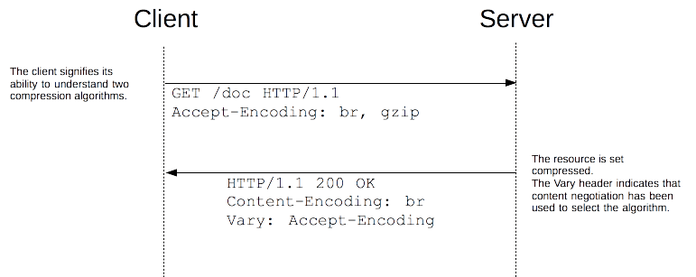
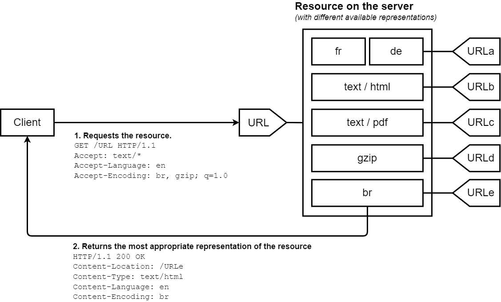
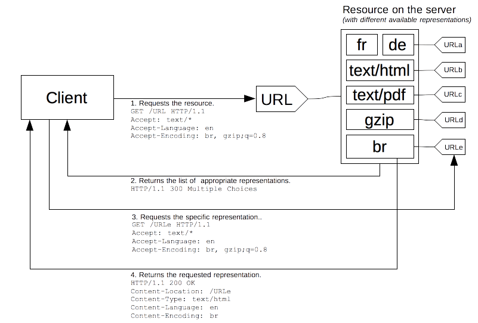

## 들어가며 

이 글은 [그림으로 배우는 Http & Network Basic](https://m.yes24.com/Goods/Detail/15894097)을 읽고 학습한 내용을 정리한 글입니다.

이번 글에서는 Http Request와 Http Response가 어떻게 동작하는지에 대해 작성하겠습니다.

## HTTP 메시지

HTTP 프로토콜은 **여러 개의 행으로 이루어진 문자열**입니다.

이를 *HTTP 메시지* 라고 합니다.

HTTP 메시지는 정해진 구조가 있습니다.

> 참고: [HTTP Request와 Response의 구조에 대해 정리한 글](https://kdkdhoho.github.io/02-http-protocol/)

## HTTP 압축

HTTP Request나 Response를 보낼 때 HTTP 메시지의 크기가 크다면 **압축**해서 보낼 수 있습니다.

압축하는 방식은 *콘텐츠 코딩*, *청크 전송 코딩* 으로 나뉠 수 있습니다.

### 콘텐츠 코딩

HTTP 메시지 본문이나 전송되는 데이터를 압축하는 방식입니다.

이미지나 영상같은 Multipart 파일이나 Json 형식의 String이 압축되는 것을 의미합니다.

#### File 형식 압축 (Multipart 파일 압축)

두 가지 방식이 있습니다.

- 무손실 압축
  - 데이터를 압축하는 과정에서 데이터의 손실이 발생하지 않습니다.
  - 이미지에서는 `gif`, `png`의 파일 확장자를 가진 파일이 사용합니다.
  - `zip`도 무손실 압축에 포함됩니다.

- 손실 압축
  - 사용자가 알아채기 힘든 정도로 데이터를 일부 손실하면서 압축하는 방식입니다.
  - 웹에서 비디오 형식은 모두 손실 압축이며 이미지의 경우 `jpeg`가 적용됩니다.

`webp`는 무손실 혹은 손실 모두 적용 가능합니다.

#### 종단간 압축 (Json 형식의 String 압축)

서버에서 Http Response를 압축하고 클라이언트가 수신한 Http Response를 압축 해제하는 방식을 _종단간 압축_ 방식이라고 합니다.

흔히 사용되는 압축 알고리즘은 `gzip` 이 있습니다. 그리고 `br` 도 있습니다. 

브라우저는 브라우저가 지원하는 압축 알고리즘(gzip, br)을 `Accept-Encoding` 헤더에 정보를 담아서 보냅니다.<br>
이를 활용해 서버는 적절한 압축 알고리즘 방식으로 Http Response를 압축하여 응답합니다.<br>
이때, 선택한 알고리즘은 `Content-Encoding` 헤더를 통해 알려줍니다. 그리고 캐싱과 관련된 헤더인 `Vary` 헤더에 `Accept-Encoding` 값을 추가해 새로운 캐시 정책을 적용할 수 있도록 합니다. 



스프링에서 `gzip` 방식 압축을 적용하려면 다음과 같이 작성하면 됩니다.

```yaml
server:
  compression:
    enabled: true
    min-response-size: ${압축 기준 크기} (default: 2048 (byte))
    mime-types: ${압축을 지원하는 Content type} (default: text/html, text/xml, text/plain, text/css, text/javascript, application/javascript, application/json, application/xml)
    
```

> 참고: [HTTP Response Compression - Spring Boot Reference](https://docs.spring.io/spring-boot/docs/current/reference/htmlsingle/#howto.webserver.enable-response-compression)

### 청크 전송 코딩

데이터를 **여러 청크로 분할해 전송하는 방식**의 알고리즘입니다.

이를 통해 전체 콘텐츠가 준비될 때까지 기다리지 않고 일부분을 먼저 송신 및 수신할 수 있습니다.<br>
특히 큰 파일이나 동영상 스트리밍과 같은 상황에서 유용하게 적용됩니다.

이를 위한 헤더로 클라이언트가 사용하는 `TE`, 서버가 사용하는 `Transfer-Encoding` 헤더가 있다.

- TE
  - 브라우저에서 수신할 수 있는 전송 인코딩 방식을 나타낸다
  - 예) `TE: trailers, chunked` 


- Transfer-Encoding
  - HTTP 메시지에 적용된 전송 인코딩 방식을 나타낸다
  - 예) `Transfer-Encoding: chunked`

> 참고: [Transfer-Encoding - MDN](https://developer.mozilla.org/ko/docs/Web/HTTP/Headers/Transfer-Encoding)

## 여러 형식의 데이터를 보내는 멀티파트

HTTP는 [MIME 프로토콜](https://developer.mozilla.org/ko/docs/Web/HTTP/Basics_of_HTTP/MIME_types)을 지원하기에 다양한 형식의 파일을 전송할 수 있습니다.

### multipart/form-data

흔히 브라우저에 파일을 업로드하고 이를 서버로 전송하는 경우가 있습니다.<br>
이를 위한 html은 다음과 같을 수 있습니다.

```html
<form action="/" method="post" enctype="multipart/form-data">
  <input type="text" name="description" value="some text" />
  <input type="file" name="myFile" />
  <button type="submit">Submit</button>
</form>
```

위 폼을 통해 서버가 수신하는 HTTP Request는 다음과 같습니다.

```text
POST /foo HTTP/1.1
Content-Length: 68137
Content-Type: multipart/form-data; boundary=---------------------------974767299852498929531610575
Content-Disposition: form-data; name="description"
---------------------------974767299852498929531610575

some text

---------------------------974767299852498929531610575
Content-Disposition: form-data; name="myFile"; filename="foo.txt"
Content-Type: text/plain

(content of the uploaded file foo.txt)

---------------------------974767299852498929531610575--
```

`boundary` 속성으로 각각의 멀티파트 엔티티에 대해 구분합니다.

그리고 마지막에는 boundary 뒤에 `--`를 붙여 마무리합니다.

### multipart/byteranges

이미지와 데이터를 특정 지점부터 원하는 만큼만 받을 수 있습니다.

이를 _resume_ 기능이라고 하고, _Range Request_라고 부릅니다.

```text
GET /tip.jpg HTTP/1.1
Host: www.usagidesing.jp
Range: bytes=5001-10000
```

```text
HTTP/1.1 206 Partial Content
Date: Fri, 13 Jul 2012 04:39:17 GMT
Content-Range: bytes 5001-10000/10000
Content-Length: 5000
Content-Type: image/jpeg
```

여기서 중요한 점은 Http Request에서 `Range` 헤더를 통해 원하는 만큼의 부분을 요청한다는 것과

Http Response에서 `Content-Range`를 통해 응답에 대한 정보를 담는다는 것입니다.<br>
그리고 응답 코드로 `206 Partial Content`를 포함합니다.

> 참고: [Content-Range - MDN](https://developer.mozilla.org/ko/docs/Web/HTTP/Headers/Content-Range)

## 콘텐츠 협상 (Content Negotiation)

동일한 URI에서 리소스의 서로 다른 버전을 제공하기 위해 사용되는 매커니즘입니다.

브라우저가 사용자에게 가장 fit한 리소스를 제공하기 위해 Http Reqeust를 보낼 때 정보를 담고 서버는 그에 따라 다른 값을 응답할 수 있습니다.<br>
예를 들어 문서의 언어, 이미지 포맷 혹은 콘텐츠 인코딩 방식 등에 적용될 수 있습니다.

콘텐츠 협상에는 두 가지 방식이 있습니다.

### 서버 주도적 협상

협상의 주도권이 서버에 있습니다.

브라우저는 협상에 필요한 정보들을 헤더에 담아 전송하면 서버는 이를 통해 가장 적합한 방식으로 리소스를 응답합니다.

브라우저는 `Accept`, `Accept-Language`, `Accept-Charset`, `Accept-Encoding` 헤더를 통해 필요한 정보를 보냅니다.



### 클라이언트 주도적 협상

협상의 주도권이 클라이언트에게 있습니다.

클라이언트가 서버에 요청을 보내면 서버는 응답 가능한 모든 버전의 리소스들에 대한 링크를 포함하여 응답합니다.<br>
그러면 브라우저는 이를 통해 원하는 리소스에 해당하는 URL로 재요청을 보내는 방식입니다.



### Reference
> - [그림으로 배우는 Http & Network Basic](https://m.yes24.com/Goods/Detail/15894097)