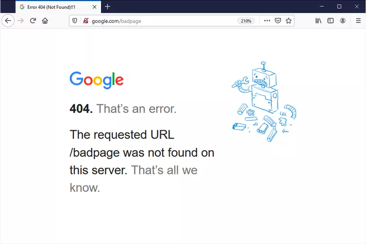
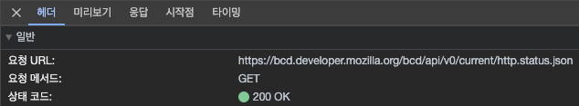

## 들어가며 

이 글은 [그림으로 배우는 Http & Network Basic](https://m.yes24.com/Goods/Detail/15894097)을 읽고 학습한 내용을 정리한 글입니다.

이번 장에서는 HTTP Status Code에 대해 알아보겠습니다.

## HTTP Status Code란?

클라이언트의 요청을 처리한 서버가 응답을 내려줄 때, 제대로 처리 됐는지? 혹은 처리하는 과정에서 이상이 없는지와 같은 정보를 함께 응답합니다.

이때 사용하게 되는 정보가 Status Code입니다.

Status Code는 `200 OK` 처럼 상태에 대한 코드 번호(`200`)와, 각 코드에 약속된 메시지(`OK`)가 있습니다.

클라이언트는 서버로부터 받은 Status Code를 통해 약속된 동작을 취할 수 있습니다. 
예를 들어 `401 Unauthorized` 가 응답으로 내려졌다면, 인증에 실패했다는 뜻으로 로그인 화면으로 이동시키거나, 
`404 Not Found`가 응답으로 내려졌다면, 아래 그림처럼 `찾을 수 없는 페이지`라는 화면을 띄어줄 수 있습니다.

아래는 실제 [HTTP Status Code - MDN](https://developer.mozilla.org/en-US/docs/Web/HTTP/Status#client_error_responses)에 요청한 결과를 나타낸 스크린샷입니다. 

## 종류

HTTP Status Code는 `100` 부터 `599` 까지 존재합니다.

하지만 모든 코드가 자주 사용되는 것은 아닙니다. 
개발을 하다보면 자주 사용하게 되는 코드가 정해져있는데요. 이런 코드들 위주로 정리하겠습니다.

### 200번 대

200번 대는 요청이 성공적으로 이루어졌을 때를 기반합니다. 

- 200 OK
  - 요청이 성공적으로 처리됐다는 뜻입니다.
- 201 Created
  - 서버에 리소스를 등록하고 결과가 성공적일 때 반환합니다.
  - 주로 `Location` 헤더에 만들어진 리소스의 URL을 함께 반환합니다.
- 204 No Content
  - 처리는 되었지만 이 후에 나타내거나 보여줄 리소스가 없을 때 반환합니다.  
  - 주로 `DELETE` 방식으로 리소스를 삭제 후에 성공적으로 처리가 됐을 때 반환합니다.

### 300번 대

300번 대는 Redirection과 관련 있습니다.

- 302 Found
  - 브라우저가 지정된 `Location` 헤더에 있는 URL에 새로운 요청을 보내도록 유도합니다.

### 400번 대

400번 대는 Client Error와 관련 있습니다.

- 400 Bad Request
  - 서버가 처리할 수 없는 요청을 보낸 경우 반환합니다.
  - URL은 유효하나 Http Request에 포함된 값들 중 서버가 처리하지 못하는 값이 포함될 가능성이 존재합니다.
- 401 Unauthorized
  - 인증이 필요하지만 요청에 인증 정보가 포함되지 않은 경우 반환합니다.
- 403 Forbidden
  - 인증은 되었지만 인가에 실패한 경우 반환합니다.
- 404 Not Found
  - 서버에 요청된 리소스를 찾을 수 없는 경우 반환합니다.
  - URL 자체가 잘못된 경우에 속합니다.
- 405 Method Not Allowed
  - URL은 유효하나 처리하지 않는 Http Method 방식인 경우 반환합니다.

### 500번 대

500번 대는 Server Error와 관련 있습니다.

- 500 Internal Server Error
  - 서버에서 처리되지 않는 에러가 발생한 경우 반환합니다.
- 502 Bad Gateway
  - 프록시 서버나 게이트웨이가 상위 스트림 서버로부터 잘못된 응답을 수신했을 때 반환합니다.
  - 프록시 서버나 게이트웨이에 문제가 있거나 두 웹 서버 간의 통신이 실패했을 때 발생할 수 있습니다.
  - 사용자의 요청이 Nginx까지는 갔지만 Nginx와 Spring Application의 통신에서 문제가 발생한 경우입니다.
- 504 Gateway Timeout
  - 프록시 서버나 게이트웨이가 사용자 요청을 처리하는 웹 서버로부터 지정된 시간 내에 응답을 받지 못한 경우 반환합니다.
  - Nginx가 Spring에 요청을 보냈지만 지정된 시간 내에 요청이 오지 못한 경우입니다.

### Reference
> - [그림으로 배우는 Http & Network Basic](https://m.yes24.com/Goods/Detail/15894097)