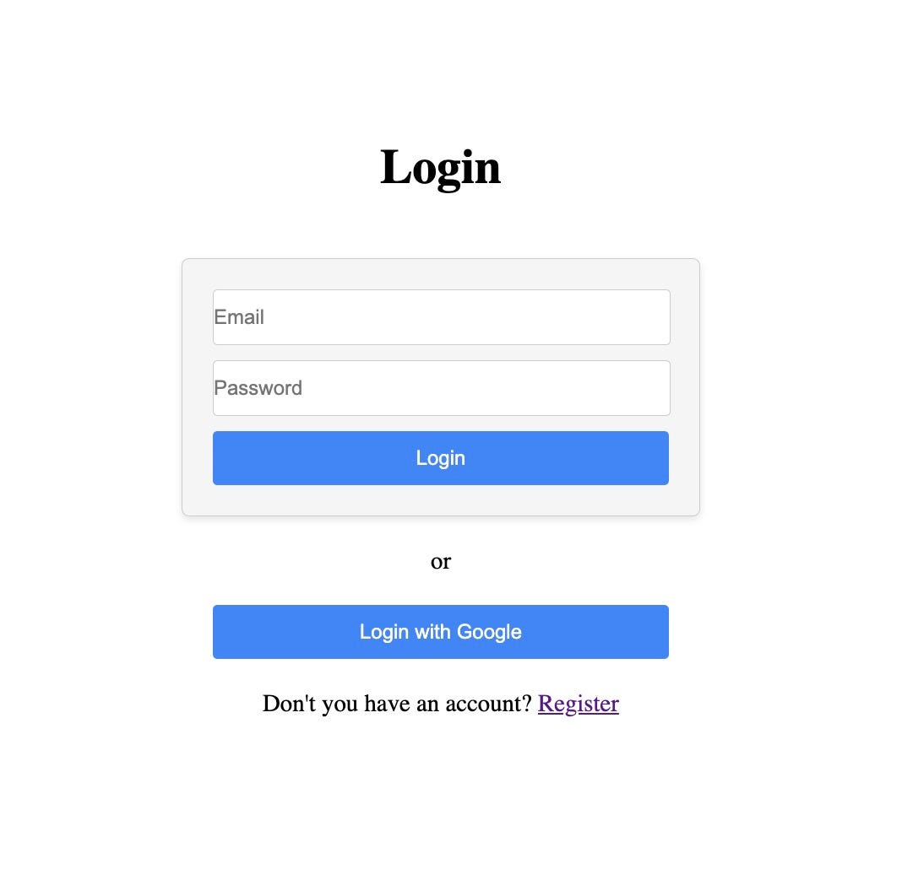

## 들어가며 

이번엔 HTTP 표준이 설명하는 여러 가지 인증 방식에 대해 알아보겠다.

## Baisc 인증

이름 그대로 가장 기본적인 인증 방식이다.

클라이언트가 Http Request를 보낼 때 `Authorization` 헤더에 ID와 패스워드를 Base64 형식으로 인코딩 한 값을 담아 보내는 방식이다.<br>
이때 값 앞에 `"Basic "`을 Prefix로 담아 함께 보내어 Basic 인증임을 나타낸다.

Basic 인증은 아래와 같은 요청이 서버로 전달된다. 

```http request
GET /my HTTP/1.1
Authoization: Basic Z3Vlc3Q35wervc32= 
```

가장 단순하며 간편한 인증 방식이다.<br>
하지만 Base64 형식은 [온라인 디코더 사이트](https://www.base64decode.org/)도 있는만큼 매우 위험한 인증 방식이다.<br>
따라서 잘 사용하진 않는다.

## DIGEST 인증

편리하지만 안전하지 않은 Basic 인증을 보완하기 위해 탄생한 기술이다.<br>
DIGEST 인증에는 _챌린지 리스폰스_ 방식이 사용되고 있어 패스워드를 그대로 보낼 일은 없다.

챌린지 리스폰스 방식은 최초에 상대방에게 인증 요구를 보내고 그 결과로 받은 챌린지 코드를 사용해서 리스폰스 코드를 계산한다.<br>
이 값을 상대에게 송신하여 인증하는 방법이다.<br>
리스폰스 코드는 패스워드와 챌린지 코드를 이용해 계산한 결과이다. 이 결과값을 보내기에 패스워드가 통신되는 일은 없다.

좀 더 자세히 살펴보면 인증 순서에 따른 요청 및 응답 내용은 아래와 같다.

1. 클라이언트가 리소스에 접근
```http request
GET /my HTTP/1.1
Host: listywave.com
```

2. 서버는 인증이 필요하다는 상태 코드와 함께 패스워드와 챌린지 코드(nonce)를 송신
```http request
HTTP/1.1 401 Unauthorized
WWW-Authenticate: Digest realm="my", nonce="MoSq25=sddfAMi217wsnDS", algorithm=MD5, qop="auth
```

3. 클라이언트는 패스워드와 챌린지 코드를 통해 리스폰스 코드를 계산해서 송신
```http request
GET /my HTTP/1.1
Host: listywave.com
Authorization: Digest username="kdkdhoho", realm="my", nonce="MoSq25=sddfAMi217wsnDS", uri="/my", algorithm=MD5, response="df563836bnfasf7acfasdfc78", qop="auth", nc=000000001, cnonce="0827c27c29c271"
```

4. 서버는 인증 성공 시 `200 OK`를 응답하고, 실패했을 경우 다시 `401 Unauthorized`를 응답한다.
```http request
HTTP/1.1 200 OK
Authentication-Info: rspauth="fvacacwararact3c5ttcctyct7tcc4t7y", cnonce="0827c27c29c271", nc=000000001, qop="auth"
```

하지만 Digest 방식도 사용상의 문제와 부족한 보안성 때문에 잘 사용하지는 않는다.

## SSL 클라이언트 인증

위 두 방식은 사용자 ID와 패스워드를 통해 인증을 진행한다.<br>
SSL 클라이언트 인증의 경우에는 클라이언트가 **클라이언트 인증서**를 서버로 전송해 인증한다.

클라이언트가 클라이언트 인증서를 서버로 전송하기 위해서는 사전에 미리 가지고 있어야 한다.<br>
이를 위해선 서버가 미리 증명서를 구매하여 사용자에게 배포를 해야 한다.<br>
다른 말로 인증을 위한 비용이 상당하다는 것이다.<br>
따라서 웹 애플리케이션 인증만을 위한 용도로는 사용하지 않고 후술할 Form 방식과 함께 사용되어 2-Factor 인증으로 사용한다.

## Form 방식

Form 방식은 HTTP 프로토콜로 스펙이 정의되어 있지는 않다.<br>
하지만 많은 웹사이트에서 채택 중이며 대부분의 경우 로그인 페이지를 통해 사용자의 인증 정보를 폼에 입력 후 서버로 전송하면, 서버는 해당 값을 토대로 사용자를 식별하고 그에 따른 인증 처리를 하는 방식으로 채택 중이다.



## 세션 및 토큰

HTTP 프로토콜은 Stateless 하다.<br>
방금 전에 로그인에 성공했지만 다음 요청마다 로그인을 새로 해야 한다.<br>
이를 개선하기 위해 쿠키[[^1]] 가 도입되었고 여기에 세션[[^2]]이나 토큰[[^3]] 을 이용해 사용자 인증 정보를 유지한다.

세션과 토큰은 현재 대부분의 경우 사용 중인 방식이다.<br>
이 둘을 잘 이해하고 사용할 줄 아는 것은 매우 중요하다는 의미이며 다른 포스팅에서 집중적으로 알아볼 예정이다.

[^0]: [그림으로 배우는 Http & Network Basic](https://m.yes24.com/Goods/Detail/15894097)
[^1]: [MDN - 쿠키](https://developer.mozilla.org/ko/docs/Web/HTTP/Cookies)
[^2]: [MDN - 세션](https://developer.mozilla.org/ko/docs/Web/HTTP/Session)
[^3]: [오픈튜토리얼스 - AccessToken](https://opentutorials.org/course/3405/22008)