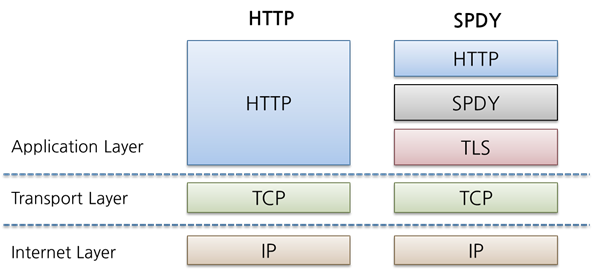
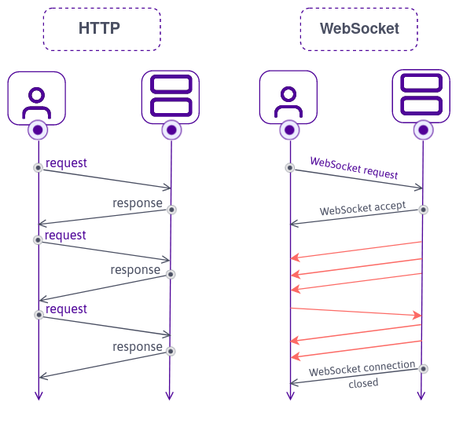

## 들어가며 

인터넷이 보급되고 웹 시장이 커져감에 따라 HTTP 프로토콜이 정말 많이 사용되고 있다.<br>
하지만 본래 HTML 문서를 전송하기 위해 탄생한 HTTP는 발전해가는 웹 시장에 비하면 부족한 기능들이 다수 존재했다.<br>
그래서 HTTP를 기반으로 하여 새로이 추가하는 형태로 새로운 프로토콜이 몇 가지 구현되었다.<br>
이 프로토콜에 대해 알아보자.

---

## HTTP의 병목 현상을 해소하는 SPDY

Google이 2010년에 발표한 **SPDY**(스피디)[[^1]]는 **HTTP의 병목 현상을 해소하고 웹 페이지 로딩 시간을 50% 단축**한다는 목표로 시작한 프로젝트다.

### HTTP의 병목 현상

HTTP 병목 현상은 많은 요청 대비 처리량이 낮아 발생한다.

대표적인 예시로 페이스북이나 트위터 같은 SNS는 수천만 명의 사람들이 실시간으로 작성한 데이터를 실시간으로 보여줘야 한다.<br>
하지만 기존 HTTP 프로토콜 스펙이 가지는 한계점 떄문에 다음과 같은 문제점들이 병목 현상을 야기한다.

1. 클라이언트(브라우저)에 자동으로 갱신을 한다거나 갱신이 되었다는 걸 표현하는 방법이 없다.
2. 새로운 정보를 얻기 위해 매번 새로운 요청을 보내야 한다. 응답은 페이지 전체에 해당하는 데이터가 내려간다.
4. 요청/응답 헤더를 압축하지 않으며 매번 같은 헤더를 보내게 될 수 있다.

### Ajax로 해결하기

2번 문제를 해결하기 위해 Ajax[[^2]]가 탄생했다.

Ajax(Asynchronous JavaScript+XML)는 JavaScript나 DOM 조작 등을 활용하여 **웹 페이지의 일부만 고쳐쓸 수 있는 비동기 통신 방법**이다.<br>
기존의 동기식 통신에 비해서 페이지의 일부분만 갱신되기 때문에 응답으로 전송되는 데이터 양은 감소한다.<br>
하지만 실시간으로 서버에서 정보를 취득하려고 하면 대량의 요청이 발생하게 된다.<br>
또, 근본적으로 HTTP 프로토콜이 가지는 문제가 해결되는 것은 아니다.

### Comet으로 해결하기

1번 문제를 해결하기 위해 Comet[[^3]]이 탄생했다.

Comet은 **서버 쪽에서 리소스의 갱신이 있을 경우, 요청을 받지 않아도 클라이언트로 응답을 보내기 위한 방법**이다.<br>
응답을 연장시킴으로써, 서버에서 통신을 개시하는 서버 푸시 기능과 유사하다.

보통은 요청이 오면 즉시 응답을 처리해 반환하지만, Comet의 경우 응답을 보류 상태로 두고 리소스의 갱신이 있는 경우에만 응답을 반환한다.<br>
하지만 그만큼 Connection을 유지하는 시간이 길어져 리소스를 많이 사용하게 된다.

### SPDY의 목표, 그리고 설계와 기능

Ajax와 Comet으로 HTTP의 사용성이 어느정도 개선되었지만 둘 다 한계가 존재했다.<br>
HTTP 프로토콜 레벨에서의 문제는 해결되지 않았기에, 근본적으로 프로토콜 레벨의 개선이 필요했다.<br>
이를 위해 SPDY 프로젝트가 시작됐다.

SPDY는 HTTP 프로토콜을 바꾸는 것이 아니다.<br>
HTTP 프로토콜 바로 아래, SSL(TLS) 프로토콜 바로 위에서 동작하는 새로운 프로토콜이다.<br>


이렇게 SPDY 프로토콜을 추가하면 다음과 같은 기능들을 얻을 수 있다.

1. 다중화 스트림<br>
   하나의 TCP 연결을 통해 다수의 요청을 무제한으로 처리할 수 있다.

2. 요청의 우선 순위 부여<br>
   요청을 무제한으로 병렬 처리할 수 있으면서도 각 요청에 우선 순위를 부여할 수 있다.

3. HTTP 헤더 압축<br>
   HTTP 헤더를 압축한다. 따라서 적은 수의 패킷으로 통신할 수 있다.

4. 서버 푸시 기능<br>
   서버에서 클라이언트로 데이터를 푸쉬하는 서버 푸시 기능을 지원한다.

5. 서버 힌트 기능<br>
   서버가 클라이언트에게 요청해야 할 리소스를 제안할 수도 있다.

### 헬로 HTTP/2, 굿바이 SPDY[[^4]]

HTTP/2가 SPDY를 기본적으로 스펙에 포함하는 수준으로 발표되었다.<br>
따라서 HTTP/2를 사용하면 위 기능들을 모두 사용할 수 있다.

---

## WebSocket

Ajax와 Comet을 사용한 통신은 웹 브라우징을 고속화하지만 기저가 HTTP 프로토콜이라는 점에서 근본적으로 병목 현상을 해결할 수 없다.<br>
WebSocket[[^5]]은 새로운 프로토콜과 API로 병목 현상을 해결하기 위해 탄생됐다.

WebSocket은 서버와 클라이언트가 Connection을 맺는데 성공하면, 서버 또는 클라이언트 모두 송신이 가능하게 되며 그 뒤 통신은 모두 전용 프로토콜로 수행하는 방식이다.


따라서 **서버 푸시 기능이 포함**되고, **통신량이 대폭 감소**한다.

WebSocket으로 통신하려면 **HTTP의 Upgrade 헤더 필드**를 사용해서 프로토콜을 변경하여<br>
3-Way HandShake 를 실시한다.
```http request
GET /chat HTTP/1.1
Host: listywave.com
Upgrade: websocket
Connection: Upgrade
Sec-WebSocket-Key: sdkjhfgasdkjfghascjfh==
Origin: https://listywave.com
Sec-WebSocket-Protocol: chat, superchat
Sec-WebSocket-Version: 13
```

`Sec-WebSocket-Key` 에는 핸드쉐이크에 필요한 키가 저장된다.<br>
`Sec-WebSocket-Protocol`에는 사용하는 서브 프로토콜이 저장된다.

위 요청에 대한 응답 상태 코드는 `101 Switching Protocols`[[^6]] 이다.<br>
```http request
HTTP/1.1 101 Switching Protocols
Upgrade: websocket
Connection: Upgrade
Sec-WebSocket-Accept: aasvfcert43devca==
Sec-WebSocket-Protocol: chat
```

`Sec-WebSocket-Accept`에는 `Sec-WebSocket-Key`의 값에서 생성된 값이 저장된다.

## HTTP/2.0

위에서 HTTP/1.1 의 성능을 개선하기 위해 다양한 기술이 탄생했다.<br>
HTTP/2.0은 성능 개선이 주된 목표이다. 따라서 *SPDY* 와 같은 프로토콜이 자체적인 스펙으로 탑재되어 있다.

<br>
<br>
<br>
<br>

[^0]: [그림으로 배우는 Http & Network Basic](https://m.yes24.com/Goods/Detail/15894097)
[^1]: [SPDY - The Chromium Projects](https://www.chromium.org/spdy/)
[^2]: [Ajax - Wikipedia](https://ko.wikipedia.org/wiki/Ajax)
[^3]: [Comet - Wikipedia](https://ko.wikipedia.org/wiki/%EC%BD%94%EB%A9%A7_(%ED%94%84%EB%A1%9C%EA%B7%B8%EB%9E%98%EB%B0%8D))
[^4]: [헬로 HTTP/2, 굿바이 SPDY - Google for Developers KR](https://developers-kr.googleblog.com/2015/02/hellohttp2.html)
[^5]: [WebSocket - Wikipedia](https://ko.wikipedia.org/wiki/%EC%9B%B9%EC%86%8C%EC%BC%93)
[^6]: [101 Switching Protocols - MDN](https://developer.mozilla.org/en-US/docs/Web/HTTP/Status/101)