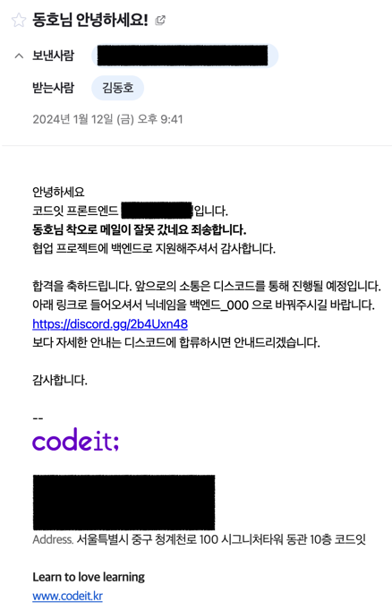
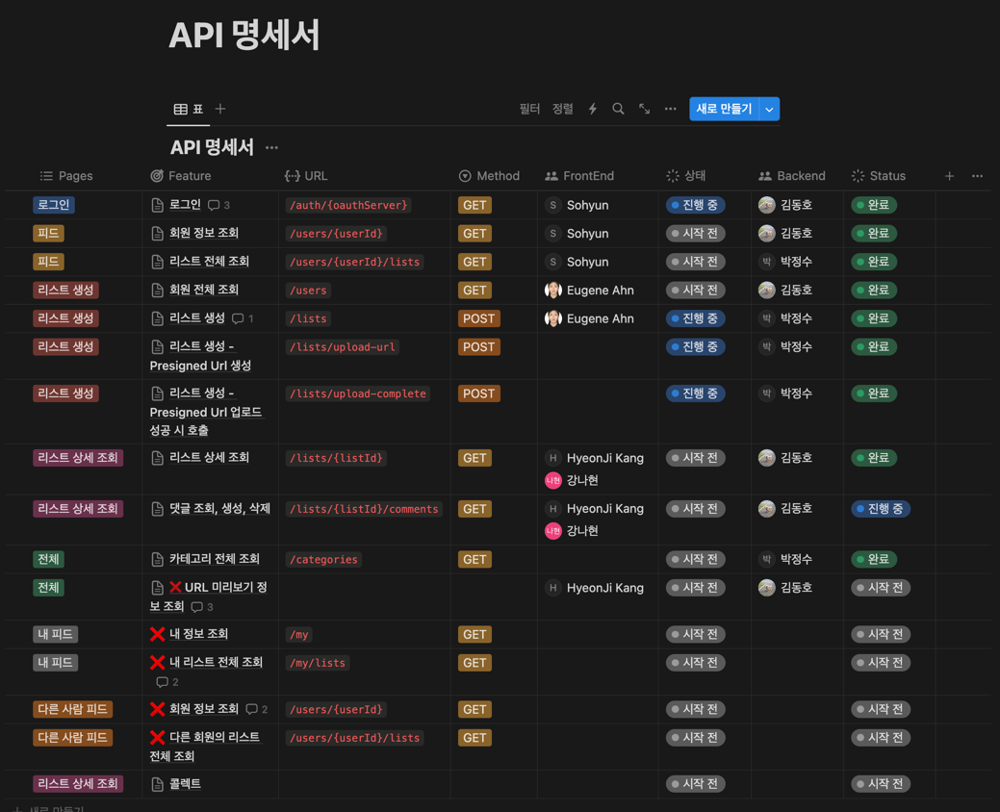

## 들어가며

이 글은 ListyWave 프로젝트를 진행하며 한 주를 되돌아보는 회고록입니다.

## 프로젝트를 하게 된 계기는요

우테코가 끝나고 개인 공부를 쭈욱 해오면서 개인 사이드 프로젝트를 진행하고 싶다는 생각이 들었습니다.
그래서 혼자 만들고 싶은 서비스를 기획하고 설계하고 개발 초기 진행 단계까지 진행했는데요.

가장 처음 기능인 소셜 로그인 기능을 구현할 때부터 막막했습니다.. 
프론트를 다룰 줄 모르고 와이어프레임도 없고 API 명세도 없어 쌩으로 서버만 구현하는 경험이 처음이었기 때문입니다. 
그래서 아무나 같이 협업할 프론트엔드 팀원이 있었으면 좋겠다는 생각이 자연스레 들었고 어느새 프로젝트를 함께 할 팀원을 구하는 게시글을 보고 있었습니다.

그러다 운좋게 [코드잇에서 모집하는 프로젝트 공고문](https://codeit-sprint.oopy.io/)을 보게 되었고 홀린듯이 지원했습니다. 
지원동기를 작성하는 란에 "최대한 솔직하게 작성해달라"는 멘트에 이끌려 진심을 호소하며 작성했던 기억이 있습니다.

지원동기를 간단히 적어보자면, <u>경험과 실력이 부족한 탓에 우테코에서 했던 프로젝트를 주도적으로 하지 못한 것이 너무 큰 아쉬움이 남았고 프로젝트를 주도적으로 진행해보고 싶다는 내용</u>으로 작성했습니다.

다행히 서류 합격으로 면접을 볼 기회가 주어졌고 5분도 채 안되는 속성 면접을 진행하고 마침내 최종 합격을 했습니다 !

~~처음엔 불합격 메일이 왔었는데 알고보니 오발송이었던 해프닝이 있습니다 😂~~

## 무엇을 하고 느꼈나면요

최종합격 이후로 1월 22일 첫 팀 미팅을 진행했고 이때 우리가 만들 서비스를 기획하는 시간을 가졌습니다. 이때가 1주차가 될텐데요. 1주차에는 주로 기획하고 와이어프레임 작성하며 개발을 준비하는 시간을 가졌습니다.

그리고 2주차부터 본격적인 개발 관련 작업을 진행했는데요. 이때는 아래 작업들을 모두 진행했습니다.

- 프론트엔드 및 백엔드 CI/CD 구축
- 개발 서버 구축 
- 도메인 구매 및 연결
- 개발 문화 설정
- 개발환경 셋팅
- ERD 설계
- API 명세 작성
- 브랜칭 전략 설정
- Issue Template 및 PR Template 설정
- 1차 MVP 구현
  - 카카오 Oauth 로그인
  - 회원 정보 조회 API
  - 회원 전체 조회 API
  - 리스트 상세 조회 API
  - 댓글/답글 CRD API
- 카테고리를 어떻게 관리할 것인지 고민
- DB 구축
- 설정 파일 외부 분리 작업
- 새로운 기술 학습하기

2주차가 끝나는 지금, 이번 주 진짜 힘들다 느끼고 있었는데 막상 적고보니 힘들만 했군요 허허..

이 중에서 언급하고 싶은 경험들은 아래와 같습니다.

### 인프라 구축

처음으로 인프라 구축을 시작부터 완성까지 혼자서 진행해보았습니다.

백엔드 CI/CD는 익숙하기도 하고 간단하게나마 해본 경험이 있어 2-3시간 내로 금방 구축했지만 
프론트엔드 CI/CD는 Next.js 기반 프로젝트를 빌드하는 것부터 익숙치않아 한 2-3일은 걸렸습니다. 
물론 보완할 작업이 있지만 차차 진행해야겠습니다. 

DB 구축, 연결도 쉽지 않았습니다. 
그 전에는 RDS를 써서 그다지 어렵지 않게 사용한 경험이 있었고 우테코에서는 보안 관련 설정은 되어 있었으며 팀원이었던 크루가 구축부터 연결까지 모두 진행해주어 어려운 작업인지 몰랐는데 꽤나 쉽지 않았던 기억이 있습니다.

또한 개발 EC2의 디스크 용량이 부족한 이슈가 발생하여 임시로 EBS 용량을 늘려 조치했지만 정확한 원인을 파악하여 문제를 해결할 이슈도 남아 있습니다.

인프라 관련하여 전반적으로 보안과 가용성 면에서 부족한 부분이 많이 있지만, 아직 초기 단계이기도 하고 점점 나아지도록 노력해야겠습니다.

### API 명세서 작성

API 명세도 생각보다 너무 어려웠습니다.

API 명세를 작성하는 건 이미 많이 해봤고 어려운 작업은 아니기에 금방 할 줄 알았는데요. 기능 요구사항이 복잡하기도 하고 오랜만의 API 명세 작업이다보니 꽤 많은 시간이 걸렸습니다.

특히 "피드 조회" 화면에 대한 API 명세를 구현할 때 다양한 유즈 케이스를 고려하여 API 명세를 작성하다보니 은근 머리가 아팠습니다.. 
비회원이냐 회원이냐, 팔로우 했느냐 하지 않았느냐, 비회원이 내 피드가 아닌 타인의 피드를 들어가느냐 등.. 고려해야 할 것들이 많았습니다.

하지만 팀원들과 함께 이야기하며 완성할 수 있었고 이때 "API 명세 작성은 프론트엔드와 백엔드 함께 작성하는 것이 맞다"고 느꼈습니다. 
아무래도 프론트엔드가 개발할 때와 백엔드가 개발할 때 입장 차이는 분명히 있고 그에 따라 한 가지 기능나 필드에 대해 누가 처리할 것인가가 결정되기 떄문입니다.

### 카테고리를 어떻게 관리할 것인지 고민

기능 요구사항 중 "카테고리에 따라 리스트를 필터링할 수 있다"는 요구사항이 있었습니다. 
위 요구사항을 만족하기 위해 카테고리를 누가? 어떻게 관리할 것인가에 대한 고민을 하게 됐습니다.

결론은 백엔드가 Enum으로 관리하는 것으로 결정되었는데요. 
이 과정에서 백엔드가 카테고리를 관리할 때 Enum으로 저장하고 관리할 것인지 DB 상에서 저장하고 관리할 것인지 거의 2-3일 간 고민했습니다. 
생각에 생각에 생각을 하다보니 머리 속에서 DeadLock이 발생했고 결국 주변 지인들에게 의견을 물어보며 결정했습니다.

하지만 최종 결정은 팀원의 의견으로 결정하게 됐는데요. 이때 "내가 너무 어렵고 복잡하게 생각만 하는구나" 입니다. 
물론 각 방법에 대한 장단점이 존재하고 트레이드 오프에 따라 **결정**을 해야 하는데, 저는 단점이 없는 방법을 찾기 위해 생각을 거듭했던 것입니다.

차라리 한 가지 방법에 대해 일단 구현해보고나서 문제가 생겼을 때 그 문제를 해결하는 것이 더 빠르게 문제를 해결하는 방법이 될 수 있겠다고 생각됐습니다.

그리고 이를 계기로 가지고 있던 "완벽주의 성향"을 조금 내려놓는 법을 배울 수 있었습니다.

### 새로운 기술 학습하기 

원래는 소셜 로그인 기능을 구현하기 위해 `Spring Security`, `OAuth 2.0 Client`, `Redis`를 이용하기로 했습니다. 
모두 한번도 사용해본 기술이 아니기에 월요일부터 학습을 진행했는데요. 
`Spring Security`만 해도 학습 비용이 상당히 높은 프레임워크이기에 다른 작업들도 기간 내에 완료하기 위해 포기하고 당장 기능이 동작하는 것에 집중했습니다.

이 과정에서도 나름대로의 실패를 경험했습니다. 
새로운 기술을 빠르게 익히지 못한다고 생각했고 이대로면 구현에 실패할 것 같아 개발에 자신감을 잃었습니다.

기분 전환 겸 산책하다가 문득 우테코 프리코스 시절 `Enum`과 `Stream API`를 처음 학습하며 너무 어려워 좌절했던 기억이 떠올랐습니다. 
현재는 `Enum`과 `Stream`을 너무나도 익숙하게 사용하고 있는 모습을 생각했을 때, 포기하지 않고 계속 학습하다보면 어느새 익숙하게 사용하고 있을 것이라는 생각에 다시 자신감을 얻었습니다.

물론 위 기술들을 모두 학습하고 적용해보고 싶은 생각이 있기에 추후 도입하여 마이그레이션 할 것입니다.

## 아쉬웠던 점은요

### 1. 무리한 일정 잡기

1시간이 걸릴 것 같으면 2시간이 걸릴 것 같다고 말하라는 소리를 들은 적이 있습니다. 
무엇이든 본인이 생각했을 때보다 2배 이상의 시간이 소요되기 때문인데요. 
특히 이번에 뼈저리게 느꼈습니다..

스스로를 과대평가하여 금방 끝날 줄 알고 많은 작업을 예정해놓았고 
그래도 말한 것은 지키기 위해 밥먹고 자는 시간 빼고는 프로젝트에 전념했습니다.

그 결과 많은 걸 진행하긴 했지만 회고록을 쓰는 지금도 눈이 침침하네요.. 👀

일정을 조금 보수적으로 잡아야겠습니다.

### 2. 테스트 코드 없이 기능 구현

우테코에서 테스트 코드의 중요성을 그렇게 강조당하고 배운 상태에서 본 프로젝트를 진행하면서 당연히 작성해야 하는 것으로 생각하고 있었습니다.

하지만 테스트 코드 작성이 익숙치 않은 팀원과 빡빡한 일정 때문에 테스트 코드를 작성할 시간이 없었습니다..

그래서 현재 테스트는 11개만 존재하고 80% 이상의 메서드에 대해 테스트를 작성하지 않았습니다.

<u>테스트 코드가 없으니 확실히 밤에 잠을 설치게 됩니다.</u> 
내가 만든 기능이 잘 동작할까? 버그는 나지 않을까? 마음 한구석 어딘가가 자꾸 불편합니다..

다음 주차에는 당장 테스트 코드를 작성해야겠습니다.

### 3. 너무 어렵게 생각했다. 그리고 생각만 했다.

카테고리 관리 방법과 로그인 기능 구현할 때 너무 어렵게만 생각했습니다. 
그래서 혼자서 자꾸 부정적인 생각을 하게 되고 자신감을 잃었습니다.

하지만 간단하게 생각하고 <u>일단 괜찮아보이는 방법이나 작은 것부터 시작</u>하는 것이 중요하다고 느꼈습니다. 
이는 체스 미션에서도 경험했던 건데 너무 오래돼서 잊고 살았나봅니다 🥲

앞으로는 생각하는 시간보단 코드 짜는 시간을 더 가지도록 해야겠습니다.

## 다음 주에 노력할 것은요

### 1. 일정을 보수적으로 잡기

몸음 조금 챙기는 한 주가 되어야겠습니다.

잠, 운동, 식사를 포기하며 개발만 하는건 2주 연속으로 하기는 힘드네요,,

### 2. 적어도 현재까지 구현한 기능들에 대해 테스트 코드 완성하기

이건 다음 주 작업 1순위로 진행하려고 합니다. 
꾸준한 리팩터링과 안정적인 서버 개발을 위해 테스트 코드는 필수인 것 같습니다 !!

## 마치며

짧은 기간 동안 많은 것을 한 만큼 고된 육체적으로나 정신적으로 고된 시간이였습니다.

하지만 동기부여에 걸맞게 모든 걸 주도적으로 진행하다보니 정말 많은 것을 느끼고 배우고 간만에 <u>몰입</u>하는 기분을 느꼈습니다.

프로젝트 정식 종료까지 한 달 밖에 남지 않은 시점에서 앞으로도 쭉 달려야겠지만, 끝나고 난 뒤에 폭발적으로 성장하고 많은 경험치를 쌓은 모습을 기대하고 열심히 달려봐야겠습니다. 🔥
