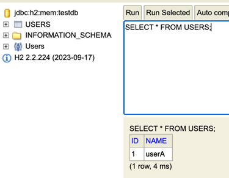
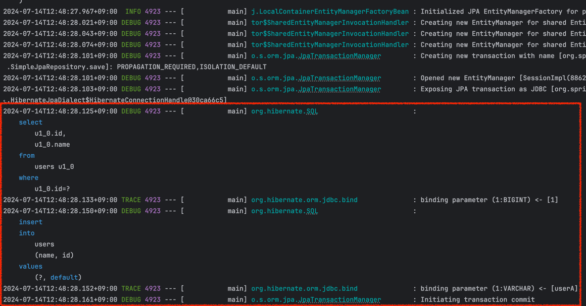

프로젝트를 진행하다보면 애플리케이션 실행과 동시에 DB에 더미 데이터를 넣고 싶은 경우가 있다.<br>
특히 로컬이나 개발 환경에서 원활한 테스트를 위해 필요한 경우가 많다.

따라서 이번 글에서는 **스프링 애플리케이션을 실행하면서 동시에 DB에 더미 데이터를 넣는 방법 2가지**에 대해 알아보고자 한다.

개발 환경은 다음과 같다.

- Java 17
- Spring Boot 3.3.1
- H2 (InMemory)
- Spring Data JPA

## 테스트를 위한 간단한 프로젝트 세팅

테스트를 위해 H2 DB를 인메모리 방식으로 띄우고 콘솔에 접속해 확인할 수 있도록 한다.<br>
그리고 로그를 남기기 위해 아래와 같이 설정 파일을 작성하자.

```yaml
# application.yml
spring:
  datasource:
    driver-class-name: org.h2.Driver
    url: jdbc:h2:mem:testdb

  h2:
    console:
      enabled: true

  jpa:
    defer-datasource-initialization: true
    hibernate:
      ddl-auto: create
    properties:
      hibernate:
        format_sql: true
        highlight_sql: true

logging:
  level:
    org.springframework.orm.jpa: DEBUG
    org.hibernate.SQL: DEBUG
    org.springframework.orm.transaction: DEBUG
    org.hibernate.orm.jdbc.bind: TRACE
```

DB에 삽입할 간단한 엔티티 객체를 만들었다.

```java
@Entity
@AllArgsConstructor
@Table(name = "users")
@NoArgsConstructor(access = AccessLevel.PROTECTED)
public class User {

    @Id
    @GeneratedValue(strategy = GenerationType.IDENTITY)
    private Long id;

    private String name;
}
```

## 1. data.sql

가장 먼저, `data.sql` 파일을 작성하는 것이다.<br>
*/src/main/resources/* 아래에 작성하면 된다.<br>

간단히 users 테이블에 id는 1이고 name은 "userA" 인 데이터를 넣기 위해 아래와 같이 작성했다.
```sql
INSERT INTO USERS
VALUES (1, 'userA');
```

h2 콘솔에 접속해서 확인하면 잘 저장되는 걸 확인할 수 있다.


하지만 해당 방법을 적용하기 위해서는 application.yml 에 `spring.jpa.defer-datasource-initialization` 옵션을 `true`로 설정해주어야 한다.<br>
data.sql 파일의 실행 시점은 _Hibernate_ 가 초기화되기 전에 실행되기 때문이다.<br>

또한, H2와 같은 임베디드 DB는 Spring이 기본적으로 data.sql 스크립트를 실행시킨다.<br>
하지만 그렇지 않은 경우에는 `spring.sql.init.mode=always` 설정을 추가해주어야 동작한다.

위와 동일하게 _schema.sql_ 스크립트를 작성할 수도 있다.<br>
이름에서 구분할 수 있듯이 schema.sql은 스키마를 초기화할 때 사용되고 data.sql은 더미 데이터를 삽입할 때 사용한다. 

## 2. 따로 클래스를 만들고 @PostConstructor 추가하기

더미 데이터를 삽입하는 관심사를 가진 객체를 만들고, `@PostConstructor`를 붙인 메서드를 실행하는 방법이다.<br>
간단하게 만들어 보았다.

```java
@Component
@RequiredArgsConstructor
public class DummyDataInserter {

    private final UserRepository userRepository;

    @PostConstruct
    public void init() {
        User userA = new User(1L, "userA");
        userRepository.save(userA);
    }
}
```

_data.sql_ 스크립트를 이용하는 방법은 내가 몰라서 그런건지 로그가 안남았다.<br>
하지만 해당 방법은 Hibernate를 이용하다보니 친절하게 로그도 남길 수 있다.


또, `@Profile`을 이용해 원하는 환경에서만 수행할 수 있다.<br>
추가로 쌩 SQL 스크립트를 작성하는 게 아닌, 코드를 작성해 저장할 수 있다는 점에서도 큰 메리트라고 생각한다.