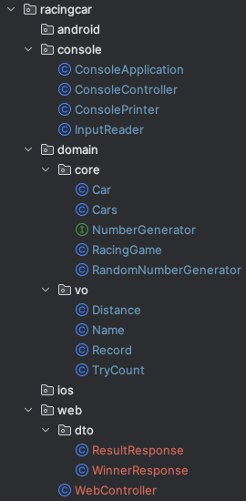
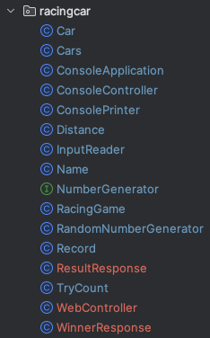

## 들어가며

흔히 Domain과 View는 분리해야 한다고 한다.

대표적인 디자인 패턴으로 MVC 패턴이 있다.

같이 작성하면 개발도 빨리 할 수 있고 코드 작성에도 편한데, 왜 분리하라고 할까?

## 결론

결론부터 말하자면, Domain 객체를 잦은 변경으로부터 보호하기 위해서이다.

## 왜 Domain을 보호해야 할까?

이를 알아보기 위해서는 우선 Domain이 무엇을 의미하는 **용어**인지 이해해보자.

### Domain이란?

흔히 **소프트웨어로 해결하고자 하는 문제 영역**이라고 한다.

우리에게 친숙한 서비스로 생각해봤을 때 
카카오톡이 해결하고자 하는 문제 영역은 채팅이다. 
배달의 민족이 해결하고자 하는 문제 영역은 배달 주문이다.

우리가 개발하는 이유에 대해서 생각해 봤을 때에도 결국 어떠한 문제를 해결을 위해서이다.

그렇기에 **Domain은 프로그램에 있어 가장 본질적인**, 그리고 **우리의 밥줄이 되는 코드**라고 할 수 있다.

## View

이제 View에 대해 알아보자.

View는 쉽게 말해 사용자에게 보여지는 코드이다.

View는 어떤 특징을 가질까?

개인적인 경험으로 View는 Domain에 비해 엄청난 변경이 발생한다.

페이지를 추가하거나, 
메인 페이지 개편을 하거나, 
처음엔 웹페이지로만 만들었다가 웹앱으로 만들었다가..
> 심지어 웹페이지랑 웹앱은 따로 관리해야 한다고도 한다 😂

더 다양한 상황의 변경이 일어난다.

혹여나 웹 서비스가 성공해서 앱으로도 제공하려면, 앱 전용 View도 작성해야 할 것이다.

## 다시 돌아와서

이제 다시 돌아와서 "왜 Domain과 View를 분리해야 할까?" 라는 질문보다,

반대로 "Domain과 View가 공존한다면? 혹은 Domain이 View에 강력하게 결합되어 있다면?" 이라는 질문을 하고 싶다.

이에 대한 답으로, 변경 가능성이 매우 높은 View가 변할 때마다 Domain도 그에 따라 변화에 대응해야 한다.

따라서 결론으로, **우리의 밥줄인 Domain을 변경하는 상황을 최소화하는 노력** 중 하나라고 이해하면 될 것 같다.

## 이해를 돕는 좋은 예시

사실 위 내용은 어느 블로그에서나 할 수 있는 이야기이다.

그렇기에 개인적으로 Domain과 View의 분리가 와닿았던 사례에 대해 소개하고자 한다.

아래 그림을 보자.

*RacingCar* 라는 이름의 게임이다.

패키지 구조를 보면 `android`, `console`, `domain`, `ios`, `web` 으로 크게 나뉘어져있다.

그리고 위 사진을 보면, `domain` 패키지 안에는 자동차 경주 게임을 진행할 때 정말 꼭 있어야 하는 필수 객체들이 존재한다.

그리고 동시에 `console`과 `web` 패키지를 보자.

각 View의 속성에 따라 객체들이 다르게 존재하는 것을 볼 수 있다.

따라서 위 게임은 콘솔 환경에서도, 웹 환경에서도 **Domain 객체의 변경이 일어나지 않는다.**

만약, 패키지 구분없이 `console`과 `web`의 실행 환경을 동시에 해야 하는 요구 사항이 있다면 패키지는 어떻게 됐을까?

아마 아래와 같은 형태일 것이다.

보기 싫다. 게다가 지금은 간단한 프로그램이라 그렇지 대규모 프로젝트였다면?

이제 그만 알아보자.