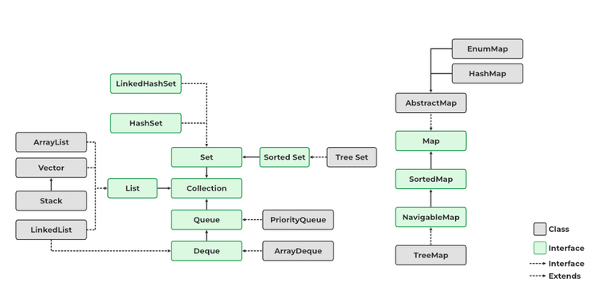
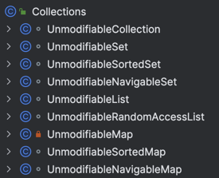

우아한테크코스의 모든 미션에 "배열 대신 컬렉션을 사용하라"는 요구 사항이 항상 존재한다.

그 이유를 알아보자.

## 두 줄 요약

1. Java가 이미 잘 만들어놓은 [JCF](https://steady-coding.tistory.com/354)가 존재한다.
2. 제네릭을 지원한다.

## JCF

Java는 다양한 자료구조와 다양한 알고리즘을 지원한다.

예를 들어 동적 배열은 `ArrayList`, 연결 리스트는 `LinkedList` 처럼 말이다.

게다가 각 자료구조에 필요한 동작들, 예를 들어 중간에 값 삽입 혹은 삭제와 같은 동작들 역시 미리 제공한다.

뿐만 아니라, `isEmpty()`, `sort()`, `clear()`, `contains()` 같은 메서드가 존재한다.

실제로 개발하다보면 위 메서드들이 정말 많이 사용되는데, 만약 컬렉션을 사용하지 않고 배열을 사용한다면 위 메서드들을 **재발명**해야 할 것이다. ~~그러면 퇴근이 늦어질 것이다.~~

따라서 상황에 따라 필요한 자료구조와 제공되는 메서드를 사용한다면 배열을 사용하는 것보다 훠어얼씬 **효율적인 개발**을 할 수 있을 것이다.

추가로 `java.util.concurrent` 패키지에서 제공하는 컬렉션들을 통해 **Thread-safe한 자료구조**도 편하게 사용할 수 있다.

또 `Collections` 클래스 내에 `UnmodifiableXXX` 를 통해 불변식 또한 지킬 수 있다.

## 제네릭을 지원한다

제네릭은 JAVA가 제공하는 유연하고 안전한 기술 중 하나이다.

컬렉션은 제네릭을 지원한다. 하지만 배열은 그렇지 않다.

> 제네릭에 대한 이해는 [이 포스팅](https://kdkdhoho.github.io/about-generic) 참고

이 제네릭을 사용한다는 것은, 개발자로 하여금 **컴파일 타임에 타입 안정성을 보장할 수 있다는 것**이다.

이는 어마어마한 메리트이다. 에러가 생겨도 가장 좋은 타이밍은 **컴파일 타임**인데, 제네릭이 이를 보장한다. 
~~일단 이거만으로도 배열 대신 컬렉션을 쓸 이유가 충분해보인다.~~
